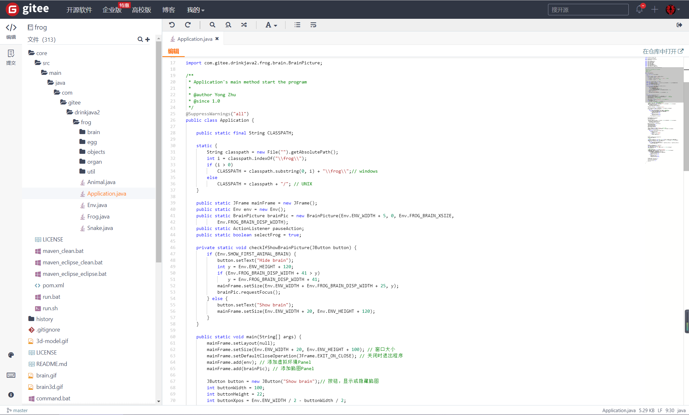

#  Eclipse Theia 多语言云端 IDE 和桌面ID

# 走进 Eclipse Theia

## 介绍

 Theia（全名Eclipse Theia）是一个可扩展的平台，用于使用最新的Web技术开发多语言的云端和桌面的 IDE。 

## 云端IDE现状

 目前云端IDE可能是未来编程的趋势， 目前国内外退出了多种云端IDE工具，如下：

- 腾讯： [Cloud Studio](https://cloudstudio.net/)  基于浏览器的集成式开发环境（IDE），为开发者提供了一个永不间断的云端工作站。用户在使用 Cloud Studio 时无需安装，随时随地打开浏览器就能使用。 

   

- 华为： [CloudIDE](https://www.huaweicloud.com/product/cloudide.html)  面向云原生的轻量级WebIDE，通过浏览器访问即可实现云端开发环境获取、代码编写、编译调试、运行预览、访问代码仓库、命令行执行等能力，同时支持丰富的插件扩展 

-  微软 ： Visual Studio Codespaces 

- GitHub ： Codespace  云端IDE ， 是在Azure上运行的基于浏览器的完整VS Code编辑器，可以像本地的IDE一样添加你喜爱的插件。

- Gitee：Web IDE

  

- 

## 目标

- 建立一个可搭建类似IDE产品的平台
- 为终端用户提供完整的多语言IDE（不仅仅是智能编辑器）
- 同时支持云端IDE和桌面版IDE
- 通过language和debug server协议提供多语言支持
- 使用JavaScript UI库提供高级GUI

## 云端IDE优点

-  当IDE由提供商托管时，开发人员不必设置和管理它。
- 开发人员可在几乎任何类型的笔记本电脑、平板电脑、智能手机或其他工作站上编写代码，只要有Web浏览器可连接到云端IDE即可。
-  代码会自动保存到基于云的环境中，因此如果开发人员的笔记本电脑出现问题并关机，也不会丢失代码。

-  与本地安装的IDE相比，云端IDE可更快地构建和调试代码，因为它们运行在功能更强大的硬件上。
-  云端IDE可以将代码快速部署到基于云的生产环境中。此设置消除了从本地IDE到云基础架构的较慢上传链接的延迟。
-  云端IDE还可使多名开发人员能够同时使用相同的环境，从而促进代码协作。
- 

## 云端IDE缺点

-  由于IDE未在本地安装，因此访问和性能可能会受到网络连接问题或带宽限制的影响。
- 并且，这种做法还会使攻击者更容易访问IDE及其上的开发人员代码。
-  虽然每种工具都不同，但一般来说，云端IDE支持的编程语言较少，并且比本地IDE更不易定制和扩展。

## 云端IDE分类

-  全托管云端IDE：
-  自托管IDE
-  Theia可以在本地计算机或云中运行-甚至可以在两者之间进行分割，这使得它成为希望IDE提供灵活部署选项的开发人员的理想选择。


# 测试Eclipse Theia

### 安装nodejs

1、下载源码，你需要在https://nodejs.org/en/download/下载最新的Nodejs版本，本文以v0.10.24为例:

```
cd /usr/local/src/
wget http://nodejs.org/dist/v0.10.24/node-v0.10.24.tar.gz
```

2、解压源码

```
tar zxvf node-v0.10.24.tar.gz
```

3、 编译安装

```
cd node-v0.10.24
./configure --prefix=/usr/local/node/0.10.24
make
make install
```

4、 配置NODE_HOME，进入profile编辑环境变量

```
vim /etc/profile
```

设置 nodejs 环境变量，在 ***export PATH USER LOGNAME MAIL HOSTNAME HISTSIZE HISTCONTROL*** 一行的上面添加如下内容:

```
#set for nodejs
export NODE_HOME=/usr/local/node/0.10.24
export PATH=$NODE_HOME/bin:$PATH
```

:wq保存并退出，编译/etc/profile 使配置生效

```
source /etc/profile
```

验证是否安装配置成功

```
node -v
```

输出 v0.10.24 表示配置成功

npm模块安装路径

```
/usr/local/node/0.10.24/lib/node_modules/
```

**注：**Nodejs 官网提供了编译好的 Linux 二进制包，你也可以下载下来直接应用。

你可以使用淘宝定制的 cnpm (gzip 压缩支持) 命令行工具代替默认的 npm:

```
$ npm install -g cnpm --registry=https://registry.npm.taobao.org
```

在安装vue的过程中，每每用到npm的时候都会超时，必须使用淘宝镜像。

永久使用:

```
npm config set registry https://registry.npm.taobao.org
```

临时使用:

```
npm install node-sass --registry=http://registry.npm.taobao.org
```

还有个常用命令，可以解决些奇怪的问题

```
npm cache clean --force
```


这样就可以使用 cnpm 命令来安装模块了：

```
$ cnpm install [name]
```

更多信息可以查阅：http://npm.taobao.org/。

```
curl --silent --location https://dl.yarnpkg.com/rpm/yarn.repo | sudo tee /etc/yum.repos.d/yarn.repo
```

安装 Node.js 后

```
curl --silent --location https://rpm.nodesource.com/setup_8.x | sudo bash -
```

 安装方式: `sudo yum -y install yarn` 

通过如下命令测试 Yarn 是否安装成功：

```
yarn --version
```

升级nodejs

 第一步：先清除npm缓存：npm cache clean -f

刚开始就给我 一个惊喜，看起开像报错，百度了一下，说是不管这个，就是网络提示，不用管它继续

第二步：安装n模块：npm install -g n

*n模块专门用来管理nodejs的版本*

有报错！
如果出现

> npm ERR! notsup Unsupported platform for n@2.1.8: wanted
> {“os”:”!win32”,”arch”:”any”} (current: {“os”:”win32”,”arch”:”x64”})

这样错误信息，在命令后面加上 –force 重新运行

继续成绩打怪

第三步：升级node.js到最新稳定版：n stable

又是一个惊喜，，我已经习惯了

执行n stable或 n latest时报错

> Error: invalid version 10.8.0

报错原因很简单,就是无法安装这个版本的,那怎样安装其他版本呢？输入n v8.11.4即可.

 还是不行
分析原因：1：使用国外源下载太慢，我没有找到怎么给他配置淘宝源 

### 安装

```
mkdir my-app
cd my-app
```

 在此目录中创建：`package.json` 

```
touch package.json
```

```
{
  "private": true,
  "dependencies": {
    "@theia/callhierarchy": "next",
    "@theia/file-search": "next",
    "@theia/git": "next",
    "@theia/markers": "next",
    "@theia/messages": "next",
    "@theia/mini-browser": "next",
    "@theia/navigator": "next",
    "@theia/outline-view": "next",
    "@theia/plugin-ext-vscode": "next",
    "@theia/preferences": "next",
    "@theia/preview": "next",
    "@theia/search-in-workspace": "next",
    "@theia/terminal": "next"
  },
  "devDependencies": {
    "@theia/cli": "next"
  }
}
```

 简而言之，Theia 应用程序和扩展是[Node.js 包](https://nodesource.com/blog/the-basics-of-package-json-in-node-js-and-npm/)。每个包都有一个显示包元数据的文件` package.json`，例如 ，其运行时和编译时的依赖关系等。 

 让我们来看看创建的包： 

 我们已将所需的扩展列为运行时依赖项，例如 。`@theia/navigator` 

-  某些扩展需要安装其他工具，例如[，@theia/python](https://www.npmjs.com/package/@theia/python) [需要安装 Python](https://github.com/palantir/python-language-server)语言服务器。 
- 使用此[链接也](https://www.npmjs.com/search?q=keywords:theia-extension)查看所有已发布的扩展。

我们已将[@theia/cli](https://www.npmjs.com/package/@theia/cli)列为编译时的依赖项。它提供了用于生成和运行应用程序的脚本。


使用 VS 代码扩展

 还可以使用（和打包）VS 代码插件， 作为应用程序的一部分 。

 Theia[存储库](https://github.com/eclipse-theia/theia/wiki/Consuming-Builtin-and-External-VS-Code-Extensions)包含有关如何将此类扩展作为应用程序的一部分的指南。`package.json` 

 示例可能如下所示：`package.json` 

```json
{
  "private": true,
  "dependencies": {
    "@theia/callhierarchy": "next",
    "@theia/file-search": "next",
    "@theia/git": "next",
    "@theia/markers": "next",
    "@theia/messages": "next",
    "@theia/mini-browser": "next",
    "@theia/navigator": "next",
    "@theia/outline-view": "next",
    "@theia/plugin-ext-vscode": "next",
    "@theia/preferences": "next",
    "@theia/preview": "next",
    "@theia/search-in-workspace": "next",
    "@theia/terminal": "next"
  },
  "devDependencies": {
    "@theia/cli": "next"
  },
  "scripts": {
    "prepare": "yarn run clean && yarn build && yarn run download:plugins",
    "clean": "theia clean",
    "build": "theia build --mode development",
    "start": "theia start --plugins=local-dir:plugins",
    "download:plugins": "theia download:plugins"
  },
  "theiaPluginsDir": "plugins",
  "theiaPlugins": {
    "vscode-builtin-css": "https://github.com/theia-ide/vscode-builtin-extensions/releases/download/v1.39.1-prel/css-1.39.1-prel.vsix",
    "vscode-builtin-html": "https://github.com/theia-ide/vscode-builtin-extensions/releases/download/v1.39.1-prel/html-1.39.1-prel.vsix",
    "vscode-builtin-javascript": "https://github.com/theia-ide/vscode-builtin-extensions/releases/download/v1.39.1-prel/javascript-1.39.1-prel.vsix",
    "vscode-builtin-json": "https://github.com/theia-ide/vscode-builtin-extensions/releases/download/v1.39.1-prel/json-1.39.1-prel.vsix",
    "vscode-builtin-markdown": "https://github.com/theia-ide/vscode-builtin-extensions/releases/download/v1.39.1-prel/markdown-1.39.1-prel.vsix",
    "vscode-builtin-npm": "https://github.com/theia-ide/vscode-builtin-extensions/releases/download/v1.39.1-prel/npm-1.39.1-prel.vsix",
    "vscode-builtin-scss": "https://github.com/theia-ide/vscode-builtin-extensions/releases/download/v1.39.1-prel/scss-1.39.1-prel.vsix",
    "vscode-builtin-typescript": "https://github.com/theia-ide/vscode-builtin-extensions/releases/download/v1.39.1-prel/typescript-1.39.1-prel.vsix",
    "vscode-builtin-typescript-language-features": "https://github.com/theia-ide/vscode-builtin-extensions/releases/download/v1.39.1-prel/typescript-language-features-1.39.1-prel.vsix"
  }
}
```

### 构建

首先，安装所有依赖项。

```text
yarn
```

其次，使用 Theia CLI 构建应用程序。

```text
yarn theia build
```

`yarn`在应用程序的上下文中查询 提供的 可执行文件，然后使用 执行命令。

 这可能需要一段时间，因为应用程序是默认在生产模式下构建的 。

### 运行

 生成完成后，我们可以启动应用程序： 

生成完成后，我们可以启动应用程序：

```text
yarn start
```

您可以提供一个工作区路径作为第一个参数打开，并在特定网络接口和端口上部署应用程序的选项，例如在所有接口和端口上打开：

```
yarn start /my-workspace --hostname 0.0.0.0 --port 8080
```

 在终端中，您应该看到 Theia 应用程序正在启动并侦听： 

 通过输入新的浏览器页面中的打印地址来打开应用程序。 


## Docker环境安装

 https://github.com/theia-ide/theia-apps#theia-docker 

```
docker run -it --init -p 3000:3000 --expose 9229 -p 9229:9229 -v "$(pwd):/home/project:cached" theiaide/theia:next --inspect=0.0.0.0:9229
```

