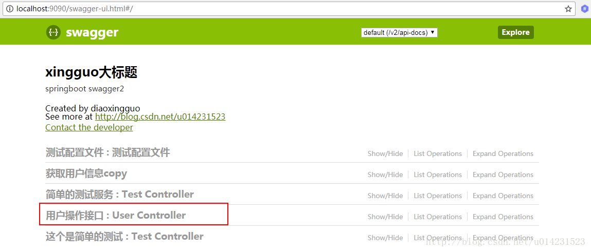

# Swagger

​		Swagger 是一个规范和完整的框架，用于生成、描述、调用和可视化 RESTful 风格的 Web 服务。 

官网： https://swagger.io/ 

​		Spring将Swagger规范纳入自身的标准，建立了`Spring-swagger`项目，后面改成了现在的Springfox。通过在项目中引入`Springfox`，可以扫描相关的代码，生成该描述文件，进而生成与代码一致的接口文档和客户端代码。

## 基于Spring框架的Swagger流程应用

在Spring项目开发中，我们一般有两种流程使用 Swagger ，具体如下：

流程一：


流程二：


## 注解详解

-  @Api()用于类；  表示标识这个类是swagger的资源  ，如在Controller上添加

  -  tags： 表示说明  

  -  value ： 也是说明，可以使用tags替代  ， 但是tags如果有多个值，会生成多个list 

    ``` java
    @Api(value="用户controller",tags={"用户操作接口"})
    @RestController
    public class UserController {
     
    }
    ```

    效果：

    

- @ApiOperation： 用于方法； 表示一个http请求的操作  
  
  - value： 用于方法描述  
  - notes： 用于提示内容  
  -  tags：可以重新分组（视情况而用） 
  - httpMethod ：Http请求方式，分为`POST`和`GET`
  
- @ApiParam： 用于方法，参数，字段说明；  表示对参数的添加元数据（说明或是否必填等） 
  - name： 参数名  
  
  - value： 参数说明  
  
  - required：是否必须填写，默认是false
  
    ```java
    @Api(value="用户controller",tags={"用户操作接口"})
    @RestController
    public class UserController {
         @ApiOperation(value="获取用户信息",notes="注意问题点")
         @GetMapping("/getUserInfo")
         public User getUserInfo(@ApiParam(name="id",value="用户id",required=true) Long id,@ApiParam(name="username",value="用户名") String username) {
         // userService可忽略，是业务逻辑
          User user = userService.getUserInfo();
     
          return user;
      }
    }
    ```
  
- @ApiModel： 用于类 ； 表示对类进行说明，用于参数用实体类接收  
  - value： 表示对象名  
  - description： 描述  
  
- @ApiModelProperty： 用于方法，字段 ； 表示对model属性的说明或者数据操作更改  
  - value： 字段说明  
  
  -  name：重写属性名字  
  
  -  dataType ： 重写属性类型 
  
  - example：示例值
  
  - required：是否必须填写，默认是false
  
  -  hidden ： 隐藏 
  
    ``` java
    @ApiModel(value="user对象",description="用户对象user")
    public class User implements Serializable{
        private static final long serialVersionUID = 1L;
         @ApiModelProperty(value="用户名",name="username",example="xingguo")
         private String username;
         @ApiModelProperty(value="状态",name="state",required=true)
          private Integer state;
          private String password;
     
          @ApiModelProperty(value="id数组",hidden=true)
          private String[] ids;
          private List<String> idList;
         //省略get/set
    }
    ```
  
-  @ApiIgnore： 用于类，方法，方法参数 ； 表示这个方法或者类被忽略  

- @ApiImplicitParam： 用于方法 ； 表示单独的请求参数  

  -    name ：参数名
  -   value ：参数说明
  -   dataType ：数据类型
  -   paramType ：参数类型
  -   example ：举例说明

-  @ApiImplicitParams ： 用于方法，包含多个 @ApiImplicitParam 

## 使用示例

### Controller层代码

```java
@Api(value="用户controller",tags={"用户操作接口"})
@RestController
public class UserController {
 
}
```

``` java
    @Override
    @ApiOperation(value = "post请求调用示例", notes = "invokePost说明", httpMethod = "POST")
    public FFResponseModel<DemoOutputDto> invokePost(@ApiParam(name="传入对象",value="传入json格式",required=true) @RequestBody @Valid DemoDto input) {
        log.info("/testPost is called. input=" + input.toString());
        return new FFResponseModel(Errcode.SUCCESS_CODE, Errcode.SUCCESS_MSG);
    }
```

### 接口请求参对象

``` java
@Data
@ApiModel(value="演示类",description="请求参数类" )
public class DemoDto implements Serializable {

    private static final long serialVersionUID = 1L;

    @NotNull
    @ApiModelProperty(value = "defaultStr",example="mockStrValue")
    private String strDemo;

    @NotNull
    @ApiModelProperty(example="1234343523",required = true)
    private Long longNum;

    @NotNull
    @ApiModelProperty(example="111111.111")
    private Double doubleNum;

    @NotNull
    @ApiModelProperty(example="2018-12-04T13:46:56.711Z")
    private Date date;
    
}
```

### 接口响应公共参类

``` java
@ApiModel(value="基础返回类",description="基础返回类")
public class FFResponseModel<T> implements Serializable {

    private static final long serialVersionUID = -2215304260629038881L;
    // 状态码
    @ApiModelProperty(example="成功")
    private String code;
    // 业务提示语
    @ApiModelProperty(example="000000")
    private String msg;
    // 数据对象
    private T data;

...
}
```

### 接口响应实际数据对象

``` java
@Data
public class DemoOutputDto {

    private String res;

    @NotNull
    @ApiModelProperty(value = "defaultOutputStr",example="mockOutputStrValue")
    private String outputStrDemo;

    @NotNull
    @ApiModelProperty(example="6666666",required = true)
    private Long outputLongNum;

    @NotNull
    @ApiModelProperty(example="88888.888")
    private Double outputDoubleNum;

    @NotNull
    @ApiModelProperty(example="2018-12-12T11:11:11.111Z")
    private Date outputDate;
    
}
```

### 效果图

 模拟请求数据报文 ：


 模拟返回数据报文： 


## 总结

​		其实归根到底，使用Swagger，就是把相关的信息存储在它定义的描述文件里面（yml或json格式），再通过维护这个描述文件可以去更新接口文档，以及生成各端代码。

​		而`Springfox-swagger`,则可以通过扫描代码去生成这个描述文件，连描述文件都不需要再去维护了。所有的信息，都在代码里面了。代码即接口文档，接口文档即代码。


