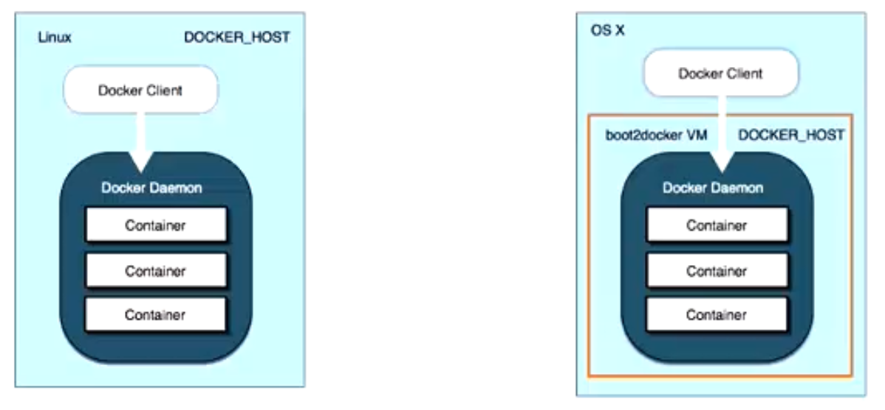
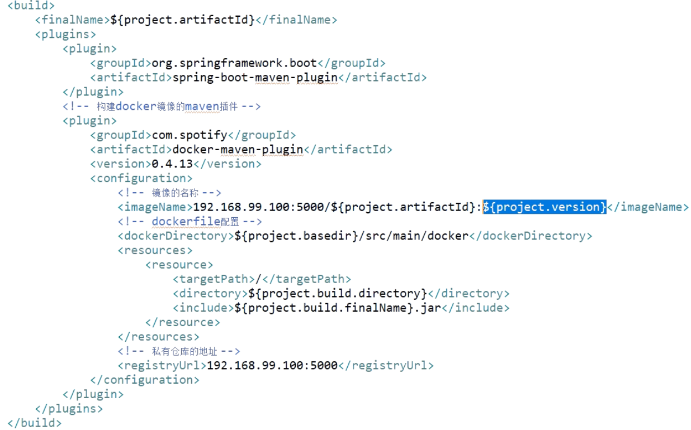
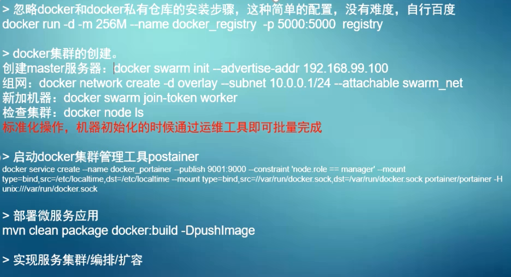

# Docker

参考：《Docker技术入门与实践第2版》

Docker的生命周期：

- 封装（Packaging）
- 分发（Distribution）
- 部署（Deployment）
- 运行（Runtime）


Docker的三大核心概念：

- 镜像（Image）
- 容器（Container ）
- 仓库（Repository）

Docker镜像：镜像是一个只读的模板，镜像是创建Docker容器。通过版本管理和增量的文件系统，Docker提供了一套十分简单的机制来创建和更新现有的镜像，用户甚至可以从网上下载一个已经做好的应用镜像，并直接使用。

Docker容器：通过版本管理和增量的文件系统，Docker提供了一套十分简单的机制来创建和更新现有的镜像，用户甚至可以从网上下载一个已经做好的应用镜像，并直接使用。

镜像自身是只读的。容器从镜像启动的时候，会在镜像的最上层创建一个可写层。

Docker仓库

Docker安装

卸载旧版本


添加yum软件源

阿里云

```shell
sudo yum-config-manager \
    --add-repo \
    http://mirrors.aliyun.com/docker-ce/linux/centos/docker-ce.repo
```

清华大学源

```shell
sudo yum-config-manager \
    --add-repo \
    https://mirrors.tuna.tsinghua.edu.cn/docker-ce/linux/centos/docker-ce.repo
```

更新yum软件源缓存

```
sudo yum update
```

安装 Docker Engine-Community

```
sudo yum install docker-ce docker-ce-cli containerd.io
```

 Start Docker. 

```
sudo systemctl start docker
```

  running the `hello-world` image. 

```
sudo docker run hello-world
```

启动一个Nginx容器

```
docker run -d -p 80:80 --name webserver nginx
```

然后使用docker ps指令查看当前运行的容器

```
 docker ps
```

可见Nginx容器已经在0.0.0.0：80启动，并映射了80端口，下面我们打开浏览器访问此地址


配置Docker服务

为了避免每次使用docker命令都要用特权身份，可以将当前用户加入安装中自动创建的docker用户组：

```
sudo usermod -aG docker USER_NAME
```

用户更新组信息后，退出并重新登录后即可生效。

通过service命令来重启Docker服务：

```
sudo systemctl restart docker.service
```

通过systemctl命令来管理Docker服务

```
sudo systemctl start docker.service
```

查看Docker版本信息

```
docker version
```


使用Docker镜像

Docker运行容器前需要本地存在对应的镜像，如果镜像没保存在本
地，Docker会尝试先从默认镜像仓库下载（默认使用Docker Hub公共注册服务器中的仓库），用户也可以通过配置，使用自定义的镜像仓库。

使用pull命令从Docker Hub仓库中下载镜像到本地

可以使用docker pull命令直接从Docker Hub镜像源来下载镜像。

命令格式：

```
docker pull NAME[：TAG]
```

- NAME是镜像仓库的名称
- TAG是镜像的标签（往往用来表示版本信息）

如果不显式指定TAG，则默认会选择 latest标签，会下载仓库中最新版本的镜像。

示例：

```
docker pull centos:centos7
```

查看本地已有的镜像信息

```
docker images
```

运行容器，并且可以通过 exec 命令进入 CentOS 容器。

```
docker run -itd --name centos-test centos:centos7
```

 通过 **docker ps** 命令查看容器的运行信息：


镜像文件一般由若干层（layer）组成，6c953ac5d795这样的串是层的唯一id（实际上完整的id包括256比特，由64个十六进制字符组成）。使用docker pull命令下载时会获取并输出镜像的各层信息。当不同的镜像包括相同的层时，本地仅存储层的一份内容，减小了需要的存储空间。


严格地讲，镜像的仓库名称中还应该添加仓库地址（即registry，册
服务器）作为前缀，只是我们默认使用的是Docker Hub服务，该前缀可以忽略。

如果从非官方的仓库下载，则需要在仓库名称前指定完整的仓库地址。

```
docker pull hub.c.163.com/public/ubuntu:14.04
```

pull子命令支持的选项主要包括：

- -a ，- - all-tags=true|false：是否获取仓库中的所有镜像，默认为否。

下载镜像到本地后，即可随时使用该镜像了，例如利用该镜像创建一个容器，在其中运行bash应用，执行ping localhost命令

```
docker run -it ubuntu:14.04 bash
root@9c74026df12a:/# ping localhost
```


查看镜像信息

使用docker images命令可以列出本地主机上已有镜像的基本信息。

```
docker images
```

在列出的信息中，可以看到以下几个字段信息。
来自于哪个仓库，比如ubuntu仓库用来保存ubuntu系列的基础镜像；
·镜像的标签信息，比如14.04、latest用来标注不同的版本信息。标签
只是标记，并不能标识镜像内容；
·镜像的ID（唯一标识镜像），如ubuntu：latest和u b u n t u ：16.04镜像的ID
都是2fa927b5cdd3，说明它们目前实际上指向同一个镜像；
·创建时间，说明镜像最后的更新时间；
·镜像大小，优秀的镜像往往体积都较小。
其中镜像的ID信息十分重要，它唯一标识了镜像。在使用镜像ID的时
候，一般可以使用该ID的前若干个字符组成的可区分串来替代完整的ID。
TAG信息用来标记来自同一个仓库的不同镜像。例如ubuntu仓库中有多
个镜像，通过TAG信息来区分发行版本，包括
10.04、12.04、12.10、13.04、14.04、16.04等标签。

镜像大小信息只是表示该镜像的逻辑体积大小，实际上由于相同的镜像
层本地只会存储一份，物理上占用的存储空间会小于各镜像的逻辑体积之
和。


images子命令主要支持如下选项，用户可以自行进行尝试。
·-a ，- - all=true|false：列出所有的镜像文件（包括临时文件），默认为
否；
·--digests=true|false：列出镜像的数字摘要值，默认为否；
·-f，--filter=[]：过滤列出的镜像，如
dangling=true只显示没有被使用
的镜像；也可指定带有特定标注的镜像等；
·--format="TEMPLATE"：控制输出格式，如.ID代表 ID信息，. R e p o s i t o r y
代表仓库信息等；
·--no-trunc=true|false：对输出结果中太长的部分是否进行截断，如镜像
的ID信息，默认为是；
·-q ，- - quiet=true|false：仅输出ID信息，默认为否。
其中，对输出结果进行控制的选项如-f，--filter=[]、--
no-trunc=true|
f a l s e 、- q ，- - quiet=true|false等，大部分子命令都支持。
更多子命令选项还可以通过man docker-images来查看。

2.使用tag命令添加镜像标签

可以使用docker tag命令来为本
地镜像任意添加新的标签。例如添加一个新的myubuntu：latest镜像标签：

```
docker tag ubuntu:latest myubuntu:latest
```

再次使用docker images列出本地主机上镜像信息，可以看到多了一个拥
有m y u b u n t u ：latest标签的镜像：

```
docker images
```

之后，用户就可以直接使用myubuntu：latest来表示这个镜像了

这些myubuntu：latest镜像的ID跟u b u n t u ：latest
完全一致。它们实际上指向同一个镜像文件，只是别名不同而已。dockertag
命令添加的标签实际上起到了类似链接的作用。


3.使用inspect命令查看详细信息

使用docker inspect命令可以获取该镜像的详细信息，包括制作者、适应
架构、各层的数字摘要等：

```
docker inspect ubuntu:14.04
```


管理镜像标签

在远端仓库使用search命令进行搜索和过滤

删除镜像标签和镜像文件

创建用户定制的镜像并且保存为外部文件

往Docker Hub仓库中推送自己的镜像


# 课程

什么是容器？

一种虚拟化的方案

操作系统级别的虚拟化

使用Docker容器开发、测试、部署服务

创建隔离的运行环境


Docker的基本组成

- Docker Client：客户端/守护进程

  - C/S架构
  - 本地/远程

- Docker Images 镜像

  - 容器的基石
  - 层叠的只读文件系统
    1. bootfs
    2. rootfs（Ubuntu）
    3. add emacs
    4. add Apache
  - 联合加载（union mount）

- Docker Container容器

  - 通过镜像启动
  - 启动和执行阶段
  - 容器会在镜像的只读文件上添加可写层
    - 可写层初始时空的，所有的容器变化都会生效到可写层
  - 

- Docker Registry仓库

  - 公有
    - Docker Hub
  - 私有

  - 

- 


## 操作

```
docker version
```


```
docker search tutorial

docker pull learn/tutorial

docker run learn/tutorial echo 'hello world'

docker run learn/tutorial apt-get install -y ping

#查看容器
docker ps -l

#提交容器
docker commit 容器ID 容器名称（如：learn/ping）

#新镜像运行容器
docker run learn/ping ping www.baidu.com

#查看当前运行的容器
docker ps

#查看运行中容器的信息
docker inspect 容器ID

#查看本地镜像
docker images

#推送镜像到docker hub
docker push learn/ping


```


## Docker容器相关技术


Docker依赖Linux内核的特性：

- Namespaces 命名空间
- Control groups （cgroups）控制组

### Namespace命名空间

- 编程语言
  - 封装：代码隔离
- 操作系统
  - 系统资源的隔离：进程、网络、文件系统

Docker使用的命名空间：

- PID（Process ID）进程隔离
- NET（Network）管理网络接口
- IPC（InterProcess Communication） 管理跨进程通信的访问
- MNT（Mount）管理挂载点
- UTS（Unix Timesharing System）隔离内核和版本标识

###  Control groups控制组

- 资源限制
  - 可以控制系统资源（内存、CPU等）的使用量
- 优先级设定
  - 可以设置对系统资源使用的优先级
- 资源计量
  - 可以计算使用了多少系统资源
- 资源控制
  - 可以控制对资源的使用，如：挂起、重启


## Docker容器的能力

- 文件系统隔离：每个容器都有自己的root文件系统
- 进程隔离：每个容器都运行在自己的进程环境中
- 网络隔离：容器间的虚拟网络接口和IP地址都是分开的
- 资源隔离和分组：使用cgroups将CPU和内存之类的资源独立分配给每个Docker容器

## Docker的安装和配置

完整前检查：

1、内核版本

```
uname -a
```

2、检查Device Mapper

``` 
ls -l /sys/class/misc/device-mapper
```


Ununtu安装

```
sudo apt-get install -y docker.io

source /etc/bash-completion.d/docker.io

sudo docker.io version
```


安装Docker维护的版本

1. 检查APT的HTTPS支持，查看/usr/lib/apt/methods/https文件是否存在，如果不存在

   ``` 
   apt-get update
   
   apt-get install -y apt-transport-https
   ```

2. 添加Docker的APT仓库

   ```
   echo deb https://get.docker.com/ubuntu docker main > /etc/apt/sources.list.d/docker.list
   ```

3. 添加仓库的key

   ```
   apt-ket adv --ketserver hkp://keyserver.ubuntu.com:80 --recv-keys 36A1D7869245C8950F966E92D8576A88D21E9
   ```

4. 安装

   ```
   apt-get update
   apt-get install -y lxc-docker
   ```


以上四步的简易安装方式：

```
sudo apt-get install -y curl

curl -sSL https://get.docker.com/ubuntu/|sudo sh
```

测试：

```
sudo docker version
sudo docker run ubuntu echo "hello world"
```


非root用户如何不使用sudo：

```
sudo groupadd docker

sudo gpasswd -a ${USER} docker

sudo service docker restart
```

如：

```
useradd chen
passwd chen
groupadd docker
gpasswd -a chen docker
systemctl restart docker
su - chen
docker -version
docker run centos:centos7 echo "hello world"
```

### Windows安装Docker

Windows中需要通过Boot2Docker。

Boot2Docker for Window包含：

- Boot2Docker Linux ISO
- Virtualbox
- MSYS-git
- 管理工具

Linux和Windos运行Docker的区别：



#### 下载Boot2Docker

1. 访问GIthub上的Boot2Docker

   ```
   https://github.com/boot2docker/boot2docker 
   ```

2. 下载docker-install.exe

3. 安装docker-install.exe

## Docker容器

### 容器的基本操作

#### 启动容器

```
docker run IMAGE [COMMAND] [ARG...]
```

- run在新容器中执行命令

示例：

```
docker run centos:centos7 echo "hello world"
```

#### 交互式启动容器

```
docker run -i -t IMAGE /bin/bash
```

- `-i --interactive=true|false` ，默认是false
- `-t --tty=true|false`，默认是false

示例：

```
docker run -it centos:centos7 /bin/bash
```

#### 查看容器

```
docker ps [-a] [-l]
```

#### 查看容器的详细信息

```
docker inspect 容器ID/容器name
```

示例：

```
 docker inspect c6a5d362114a
```

或者：

```
 docker inspect centos7
```


#### 自定义容器名

```
docker run --name=自定义名称 -it IMAGE /bin/bash
```

示例：

```
docker run -it --name=centos7 centos:centos7 /bin/bash
```

#### 重新启动已经停止的容器

```
docker start [-i] 容器名/容器ID
```

示例：

```
docker start -i centos7
```

#### 删除容器

```
docker rm 容器ID/容器名
```

注意：只能删除已经停止的容器

#### 运行守护式容器

守护式容器：

- 能够长期运行
- 没有交互式会话
- 适合运行应用程序和服务

```
docker run -d IMAGE [COMMAND] [ARG...]
```

注意：该形式只是后台运行命令，命令结束后，依旧会停止。

或者：

```
docker start 容器名/容器ID
```

示例：

```
docker run -d --name=centos7 centos:centos7 /bin/sh -c "while true;do echo hello world; sleep 1;done"
```

```
docker start centos7
```

#### 附加到运行中的容器

```
docker attach 容器名/容器ID
```

#### 查看容器日志

```
docker logs [-f] [-t] [--tail] 容器名
```

- `-f  --follows=true|false`默认是false
- `-t  --timestamps=true|false`默认是false
- `--tail="all"`

示例：

```
docker logs -ft --tail 10 centos7
```

#### 查看容器内的进程

```
docker top 容器名
```

示例：

```
docker top centos7
```

#### 在运行的容器中启动新的进程

```
docker exec [-d] [-i] [-t] 容器名 [COMMAND] [ARG...]
```

示例：

```
docker exec -it centos7 /bin/bash
```

或者：

```
docker exec centos7 echo "Hello Docker"
```

#### 停止运行中的容器

```
##通知停止
docker stop 容器名
```

和

```
##强制停止
docker kill 容器名
```

示例：

```
docker stop centos7
```

#### 设置容器的端口映射

```
docker run [-p] [-P]
```

- `-P,--publish-all=true|false`默认为false

  - 为容器暴露的所有端口进行映射

  示例：

  ```
  docker run -P -it centos:centos7 /bin/bash
  ```

- `-p,--publish=[]`

  - 为指定的端口进行映射，端口配置有四种格式：

    - `containerPort`

      示例：

      ```
      docker run -p 80 -it centos:centos7 /bin/bash
      ```

    - `hostPort:containerPort`

      ```
      docker run -p 8080:80 -it centos:centos7 /bin/bash
      ```

    - `ip::containerPort`

      ```
      docker run -p 0.0.0.0::80 -it centos:centos7 /bin/bash
      ```

    - `ip:hostPort:containerPort`

      ```
      docker run -p 0.0.0.0:8080:80 -it centos:centos7 /bin/bash
      ```

## Docker镜像

Docker Image 镜像

- 容器的基石

- 层叠的只读文件系统

- 联合加载（union mount）

- 镜像的存储路径：`/var/lib/docker` 

  可以通过docker info查看存储路径：

  ```
  docker info
  ```

- 

### 列出镜像

```
docker images [OPTIONS] [REPOSITORY]
```

- `-a,--all=false`
- `-f,--filter=[]`
- `--no-trunc=false`
- `-q,--quiet=false` ：只返回镜像ID

示例：

```
docker images
```

### 查看镜像

```
docker inspect [OPTIONS] CONTAINER|IMAGE [CONTAINER|IMAGE...]
```

- `-f,--format=""`

示例：

```
docker inspect centos:centos7
```

### 删除镜像

```
docker rmi [OPTIONS] IMAGE [IMAGE...]
```

- `-f,--force=false`：强制删除
- `--no-prune=false`：不删除被打标签的父镜像

示例：

```
docker rmi learn/tutorial
```

删除所有镜像：

```
docker rmi $(docker images ubuntu -q)
```

### 查找镜像

- docker Hub中查找

- ```
  docker search [OPTIONS] TERM
  ```

  - `--automated=false`
  - `--no-trunc=false`
  - `-s,--stars=0` 显示结果的最少星级

示例：

```
docker search centos7
```

搜索3星以上的：

```
docker search -s 3 centos7
```

### 拉取镜像

```
docker pull [OPTIONS] NAME[:TAG]
```

- `-a ,--all-tags=false` 下载所有Tag的镜像

### 镜像下载加速

使用`--registry-mirror`选型

1. 修改：`/etc/default/docker`

2. 添加：`DOCKER_OPTS="--registry-mirror=http://MIRROR-ADDR"`

   如：https://www.daocloud.io

示例：

```
vi /etc/default/docker
```

添加内容：

```
DOCKER_OPTS="--registry-mirror=http://MIRROR-ADDR"
```

### 推送镜像

```
docker push NAME[:TAG]
```

示例：

```
docker push test/centos7
```

## 构建镜像

- 保存对容器的修改，并再次使用
- 自定义镜像的能力
- 以软件的形式打包并分发服务及其运行环境

### 通过容器构建

```
docker commit [OPTIONS] CONTAINER [PEPOSITORY[:TAG]
```

- `-a,--author=""`作者
- `-m,--message=""`提交信息
- `-p,--pause=true` 提交过程中暂停容器

示例：

```
docker commit -a 'chentiefeng' -m 'add nginx' centos7 chen/centos7
```

运行测试：

```
docker run -d --name nginx_web -p 80 chen/centos7 nginx -g "daemon off"
```

### 通过Dockerfile文件构建

1、创建Dockerfile

2、使用`docker build`命令

#### 创建Dockerfile文件

示例：

```
# First Dockerfile
FROM centos:centos7
MAINTAINER chentiefeng "imchentiefeng@aliyun.com"
RUN yum update
RUN yum install -y nginx
EXPOSE 80
```

####  docker build

```
docker build [OPTIONS] PATH | URL | -
```

- `--force-rm=false`
- `--no-cache=false`
- `--pull=false`
- `-q,--quiet=false`
- `--rm=true`
- `-t,--tag=''`

示例：

```
docker build -t='chen/nginx'
```

运行测试：

```
docker run -d --name nginx_web -p 80 chen/nginx nginx -g "daemon off"
```


# 示例：在容器中部署静态网站

## Nginx部署流程

1. 创建映射80端口的交互式容器
2. 安装Nginx
3. 安装文本编辑器vim
4. 创建静态页面
5. 修改Nginx配置文件
6. 运行Nginx
7. 验证网站访问

```
firewall-cmd --zone=public --add-port=20080/tcp --permanent
firewall-cmd --reload
```


```
docker run -p 20080:80 --name nginx -it centos:centos7 /bin/bash
```


安装nginx

```
yum install yum-utils
vi /etc/yum.repos.d/nginx.repo

##/etc/yum.repos.d/nginx.repo

[nginx-stable]
name=nginx stable repo
baseurl=http://nginx.org/packages/centos/$releasever/$basearch/
gpgcheck=1
enabled=1
gpgkey=https://nginx.org/keys/nginx_signing.key
module_hotfixes=true

[nginx-mainline]
name=nginx mainline repo
baseurl=http://nginx.org/packages/mainline/centos/$releasever/$basearch/
gpgcheck=1
enabled=0
gpgkey=https://nginx.org/keys/nginx_signing.key
module_hotfixes=true


yum-config-manager --enable nginx-mainline
yum install -y nginx
```


```
mkdir -p /var/www/html
cd /var/www/html
vi index.html
```


```
<html>
	<head>
		<title>Nginx in Docker</title>
	</head>
	<body>
		<h1>Hello, I‘m a website in docker!</h1>
	</body>
</html>
```

查看nginx的安装位置：

```
whereis nginx
#进入Nginx的配置位置
cd /etc/nginx/conf.d/
vi default.conf
```

修改如下：

```
    location / {
        root   /var/www/html;
        index  index.html index.htm;
    }
```

启动：

```
nginx
```

可以看到网站已经可以访问了http://49.233.207.213:20080/

停止容器：

```
docker stop nginx
```

重启容器：

```
docker start nginx
```

重启nginx：

```
docker exec nginx nginx
```


## Docker+微服务

1. 打包
2. 运行
3. 动态扩容

准备：

- Docker环境
- Docker仓库


Dockerfile

```
# 需要Java基础镜像，官方提供，包含了OS镜像和其他配置
FROM java

# 将当前目录下的*.jar 添加到镜像中，并命名为app.jar
ADD *.jar app.jar

# 镜像启动时执行命令
CMD exec java ${JAVA_OPTS} -Djava.security.egd=file:/dev/./urandom -jar /app.jar
```

使用docker的maven插件构建

```
docker-maven-plugin
```




打包：

```
mvn clean package
```

构建镜像并推送到仓库上：

```
mvn docker:build -DpushImage
```




