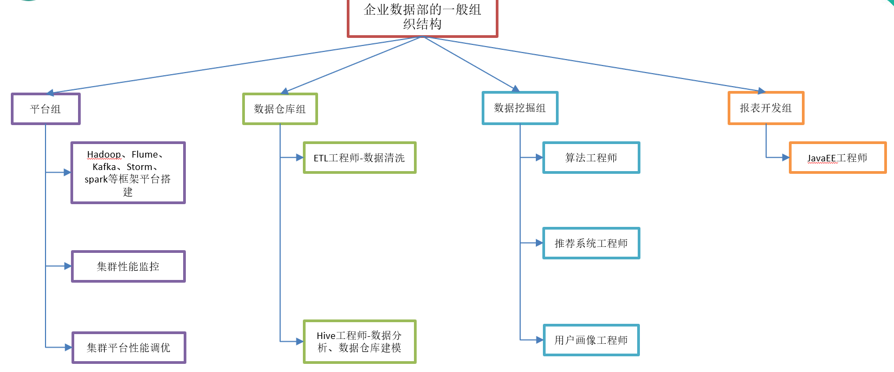
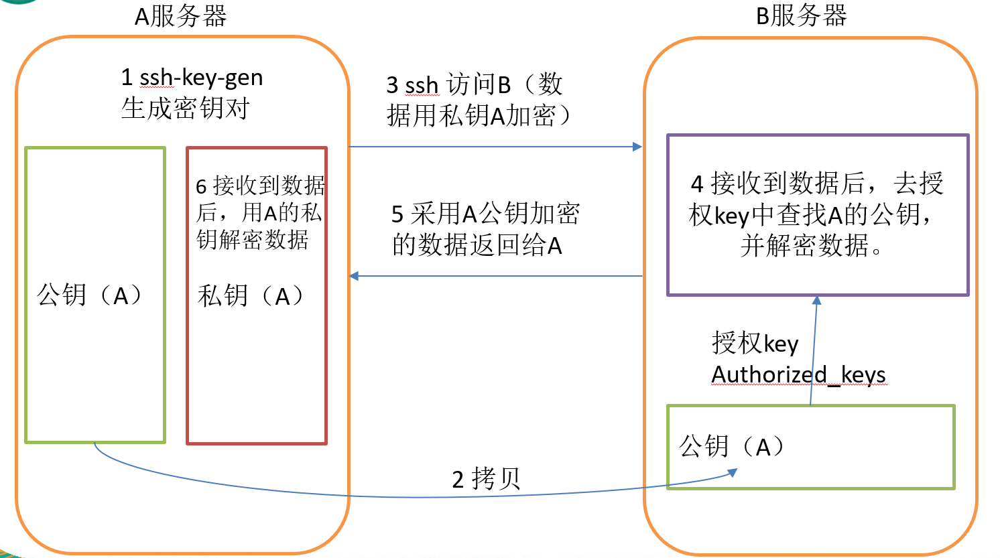
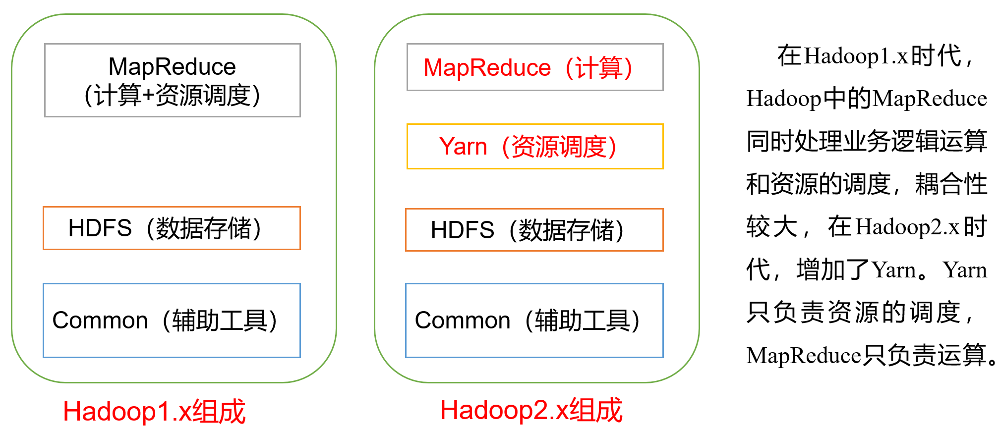
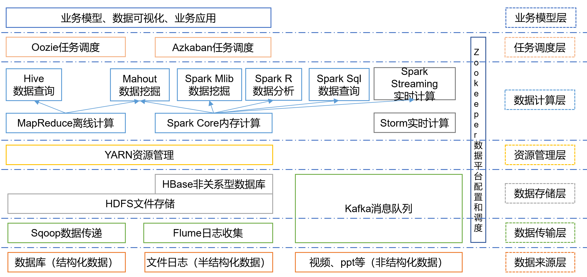
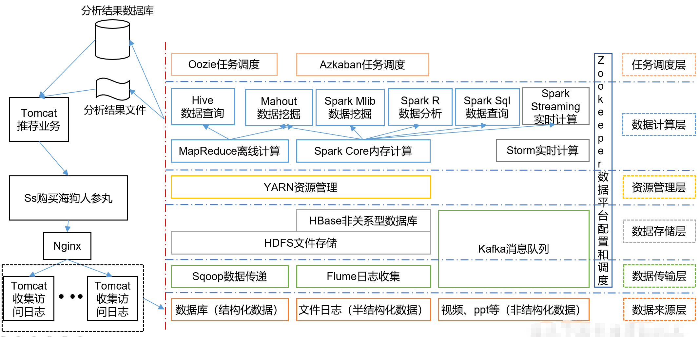
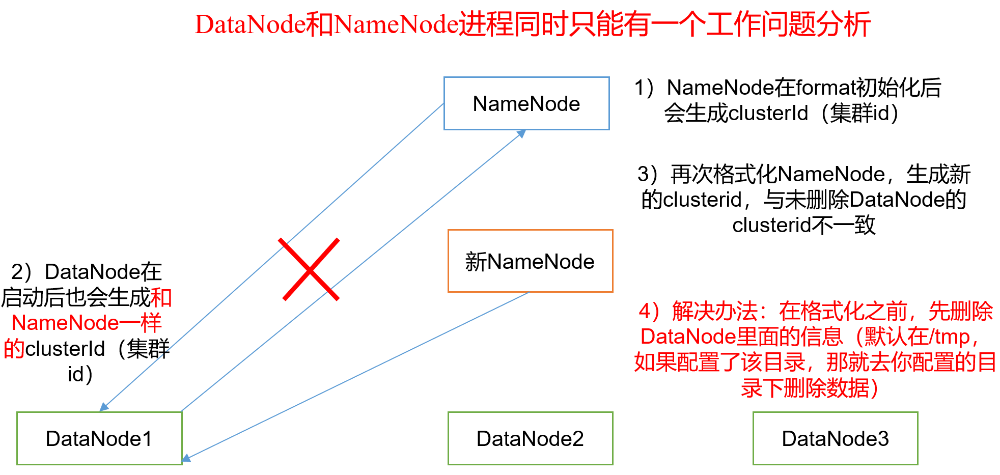
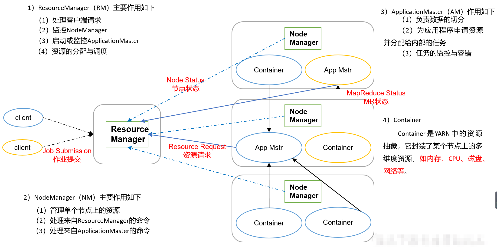

# 走进Hadoop

## Hadoop背景

### Hadoop职业前景



### 企业数据部的业务流程分析

1. 产品人员提需求（统计总用户数、日活跃用户数、回流用户数等）
2. 数据部门搭建数据平台、分析数据指标
3. 数据可视化（报表展示、邮件发送、大屏幕展示等）

## Hadoop组成

- MapReduce（计算）
- Yarn（资源调度）
- HDFS（数据存储）
- Common（辅助工具）

## 免密登录原理




## Hadoop1.x和Hadoop2.x的区别



## 大数据技术生态体系

大数据层次：

1. 数据来源层
   - 数据库（结构化数据）
     - Sqoop数据传递
   - 文件日志（半机构化数据）
     - Flume日志收集
   - 视频、ppt等（非结构化数据）
     - kafka消息队列 
2. 数据传输层
3. 数据存储层
   - HDFS文件存储
   - HBase非关系型数据库
4. 资源管理层
   - Yarn资源管理
5. 数据计算层
   - MapReduce离线计算
   - Spark Core内存计算
   - Storm实时计算
6. 数据应用层
   - Hive数据查询
   - Mahout数据挖掘
   - Spark Mlib数据挖掘
   - Spark R数据分析
   - Spark Sql数据查询
   - Spark Streaming实时计算
7. 任务调度层
   - Oozie任务调度
   - Azkaban任务调度
8. 业务模型层
   - 业务模型
   - 数据可视化
   - 业务应用



图中涉及的技术名词解释如下：

1）Sqoop：Sqoop是一款开源的工具，主要用于在Hadoop、Hive与传统的数据库(MySql)间进行数据的传递，可以将一个关系型数据库（例如 ：MySQL，Oracle 等）中的数据导进到Hadoop的HDFS中，也可以将HDFS的数据导进到关系型数据库中。

2）Flume：Flume是Cloudera提供的一个高可用的，高可靠的，分布式的海量日志采集、聚合和传输的系统，Flume支持在日志系统中定制各类数据发送方，用于收集数据；同时，Flume提供对数据进行简单处理，并写到各种数据接受方（可定制）的能力。

3）Kafka：Kafka是一种高吞吐量的分布式发布订阅消息系统，有如下特性：

（1）通过O(1)的磁盘数据结构提供消息的持久化，这种结构对于即使数以TB的消息存储也能够保持长时间的稳定性能。

（2）高吞吐量：即使是非常普通的硬件Kafka也可以支持每秒数百万的消息。

（3）支持通过Kafka服务器和消费机集群来分区消息。

（4）支持Hadoop并行数据加载。

4）Storm：Storm用于“连续计算”，对数据流做连续查询，在计算时就将结果以流的形式输出给用户。

5）Spark：Spark是当前最流行的开源大数据内存计算框架。可以基于Hadoop上存储的大数据进行计算。

6）Oozie：Oozie是一个管理Hdoop作业（job）的工作流程调度管理系统。

7）Hbase：HBase是一个分布式的、面向列的开源数据库。HBase不同于一般的关系数据库，它是一个适合于非结构化数据存储的数据库。

8）Hive：Hive是基于Hadoop的一个数据仓库工具，可以将结构化的数据文件映射为一张数据库表，并提供简单的SQL查询功能，可以将SQL语句转换为MapReduce任务进行运行。 其优点是学习成本低，可以通过类SQL语句快速实现简单的MapReduce统计，不必开发专门的MapReduce应用，十分适合数据仓库的统计分析。

10）R语言：R是用于统计分析、绘图的语言和操作环境。R是属于GNU系统的一个自由、免费、源代码开放的软件，它是一个用于统计计算和统计制图的优秀工具。

11）Mahout：Apache Mahout是个可扩展的机器学习和数据挖掘库。

12）ZooKeeper：Zookeeper是Google的Chubby一个开源的实现。它是一个针对大型分布式系统的可靠协调系统，提供的功能包括：配置维护、名字服务、 分布式同步、组服务等。ZooKeeper的目标就是封装好复杂易出错的关键服务，将简单易用的接口和性能高效、功能稳定的系统提供给用户。

## 架构图示例

### 荐系统框架图



# Hadoop运行环境搭建

## 环境准备

1、修改ip

``` shell
vim /etc/sysconfig/network-scripts/ifcfg-eth0
```

2、修改主机名

``` shell
vim /etc/sysconfig/network
```

2、修改hosts

``` shell
vim /etc/hosts
```

3、创建大数据用户bigdata

``` shell
#创建用户
useradd bigdata
#设置密码
passwd bigdata
```

4、配置大数据用户具有root权限

```
vim /etc/sudoers
```

```
bigdata  ALL=(ALL)  ALL
```

5、安装JDK

（1）解压

```shell
tar -zxvf jdk-8****.tar.gz  -C /usr/local/java
```

（2）配置环境变量

``` shell
sudo vim /etc/profile
```

```shell
export JAVA_HOME=/usr/local/java
export PATH=$PATH:$JAVA_HOME/bin
```

（3）使配置生效

``` shell
source /etc/profile
```

（4）测试环境

``` shell
java -version
```

6、

## 安装Hadoop

1、解压

2、配置环境变量

```shell
sudo vim /etc/profile
```

```
export HADOOP_HOME=/usr/local/hadoop
export PATH=$PATH:$HADOOP_HOME/bin
export PATH=$PATH:$HADOOP_HOME/sbin
```

（3）使配置生效

``` shell
source /etc/profile
```

4、测试环境

``` shell
hadoop
```

## Hadoop目录结构

重要目录：

（1）bin目录：存放对Hadoop相关服务（HDFS,YARN）进行操作的脚本

（2）etc目录：Hadoop的配置文件目录，存放Hadoop的配置文件

（3）lib目录：存放Hadoop的本地库（对数据进行压缩解压缩功能）

（4）sbin目录：存放启动或停止Hadoop相关服务的脚本

（5）share目录：存放Hadoop的依赖jar包、文档、和官方案例

## Hadoop运行模式

Hadoop运行模式包括：本地模式、伪分布式模式以及完全分布式模式。

### 本地模式

#### 官方Grep案例  

1. 创建在hadoop目录下面创建一个input文件夹

   ``` shell
    mkdir input
   ```

2. 将Hadoop的xml配置文件复制到input

   ``` shell
   cp etc/hadoop/*.xml input
   ```

3. 执行share目录下的MapReduce程序

   ``` shell
   bin/hadoop jar
   share/hadoop/mapreduce/hadoop-mapreduce-examples-2.7.2.jar grep input output 'dfs[a-z.]+'
   ```

4.  查看输出结果  

   ``` shell
   cat output/*
   ```

####  官方WordCount案例  

1. 创建在hadoop目录下面创建一个wcinput文件夹 

   ``` shell
   mkdir wcinput
   ```

2. 在wcinput文件下创建一个wc.input文件

   ``` shell
   cd wcinput
   touch wc.input
   ```

3. 编辑wc.input文件  

   ``` shell
   vi wc.input
   ```
   在文件中输入如下内容
   ``` 
   hadoop yarn
   hadoop mapreduce
   chentiefeng
   tiefeng
   ```

4. 回到Hadoop目录 

   ``` shell
   cd ../
   ```

5. 执行程序  

   ``` shell
    hadoop jar
    share/hadoop/mapreduce/hadoop-mapreduce-examples-2.7.2.jar wordcount wcinput wcoutput
   ```

6. 查看结果  

   ```
   cat wcoutput/part-r-00000
   ```

   

### 伪分布模式

​    （1）配置集群

​    （2）启动、测试集群增、删、查

​    （3）执行WordCount案例

#### 配置

##### 配置：hadoop-env.sh

Linux系统中获取JDK的安装路径：

```shell
echo $JAVA_HOME
```

修改hadoop-env.sh中JAVA_HOME 路径：

```java
vi hadoop-env.sh
```

```
export JAVA_HOME=/usr/local/java
```

##### 配置：core-site.xml  

``` xml
<!-- 指定HDFS中NameNode的地址 -->
<property>
<name>fs.defaultFS</name>
    <value>hdfs://hadoop101:9000</value>
</property>

<!-- 指定Hadoop运行时产生文件的存储目录 -->
<property>
	<name>hadoop.tmp.dir</name>
	<value>/opt/hadoop/data/tmp</value>
</property>
```

##### 配置：hdfs-site.xml  

``` xml
<!-- 指定HDFS副本的数量 -->
<property>
	<name>dfs.replication</name>
	<value>1</value>
</property>
```

#### 启动集群

1、**格式化NameNode**（第一次启动时格式化，以后就不要总格式化）

```shell
bin/hdfs namenode -format
```

2、启动服务

启动NameNode 

``` shell
sbin/hadoop-daemon.sh start namenode
```

启动datanode

``` shell
hadoop-daemon.sh start datanode
```

3、查看集群

（1）查看是否启动成功  

```shell
$ jps
```

```
13586 NameNode
13668 DataNode
13786 Jps
```

（2）web端查看HDFS文件系统

浏览器访问：http://hadoop101:50070/

（3）查看产生的Log日志

​         说明：在企业中遇到Bug时，经常根据日志提示信息去分析问题、解决Bug。  

``` shell
cd $HADOOP_HOME/log
```

#### 操作集群

1、测试创建文件夹

``` shell
bin/hdfs dfs -mkdir -p /user/chen/input
```

2、测试上传文件

``` shell
/bin/hdfs dfs -put wcinput/wc.input /user/chen/input
```

3、查看上传的文件是否正确

```
bin/hdfs dfs -ls /user/chen/input
```

#### 官方wordCount案例

1、创建文件夹

``` shell
bin/hdfs dfs -mkdir -p /user/chen/wd/input
```

2、上传文件

``` shell
/bin/hdfs dfs -put wcinput/wc.input /user/chen/wd/input
```

3、查看上传的文件是否正确

```
bin/hdfs dfs -ls /user/chen/wd/input
```

4、执行 MapReduce程序  

```shell
bin/hadoop jar
share/hadoop/mapreduce/hadoop-mapreduce-examples-2.7.2.jar wordcount /user/chen/wd/input/ /user/chen/wd/output
```

5、查看输出结果

```
bin/hdfs dfs -cat /user/chen/wd/output/p*
```

### 完全分布式模式

#### 1、准备

至少准备3台机器，并且满足以下条件：

- 配置了IP、主机名
- 修改了hosts文件
- 关闭了防火墙
- 安装了JDK

#### 2、编写集群分发脚本xsync 

##### （1）编写脚本

```
vi xsync.sh
```

在该文件中编写如下代码

``` shell
#!/bin/bash
#1 获取输入参数个数，如果没有参数，直接退出
pcount=$#
if((pcount==0)); then
  echo no args;
  exit;
fi

#2 获取文件名称
p1=$1
fname=`basename $p1`
echo fname=$fname

#3 获取上级目录到绝对路径
pdir=`cd -P $(dirname $p1); pwd`
echo pdir=$pdir

#4 获取当前用户名称
user=`whoami`

#5 循环
for((host=103; host<105; host++)); do
        echo ------------------- hadoop$host --------------
        rsync -rvl $pdir/$fname $user@hadoop$host:$pdir
done
```

##### （2）修改脚本 xsync 具有执行权限

```shell
chmod 777 xsync
```

##### （3）调用脚本形式：xsync 文件名称  

```
xsync /home/chen/bin
```

注意：如果将xsync放到/home/chen/bin目录下仍然不能实现全局使用，可以将xsync移动到/usr/local/bin目录下。

#### 3、集群配置

##### 1）集群规划

|      | hadoop1            | hadoop2                      | hadoop3                     |
| ---- | ------------------ | ---------------------------- | --------------------------- |
| HDFS | NameNode  DataNode | DataNode                     | SecondaryNameNode  DataNode |
| YARN | NodeManager        | ResourceManager  NodeManager | NodeManager                 |

##### 2）配置集群

###### （1）核心配置文件 

1. 配置core-site.xml

```shell
vi core-site.xml
```

```xml
<!-- 指定HDFS中NameNode的地址 -->
<property>
		<name>fs.defaultFS</name>
      <value>hdfs://hadoop1:9000</value>
</property>

<!-- 指定Hadoop运行时产生文件的存储目录 -->
<property>
		<name>hadoop.tmp.dir</name>
		<value>/opt/module/hadoop-2.7.2/data/tmp</value>
</property>
```

###### （2）HDFS配置文件  

1. 配置hadoop-env.sh

```shell
 vi hadoop-env.sh
```

``` shell
export JAVA_HOME=/opt/module/jdk1.8.0_144
```

2. 配置hdfs-site.xml

``` shell
vi hdfs-site.xml
```

在该文件中编写如下配置

``` xml
<property>
		<name>dfs.replication</name>
		<value>3</value>
</property>

<!-- 指定Hadoop辅助名称节点主机配置 -->
<property>
      <name>dfs.namenode.secondary.http-address</name>
      <value>hadoop3:50090</value>
</property>
```

###### （3）YARN配置文件

1. 配置yarn-env.sh

``` shell
vi yarn-env.sh
```

``` shell
export JAVA_HOME=/opt/module/jdk1.8.0_144
```

2. 配置yarn-site.xml

``` shell
vi yarn-site.xml
```

在该文件中增加如下配置

``` xml
<!-- Reducer获取数据的方式 -->
<property>
		<name>yarn.nodemanager.aux-services</name>
		<value>mapreduce_shuffle</value>
</property>

<!-- 指定YARN的ResourceManager的地址 -->
<property>
		<name>yarn.resourcemanager.hostname</name>
		<value>hadoop2</value>
</property>
```

###### （4）MapReduce配置文件

1. 配置mapred-env.sh

``` shell
vi mapred-env.sh
```

``` shell
export JAVA_HOME=/opt/module/jdk1.8.0_144
```

2. 配置mapred-site.xml

``` shell
cp mapred-site.xml.template mapred-site.xml
vi mapred-site.xml
```

在该文件中增加如下配置

``` xml
<!-- 指定MR运行在Yarn上 -->
<property>
		<name>mapreduce.framework.name</name>
		<value>yarn</value>
</property>
```

###### （5）在集群上分发配置好的Hadoop配置文件

``` shell
xsync /opt/module/hadoop-2.7.2/
```

###### （6）查看文件分发情况

``` shell
cat /opt/module/hadoop-2.7.2/etc/hadoop/core-site.xml
```

#### 4、集群单点启动(可省略)

（1）如果集群是第一次启动，需要**格式化NameNode**  

``` shell
hadoop namenode -format
```

（2）在hadoop1上启动NameNode 

```
hadoop-daemon.sh start namenode
```

```
jps
```

可以看到NameNode  

（3）在hadoop1、hadoop2以及hadoop3上分别启动DataNode

```shell
hadoop-daemon.sh start datanode
```

```
jps
```

可以看到DataNode 

#### 5、配置SSH免密登录

（1）生成公钥和私钥：  

```shell
ssh-keygen -t rsa
```

然后敲（三个回车），就会生成两个文件id_rsa（私钥）、id_rsa.pub（公钥）

（2）将公钥拷贝到要免密登录的目标机器上  

```
ssh-copy-id hadoop1
ssh-copy-id hadoop2
ssh-copy-id hadoop3
```

注意：

- 因为hadoop1上有NameNode，所以需要免密登录到其他所有的DataNode机器
- 因为hadoop2上有ResourceManager ，所以需要免密登录到其他所有的NodeManager机器上

#### 6、群起集群

##### 1） 配置slaves

``` shell
vi /opt/module/hadoop-2.7.2/etc/hadoop/slaves
```

在该文件中增加如下内容：

```
hadoop1
hadoop2
hadoop3
```

注意：该文件中添加的内容结尾不允许有空格，文件中不允许有空行。

同步所有节点配置文件

```shell
xsync slaves
```

##### 2）启动集群

（1）如果集群是第一次启动，需要格式化NameNode（注意格式化之前，一定要先停止上次启动的所有namenode和datanode进程，然后再删除data和log数据）  

```  shel
 bin/hdfs namenode -format
```

（2）启动HDFS

``` shell
sbin/start-dfs.sh
```

```
jps
```

可以看到NameNode 和DataNode

（3）启动YARN  

``` shell
sbin/start-yarn.sh
```

注意：NameNode和ResourceManger如果不是同一台机器，不能在NameNode上启动 YARN，应该在ResouceManager所在的机器上启动YARN。

（4）Web端查看SecondaryNameNode

浏览器中输入：http://hadoop3:50090/status.html，查看SecondaryNameNode 信息

#### 7、集群基本测试

##### （1）上传文件到集群

```
hdfs dfs -mkdir -p /user/chen/wd/input
hdfs dfs -put wcinput/wc.input /user/chen/wd/input
```

##### （2）上传文件后查看文件存放在什么位置

（a）查看HDFS文件存储路径

```
pwd
```

/opt/module/hadoop-2.7.2/data/tmp/dfs/data/current/BP-938951106-192.168.10.107-1495462844069/current/finalized/subdir0/subdir0

（b）查看HDFS在磁盘存储文件内容

``` shell
cat blk_1073741825
```

（c）拼接

```
cat blk_1073741836>>tmp.file
cat blk_1073741837>>tmp.file
tar -zxvf tmp.file
```

##### （3）下载文件

```shell
bin/hadoop fs -get /user/chen/wd/input/hadoop-2.7.2.tar.gz ./
```

### 集群启动/停止方式总结 

1. 各个服务组件逐一启动/停止

​    （1）分别启动/停止HDFS组件

``` shell
hadoop-daemon.sh start / stop namenode / datanode / secondarynamenode
```

​    （2）启动/停止YARN

``` shell
yarn-daemon.sh start / stop resourcemanager / nodemanager
```

2. 各个模块分开启动/停止（配置ssh是前提）常用

​    （1）整体启动/停止HDFS

       ``` shell
start-dfs.sh  / stop-dfs.sh
       ```

​    （2）整体启动/停止YARN

``` shell
start-yarn.sh / stop-yarn.sh
```

## 集群时间同步


# Hadoop配置文件

​		Hadoop配置文件分两类：默认配置文件和自定义配置文件，只有用户想修改某一默认配置值时，才需要修改自定义配置文件，更改相应属性值。

## 默认配置文件： 

| 要获取的默认文件     | 文件存放在Hadoop的jar包中的位置                             |
| -------------------- | ----------------------------------------------------------- |
| [core-default.xml]   | hadoop-common-2.7.2.jar/  core-default.xml                  |
| [hdfs-default.xml]   | hadoop-hdfs-2.7.2.jar/  hdfs-default.xml                    |
| [yarn-default.xml]   | hadoop-yarn-common-2.7.2.jar/  yarn-default.xml             |
| [mapred-default.xml] | hadoop-mapreduce-client-core-2.7.2.jar/  mapred-default.xml |

## 自定义配置文件  

​         **core-site.xml、hdfs-site.xml、yarn-site.xml、mapred-site.xml**四个配置文件存放在`$HADOOP_HOME/etc/hadoop`这个路径上，用户可以根据项目需求重新进行修改配置。  


# HDFS

## HDFS架构概述

1）NameNode（nn）：存储文件的元数据，如文件名，文件目录结构，文件属性（生成时间、副本数、文件权限），以及每个文件的块列表和块所在的DataNode等。

2）DataNode(dn)：在本地文件系统存储文件块数据，以及块数据的校验和。

3）Secondary NameNode(2nn)：用来监控HDFS状态的辅助后台程序，每隔一段时间获取HDFS元数据的快照。

## HDFS 文件块大小


## 问题解决

### datanode和namenode进程同时只能有一个工作问题分析

1）第一次启动时没有问题

2）第二次启动时，原来的datanode数据并没有删除掉，它在与新namenode通信时连接不上。导致集群不能正常启动。

3）解决办法：在格式化之前，删除datanode里面的信息（默认在/tmp，如果配置了该目录，那就去你配置的目录下删除数据）




# Yarn

## Yarn基本架构

1、ResourceManager（RM）主要作用如下：

（1）处理客户端请求

（2）监控NodeManager

（3）启动或监控ApplicationMaster

（4）资源的分配和调度

2、NodeManager（NM）主要作用如下：

（1）管理单个节点的资源

（2）处理来自ResourceManager的命令

（3）处理来自ApplicationMaster的命令

3、ApplicationMaster（AM）主要作用如下：

（1）负责数据的切分

（2）为应用程序申请资源并分配给内部的任务 

（3）任务的监控与容错

4、Container：Container是YARN中的资源抽象，它封装了某个节点上的多维度资源，如内存、CPU、磁盘、网络等。




## 启动Yarn并运行MapReduce程序  

（1）配置集群在YARN上运行MR

（2）启动、测试集群增、删、查

（3）在YARN上执行WordCount案例

### 配置

#### 1、配置yarn-env.sh  

```shell
vi yarn-env.sh 
```

配置一下JAVA_HOME

``` shell
export JAVA_HOME=/usr/local/java
```

#### 2、配置yarn-site.xml

``` xml
<!-- Reducer获取数据的方式 -->
<property>
 		<name>yarn.nodemanager.aux-services</name>
 		<value>mapreduce_shuffle</value>
</property>

<!-- 指定YARN的ResourceManager的地址 -->
<property>
    <name>yarn.resourcemanager.hostname</name>
    <value>hadoop101</value>
</property>
```

#### 3、配置mapred-env.sh  

```shell
vi mapred-env.sh
```

配置一下JAVA_HOME

``` shell
export JAVA_HOME=/usr/local/java
```

#### 4、配置 mapred-site.xml  

 对mapred-site.xml.template重新命名为mapred-site.xml  

``` xml
<!-- 指定MR运行在YARN上 -->
<property>
		<name>mapreduce.framework.name</name>
		<value>yarn</value>
</property>
```

#### 5、启动集群

注意：启动前必须保证NameNode和DataNode已经启动  

（1）启动ResourceManager  

``` shell
sbin/yarn-daemon.sh start resourcemanager
```

（2）启动NodeManager 

``` shell
sbin/yarn-daemon.sh start nodemanager
```

#### 6、集群操作

 YARN的浏览器页面查看 http://hadoop101:8088/cluster 

（1）删除output路径

``` shell
bin/hdfs dfs -rm -R /user/chen/wd/output
```

（2）执行 MapReduce程序  

```shell
bin/hadoop jar
share/hadoop/mapreduce/hadoop-mapreduce-examples-2.7.2.jar wordcount /user/chen/wd/input/ /user/chen/wd/output
```

（3）在Yarn的浏览器页面可以看到Application

## 配置历史服务器

为了查看程序的历史运行情况，需要配置一下历史服务器。

### 1、 配置mapred-site.xml  

``` shell
vi mapred-site.xml
```

在该文件里面增加如下配置。

``` xml
<!-- 历史服务器端地址 -->
<property>
    <name>mapreduce.jobhistory.address</name>
    <value>hadoop101:10020</value>
</property>
<!-- 历史服务器web端地址 -->
<property>
    <name>mapreduce.jobhistory.webapp.address</name>
    <value>hadoop101:19888</value>
</property>
```

### 2、启动历史服务器 

``` shell
sbin/mr-jobhistory-daemon.sh start historyserver
```

### 3、查看历史服务器是否启动 

``` shell
jps
```

可以看到`JobHistoryServer`进程。

通过浏览器访问：http://hadoop101:19888/jobhistory，可以看到页面。

## 配置日志聚集

日志聚集概念：应用运行完成以后，将程序运行日志信息上传到HDFS系统上。

日志聚集功能好处：可以方便的查看到程序运行详情，方便开发调试。

注意：开启日志聚集功能，需要重新启动NodeManager 、ResourceManager和HistoryManager。

### 1、配置yarn-site.xml

```shell
vi yarn-site.xml
```

在该文件里面增加如下配置  

``` xml
<!-- 日志聚集功能使能 -->
<property>
    <name>yarn.log-aggregation-enable</name>
    <value>true</value>
</property>

<!-- 日志保留时间设置7天 -->
<property>
    <name>yarn.log-aggregation.retain-seconds</name>
    <value>604800</value>
</property>
```

### 2、关闭NodeManager 、ResourceManager和HistoryManager

```shell
sbin/yarn-daemon.sh stop resourcemanager
sbin/yarn-daemon.sh stop nodemanager
sbin/mr-jobhistory-daemon.sh stop historyserver
```

### 3、启动NodeManager 、ResourceManager和HistoryManager 

``` shell
sbin/yarn-daemon.sh start resourcemanager
sbin/yarn-daemon.sh start nodemanager
sbin/mr-jobhistory-daemon.sh start historyserver
```

### 4、 删除HDFS上已经存在的输出文件

``` shell
bin/hdfs dfs -rm -R /user/chen/wd/output
```

### 5、执行 MapReduce程序  

```shell
bin/hadoop jar
share/hadoop/mapreduce/hadoop-mapreduce-examples-2.7.2.jar wordcount /user/chen/wd/input/ /user/chen/wd/output
```

### 6、查看日志

http://hadoop101:19888/jobhistory

# MapReduce

## MapReduce架构概述 

MapReduce将计算过程分为两个阶段：Map和Reduce，如图2-25所示

1）Map阶段并行处理输入数据

2）Reduce阶段对Map结果进行汇总


# 面试

## 1、为什么不能一直格式化NameNode，格式化NameNode，要注意什么？

```
   在NameNode的存储文件夹下，有一个VERSION文件，文件中标识了集群id（clusterID）,在DataNode的存储文件夹下的current文件夹中，也有一个VERSION文件，文件中也有集群id（clusterID），这两个是一样的。
   格式化NameNode，会产生新的集群id,导致NameNode和DataNode的集群id不一致，集群找不到已往数据。所以，格式NameNode时，一定要先删除data数据和log日志，然后再格式化NameNode。
```

分析如下：


## 2、有哪些端口号

- 50070
- 8088
- 


