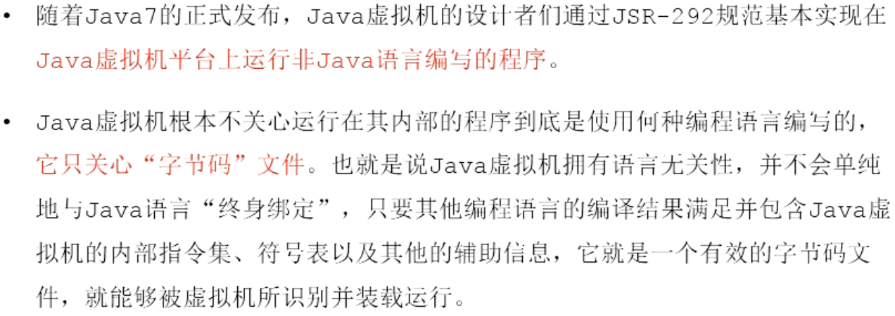
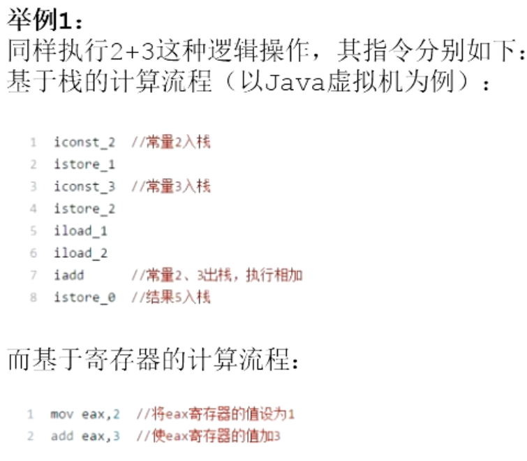
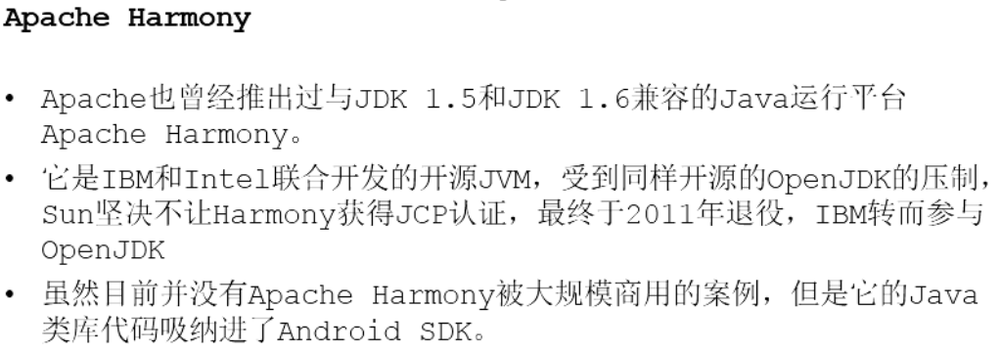
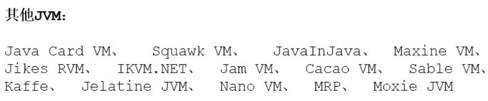
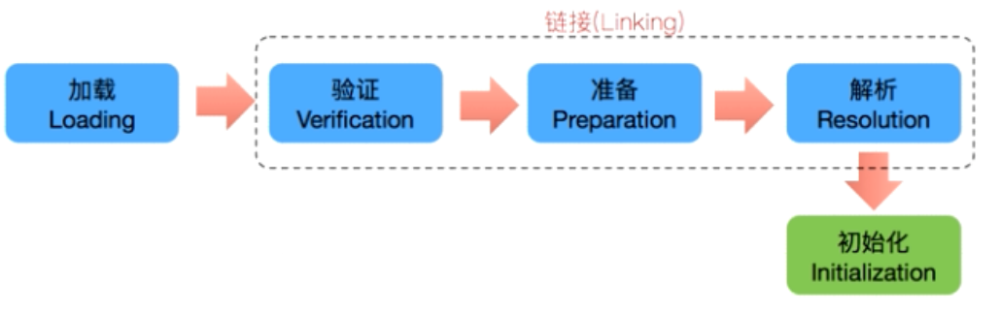

 

参考书籍：《Java虚拟机规范》《深入理解java虚拟机》《深入理解JVM》《揭秘Java虚拟机》《Java虚拟机基础教程》《实战Java虚拟机》《Java虚拟机精讲》《码出高效Java开发手册》《自己动手写Java虚拟机》

# 内存与垃圾回收篇

## JVM基础

### JVM跨语言




### 字节码


### 多语言混合编程


### Java发展


### OpenJDK和OracleJDK


### 虚拟机


### Java虚拟机


### JVM整体结构


### Java代码执行流程


### JVM的架构模型





### JVM的生命周期


### JVM发展

#### Sun Classic VM


#### Exact VM

#### KVM和CDC


#### Azul VM


#### Liquid VM


#### Apache Harmony



#### Microsoft JVM


#### Taobao JVM


#### Dalvik VM


#### JRockit（常用）


#### J9（常用）


#### HotSpot VM（重点）


#### Graal VM（未来）


#### 其他JVM




## 类加载子系统

### 类加载简图


### 类加载详图


- Class Files：字节码文件
- Class Loader SubSystem：类加载子系统
  - Loading：加载阶段
    - BootStrap ClassLoader：引导类加载器
    - Extension ClassLoader：扩展类加载器
    - Application ClassLoader：系统类加载器
  - Linking：链接阶段
    - Verify：验证
    - Prepare：准备
    - Resolve：解析
  - Initialization：初始化阶段
    - 初始化
- Runtime Data Areas：运行时数据区
  - Method Area：方法去
  - Heap Area：堆
  - Stack Area：虚拟机栈
  - PC Registers：PC寄存器
  - Native Method Stack：本地方法栈
- Execution Engine：执行引擎
  - Interpreter：解释器
  - JIT Compiler：即时编译器
    - Intermediate Code Generator：中间代码生成器
    - Code Optimizer：代码优化器
    - Targer Code Generator：目标代码生成器
    - Profiler：分析器
  - Garbage Collection：垃圾回收器
- Native Method Interface（JNI）：本地方法接口
- Native Method Library：本地方法库

注意：手写Java虚拟机，需要考虑**类加载子系统**和**执行引擎**。

### 类加载子系统


### 类加载器ClassLoader


### 类的加载过程



示例：


#### 加载


#### 链接


#### 初始化


### 类加载器分类


#### 虚拟机自带的加载器

##### 引导类加载器


``` java
        //获取BootstrapClassLoader能够加载的api的路径
        URL[] urLs = sun.misc.Launcher.getBootstrapClassPath().getURLs();
        for (URL element : urLs) {
            System.out.println(element.toExternalForm());
        }
        //从上面的路径中随意选择一个类,来看看他的类加载器是什么:引导类加载器
        ClassLoader classLoader = Provider.class.getClassLoader();
        System.out.println(classLoader); //null，说明是引导类加载器
```

##### 扩展类加载器


``` java
        //获取扩展类加载器的加载路径
        String extDirs = System.getProperty("java.ext.dirs");
        for (String path : extDirs.split(";")) {
            System.out.println(path);
        }

        //从上面的路径中随意选择一个类,来看看他的类加载器是什么:扩展类加载器
        ClassLoader classLoader1 = CurveDB.class.getClassLoader();
        System.out.println(classLoader1);//sun.misc.Launcher$ExtClassLoader@1540e19d
```

##### 系统类加载器


``` java
        //获取系统类加载器
        ClassLoader systemClassLoader = ClassLoader.getSystemClassLoader();
        System.out.println(systemClassLoader);//sun.misc.Launcher$AppClassLoader@18b4aac2

        //获取其上层：扩展类加载器
        ClassLoader extClassLoader = systemClassLoader.getParent();
        System.out.println(extClassLoader);//sun.misc.Launcher$ExtClassLoader@1540e19d

        //获取其上层：获取不到引导类加载器
        ClassLoader bootstrapClassLoader = extClassLoader.getParent();
        System.out.println(bootstrapClassLoader);//null，说明是引导类加载器

        //对于用户自定义类来说：默认使用系统类加载器进行加载
        ClassLoader classLoader = ClassLoaderTest.class.getClassLoader();
        System.out.println(classLoader);//sun.misc.Launcher$AppClassLoader@18b4aac2

        //String类使用引导类加载器进行加载的。---> Java的核心类库都是使用引导类加载器进行加载的。
        ClassLoader classLoader1 = String.class.getClassLoader();
        System.out.println(classLoader1);//null，说明是引导类加载器
```

#### 用户自定义类加载器


示例：

``` java
public class CustomClassLoader extends ClassLoader {
    @Override
    protected Class<?> findClass(String name) throws ClassNotFoundException {

        try {
            byte[] result = getClassFromCustomPath(name);
            if(result == null){
                throw new FileNotFoundException();
            }else{
                return defineClass(name,result,0,result.length);
            }
        } catch (FileNotFoundException e) {
            e.printStackTrace();
        }

        throw new ClassNotFoundException(name);
    }

    private byte[] getClassFromCustomPath(String name){
        //从自定义路径中加载指定类:细节略
        //如果指定路径的字节码文件进行了加密，则需要在此方法中进行解密操作。
        return null;
    }

    public static void main(String[] args) {
        CustomClassLoader customClassLoader = new CustomClassLoader();
        try {
            Class<?> clazz = Class.forName("One",true,customClassLoader);
            Object obj = clazz.newInstance();
            System.out.println(obj.getClass().getClassLoader());
        } catch (Exception e) {
            e.printStackTrace();
        }
    }
}
```


#### 关于ClassLoader


注意：`ExtClassLoader`和`AppClassLoader`都是`sun.misc.Launcher`的内部类，`Launcher类`是一个java虚拟机的入口。

通过以下代码可以获取加载器：

```java
        //获取系统类加载器
        ClassLoader systemClassLoader = ClassLoader.getSystemClassLoader();
        System.out.println(systemClassLoader);//sun.misc.Launcher$AppClassLoader@18b4aac2

        //获取其上层：扩展类加载器
        ClassLoader extClassLoader = systemClassLoader.getParent();
        System.out.println(extClassLoader);//sun.misc.Launcher$ExtClassLoader@1540e19d

        //获取其上层：获取不到引导类加载器
        ClassLoader bootstrapClassLoader = extClassLoader.getParent();
        System.out.println(bootstrapClassLoader);//null，说明是引导类加载器

        //对于用户自定义类来说：默认使用系统类加载器进行加载
        ClassLoader classLoader = ClassLoaderTest.class.getClassLoader();
        System.out.println(classLoader);//sun.misc.Launcher$AppClassLoader@18b4aac2

        //String类使用引导类加载器进行加载的。---> Java的核心类库都是使用引导类加载器进行加载的。
        ClassLoader classLoader1 = String.class.getClassLoader();
        System.out.println(classLoader1);//null，说明是引导类加载器
```

##### 获取ClassLoader的方法


``` java
            //1.
            ClassLoader classLoader = Class.forName("java.lang.String").getClassLoader();
            System.out.println(classLoader);//null
            //2.
            ClassLoader classLoader1 = Thread.currentThread().getContextClassLoader();
            System.out.println(classLoader1);//sun.misc.Launcher$AppClassLoader@18b4aac2

            //3.
            ClassLoader classLoader2 = ClassLoader.getSystemClassLoader().getParent();
            System.out.println(classLoader2);//sun.misc.Launcher$ExtClassLoader@1540e19d
```

### 双亲委派机制


#### 工作原理


#### 示例


#### 优势


### 沙箱安全机制


### 其他

#### 判断同一个类


#### 对类加载器的引用


#### 类的主动使用和被动使用


## 运行时数据区


# 字节码与类的加载篇

# 性能监控与调优篇

# 面试篇


