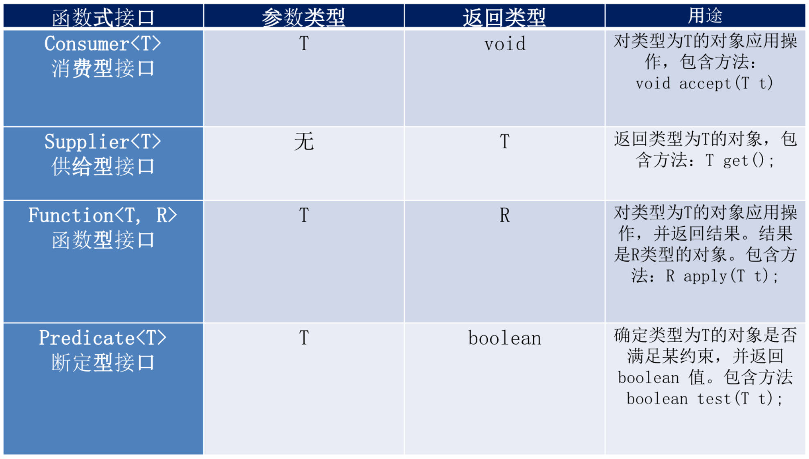

# Java8新特性

## 对Map优化

当Map中某个元素的链表长度大于8，并且总数大于64时，将数组+链表转换为数组+红黑树

## 对ConcurrentHashMap优化

concurrentLevel=16

改成了CAS算法


## 内存模型的优化

永久区（PremGen）变成了元空间（MetaSpace）

元空间（MetaSpace）使用的是物理内存

PremGenSize参数和MaxPremGenSize参数无效了

变成了MetaspaceSize和MaxMateSpaceSize


## Lambda表达式

### 示例1：Comparator匿名对象

jdk8之前：

``` java
      Comparator<String> com = new Comparator<String>(){
			@Override
			public int compare(String o1, String o2) {
				return Integer.compare(o1.length(), o2.length());
			}
		};
		
		TreeSet<String> ts = new TreeSet<>(com);
```

jdk8：

```java
Comparator<String> com = (x, y) -> Integer.compare(x.length(), y.length());
TreeSet<String> ts = new TreeSet<>(com);
```

### 示例2：根据条件过滤

#### 方案1：传统方式

```java
	List<Employee> emps = Arrays.asList(
			new Employee(101, "张三", 18, 9999.99),
			new Employee(102, "李四", 59, 6666.66),
			new Employee(103, "王五", 28, 3333.33),
			new Employee(104, "赵六", 8, 7777.77),
			new Employee(105, "田七", 38, 5555.55)
	);

	//需求：获取公司中年龄小于 35 的员工信息
	public List<Employee> filterEmployeeAge(List<Employee> emps){
		List<Employee> list = new ArrayList<>();
		
		for (Employee emp : emps) {
			if(emp.getAge() <= 35){
				list.add(emp);
			}
		}
		
		return list;
	}
	//需求：获取公司中工资大于 5000 的员工信息
	public List<Employee> filterEmployeeSalary(List<Employee> emps){
		List<Employee> list = new ArrayList<>();
		
		for (Employee emp : emps) {
			if(emp.getSalary() >= 5000){
				list.add(emp);
			}
		}
		
		return list;
	}
```

传统方式通过代码中写死规则（年龄小于 35 ），如果判断规则改变（工资大于 5000），需要重写写方法。

#### 方案2：策略设计模式

策略接口：

```java
public interface MyPredicate<T> {

	public boolean test(T t);
	
}
```

判断逻辑：

```java
	public List<Employee> filterEmployee(List<Employee> emps, MyPredicate<Employee> mp){
		List<Employee> list = new ArrayList<>();
		
		for (Employee employee : emps) {
			if(mp.test(employee)){
				list.add(employee);
			}
		}
		
		return list;
	}
```

年龄判断策略：

```java
public class FilterEmployeeForAge implements MyPredicate<Employee>{

	@Override
	public boolean test(Employee t) {
		return t.getAge() <= 35;
	}

}
```

工资判断策略：

```java
public class FilterEmployeeForSalary implements MyPredicate<Employee> {

	@Override
	public boolean test(Employee t) {
		return t.getSalary() >= 5000;
	}

}
```

测试：

```java
	List<Employee> emps = Arrays.asList(
			new Employee(101, "张三", 18, 9999.99),
			new Employee(102, "李四", 59, 6666.66),
			new Employee(103, "王五", 28, 3333.33),
			new Employee(104, "赵六", 8, 7777.77),
			new Employee(105, "田七", 38, 5555.55)
	);
        List<Employee> list = filterEmployee(emps, new FilterEmployeeForAge());
		for (Employee employee : list) {
			System.out.println(employee);
		}
		
		System.out.println("------------------------------------------");
		
		List<Employee> list2 = filterEmployee(emps, new FilterEmployeeForSalary());
		for (Employee employee : list2) {
			System.out.println(employee);
		}
```

#### 方案3：匿名内部类

策略接口：

```java
public interface MyPredicate<T> {

	public boolean test(T t);
	
}
```

判断逻辑：

```java
	public List<Employee> filterEmployee(List<Employee> emps, MyPredicate<Employee> mp){
		List<Employee> list = new ArrayList<>();
		
		for (Employee employee : emps) {
			if(mp.test(employee)){
				list.add(employee);
			}
		}
		
		return list;
	}
```

测试：

``` java
		List<Employee> list = filterEmployee(emps, new MyPredicate<Employee>() {
			@Override
			public boolean test(Employee t) {
				return t.getId() <= 103;
			}
		});
		
		for (Employee employee : list) {
			System.out.println(employee);
		}
```

#### 方案4：Lambda表达式

策略接口：

```java
@FunctionalInterface
public interface MyPredicate<T> {

	public boolean test(T t);
	
}
```

判断逻辑：

```java
	public List<Employee> filterEmployee(List<Employee> emps, MyPredicate<Employee> mp){
		List<Employee> list = new ArrayList<>();
		
		for (Employee employee : emps) {
			if(mp.test(employee)){
				list.add(employee);
			}
		}
		
		return list;
	}
```

测试：

``` java
		List<Employee> list = filterEmployee(emps, (e) -> e.getAge() <= 35);
		list.forEach(System.out::println);
		
		System.out.println("------------------------------------------");
		
		List<Employee> list2 = filterEmployee(emps, (e) -> e.getSalary() >= 5000);
		list2.forEach(System.out::println);
```

#### 方案5：Stream API

```java
	List<Employee> emps = Arrays.asList(
			new Employee(101, "张三", 18, 9999.99),
			new Employee(102, "李四", 59, 6666.66),
			new Employee(103, "王五", 28, 3333.33),
			new Employee(104, "赵六", 8, 7777.77),
			new Employee(105, "田七", 38, 5555.55)
	);
		emps.stream()
			.filter((e) -> e.getAge() <= 35)
			.forEach(System.out::println);
		
		System.out.println("----------------------------------------------");
		
		emps.stream()
			.map(Employee::getName)
			.limit(3)
			.sorted()
			.forEach(System.out::println);
```

### Lambda基本语法

- ```
  Lambda 表达式的基础语法：Java8中引入了一个新的操作符 "->" 该操作符称为箭头操作符或 Lambda 操作符，箭头操作符将 Lambda 表达式拆分成两部分：
      左侧：Lambda 表达式的参数列表
      右侧：Lambda 表达式中所需执行的功能， 即 Lambda 体
  ```

- ```
  语法格式一：无参数，无返回值
  () -> System.out.println("Hello Lambda!");
  
  ```

  ```
  Runnable r1 = () -> System.out.println("Hello Lambda!");
  r1.run();
  ```

- ```
  语法格式二：有一个参数，并且无返回值
  (x) -> System.out.println(x)
  
  		Consumer<String> con = x -> System.out.println(x);
  		con.accept("陈铁锋，你好啊！");
  ```

- ```
  语法格式三：若只有一个参数，小括号可以省略不写
  x -> System.out.println(x)
  ```

- ```
  语法格式四：有两个以上的参数，有返回值，并且 Lambda 体中有多条语句
   		Comparator<Integer> com = (x, y) -> {
   			System.out.println("函数式接口");
   			return Integer.compare(x, y);
   		};
  ```

- ```
  语法格式五：若 Lambda 体中只有一条语句， return 和 大括号都可以省略不写
  Comparator<Integer> com = (x, y) -> Integer.compare(x, y);
  ```

- ```
  语法格式六：Lambda 表达式的参数列表的数据类型可以省略不写，因为JVM编译器通过上下文推断出，数据类型，即“类型推断”
  (Integer x, Integer y) -> Integer.compare(x, y);
  ```

- ```
  二、Lambda 表达式需要“函数式接口”的支持
  函数式接口：接口中只有一个抽象方法的接口，称为函数式接口。 可以使用注解 @FunctionalInterface 修饰可以检查是否是函数式接口
  ```

#### 类型推断

​		上述 Lambda 表达式中的参数类型都是由编译器推断得出的。Lambda 表达式中无需指定类型，程序依然可以编译，这是因为 javac 根据程序的上下文，在后台推断出了参数的类型。Lambda 表达式的类型依赖于上
下文环境，是由编译器推断出来的。这就是所谓的“类型推断”。

#### 示例：Comparator

```java
        List<Employee> emps = Arrays.asList(
                new Employee(101, "张三", 18, 9999.99),
                new Employee(102, "李四", 59, 6666.66),
                new Employee(103, "王五", 28, 3333.33),
                new Employee(104, "赵六", 8, 7777.77),
                new Employee(105, "田七", 38, 5555.55)
        );

        Collections.sort(emps,(e1,e2)->{
            if(e1.getAge()==e2.getAge()){
                return e1.getName().compareTo(e2.getName());
            }else{
                return Integer.compare(e1.getAge(),e2.getAge());
            }
        });
```


## 函数式接口

- 只包含一个抽象方法的接口，称为函数式接口。
- 你可以通过 Lambda 表达式来创建该接口的对象。（若 Lambda 表达式抛出一个受检异常，那么该异常需要在目标接口的抽象方法上进行声明）。
- 我们可以在任意函数式接口上使用 @FunctionalInterface 注解，这样做可以检查它是否是一个函数式接口，同时 javadoc 也会包含一条声明，说明这个接口是一个函数式接口。

### 自定义函数式接口

如：

```java
@FunctionalInterface
public interface MyFun<T> {

	public T getValue(T t);
	
}
```

定义操作方法：

```java
	public Integer operation(Integer num, MyFun<Integer> mf){
		return mf.getValue(num);
	}
```

测试

```java
		Integer num = operation(100, (x) -> x * x);
		System.out.println(num);
		
		System.out.println(operation(200, (y) -> y + 200));
```

### Java8内置四大核心函数式接口



#### `Consumer<T>`

源码：

```java
@FunctionalInterface
public interface Consumer<T> {
    /**
     * Performs this operation on the given argument.
     *
     * @param t the input argument
     */
   void accept(T t);

   default Consumer<T> andThen(Consumer<? super T> after) {
        Objects.requireNonNull(after);
        return (T t) -> { accept(t); after.accept(t); };
    }
}
```


#### `Supplier<T>`

源码：

``` java
@FunctionalInterface
public interface Supplier<T> {

    /**
     * Gets a result.
     *
     * @return a result
     */
    T get();
}
```


#### `Function<T, R>`

源码：

``` java
@FunctionalInterface
public interface Function<T, R> {
    /**
     * Applies this function to the given argument.
     *
     * @param t the function argument
     * @return the function result
     */
    R apply(T t);
    
    default <V> Function<V, R> compose(Function<? super V, ? extends T> before) {
        Objects.requireNonNull(before);
        return (V v) -> apply(before.apply(v));
    }
    
    default <V> Function<T, V> andThen(Function<? super R, ? extends V> after) {
        Objects.requireNonNull(after);
        return (T t) -> after.apply(apply(t));
    }
    
    static <T> Function<T, T> identity() {
        return t -> t;
    }
}
```


#### `Predicate<T>`

源码：

``` java
@FunctionalInterface
public interface Predicate<T> {
    /**
     * Evaluates this predicate on the given argument.
     *
     * @param t the input argument
     * @return {@code true} if the input argument matches the predicate,
     * otherwise {@code false}
     */
    boolean test(T t);
    
    default Predicate<T> and(Predicate<? super T> other) {
        Objects.requireNonNull(other);
        return (t) -> test(t) && other.test(t);
    }
    
    default Predicate<T> negate() {
        return (t) -> !test(t);
    }
    
    default Predicate<T> or(Predicate<? super T> other) {
        Objects.requireNonNull(other);
        return (t) -> test(t) || other.test(t);
    }
    
    static <T> Predicate<T> isEqual(Object targetRef) {
        return (null == targetRef)
                ? Objects::isNull
                : object -> targetRef.equals(object);
    }
}
```


## 方法引用和构造器引用

## Stream API

## 接口中的默认方法与静态方法

## 新时间日期API

## Optional

Optional用于最大化的减少空指针异常。


## 其他特性


