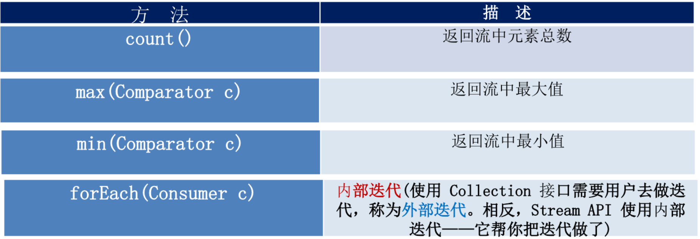

```Java8新特性

```

## 对Map优化

当Map中某个元素的链表长度大于8，并且总数大于64时，将数组+链表转换为数组+红黑树

## 对ConcurrentHashMap优化

concurrentLevel=16

改成了CAS算法


## 内存模型的优化

永久区（PremGen）变成了元空间（MetaSpace）

元空间（MetaSpace）使用的是物理内存

PremGenSize参数和MaxPremGenSize参数无效了

变成了MetaspaceSize和MaxMateSpaceSize


## Lambda表达式

### 示例1：Comparator匿名对象

jdk8之前：

``` java
      Comparator<String> com = new Comparator<String>(){
			@Override
			public int compare(String o1, String o2) {
				return Integer.compare(o1.length(), o2.length());
			}
		};
		
		TreeSet<String> ts = new TreeSet<>(com);
```

jdk8：

```java
Comparator<String> com = (x, y) -> Integer.compare(x.length(), y.length());
TreeSet<String> ts = new TreeSet<>(com);
```

### 示例2：根据条件过滤

#### 方案1：传统方式

```java
	List<Employee> emps = Arrays.asList(
			new Employee(101, "张三", 18, 9999.99),
			new Employee(102, "李四", 59, 6666.66),
			new Employee(103, "王五", 28, 3333.33),
			new Employee(104, "赵六", 8, 7777.77),
			new Employee(105, "田七", 38, 5555.55)
	);

	//需求：获取公司中年龄小于 35 的员工信息
	public List<Employee> filterEmployeeAge(List<Employee> emps){
		List<Employee> list = new ArrayList<>();
		
		for (Employee emp : emps) {
			if(emp.getAge() <= 35){
				list.add(emp);
			}
		}
		
		return list;
	}
	//需求：获取公司中工资大于 5000 的员工信息
	public List<Employee> filterEmployeeSalary(List<Employee> emps){
		List<Employee> list = new ArrayList<>();
		
		for (Employee emp : emps) {
			if(emp.getSalary() >= 5000){
				list.add(emp);
			}
		}
		
		return list;
	}
```

传统方式通过代码中写死规则（年龄小于 35 ），如果判断规则改变（工资大于 5000），需要重写写方法。

#### 方案2：策略设计模式

策略接口：

```java
public interface MyPredicate<T> {

	public boolean test(T t);
	
}
```

判断逻辑：

```java
	public List<Employee> filterEmployee(List<Employee> emps, MyPredicate<Employee> mp){
		List<Employee> list = new ArrayList<>();
		
		for (Employee employee : emps) {
			if(mp.test(employee)){
				list.add(employee);
			}
		}
		
		return list;
	}
```

年龄判断策略：

```java
public class FilterEmployeeForAge implements MyPredicate<Employee>{

	@Override
	public boolean test(Employee t) {
		return t.getAge() <= 35;
	}

}
```

工资判断策略：

```java
public class FilterEmployeeForSalary implements MyPredicate<Employee> {

	@Override
	public boolean test(Employee t) {
		return t.getSalary() >= 5000;
	}

}
```

测试：

```java
	List<Employee> emps = Arrays.asList(
			new Employee(101, "张三", 18, 9999.99),
			new Employee(102, "李四", 59, 6666.66),
			new Employee(103, "王五", 28, 3333.33),
			new Employee(104, "赵六", 8, 7777.77),
			new Employee(105, "田七", 38, 5555.55)
	);
        List<Employee> list = filterEmployee(emps, new FilterEmployeeForAge());
		for (Employee employee : list) {
			System.out.println(employee);
		}
		
		System.out.println("------------------------------------------");
		
		List<Employee> list2 = filterEmployee(emps, new FilterEmployeeForSalary());
		for (Employee employee : list2) {
			System.out.println(employee);
		}
```

#### 方案3：匿名内部类

策略接口：

```java
public interface MyPredicate<T> {

	public boolean test(T t);
	
}
```

判断逻辑：

```java
	public List<Employee> filterEmployee(List<Employee> emps, MyPredicate<Employee> mp){
		List<Employee> list = new ArrayList<>();
		
		for (Employee employee : emps) {
			if(mp.test(employee)){
				list.add(employee);
			}
		}
		
		return list;
	}
```

测试：

``` java
		List<Employee> list = filterEmployee(emps, new MyPredicate<Employee>() {
			@Override
			public boolean test(Employee t) {
				return t.getId() <= 103;
			}
		});
		
		for (Employee employee : list) {
			System.out.println(employee);
		}
```

#### 方案4：Lambda表达式

策略接口：

```java
@FunctionalInterface
public interface MyPredicate<T> {

	public boolean test(T t);
	
}
```

判断逻辑：

```java
	public List<Employee> filterEmployee(List<Employee> emps, MyPredicate<Employee> mp){
		List<Employee> list = new ArrayList<>();
		
		for (Employee employee : emps) {
			if(mp.test(employee)){
				list.add(employee);
			}
		}
		
		return list;
	}
```

测试：

``` java
		List<Employee> list = filterEmployee(emps, (e) -> e.getAge() <= 35);
		list.forEach(System.out::println);
		
		System.out.println("------------------------------------------");
		
		List<Employee> list2 = filterEmployee(emps, (e) -> e.getSalary() >= 5000);
		list2.forEach(System.out::println);
```

#### 方案5：Stream API

```java
	List<Employee> emps = Arrays.asList(
			new Employee(101, "张三", 18, 9999.99),
			new Employee(102, "李四", 59, 6666.66),
			new Employee(103, "王五", 28, 3333.33),
			new Employee(104, "赵六", 8, 7777.77),
			new Employee(105, "田七", 38, 5555.55)
	);
		emps.stream()
			.filter((e) -> e.getAge() <= 35)
			.forEach(System.out::println);
		
		System.out.println("----------------------------------------------");
		
		emps.stream()
			.map(Employee::getName)
			.limit(3)
			.sorted()
			.forEach(System.out::println);
```

### Lambda基本语法

- ```
  Lambda 表达式的基础语法：Java8中引入了一个新的操作符 "->" 该操作符称为箭头操作符或 Lambda 操作符，箭头操作符将 Lambda 表达式拆分成两部分：
      左侧：Lambda 表达式的参数列表
      右侧：Lambda 表达式中所需执行的功能， 即 Lambda 体
  ```

- ```
  语法格式一：无参数，无返回值
  () -> System.out.println("Hello Lambda!");
  
  ```

  ```
  Runnable r1 = () -> System.out.println("Hello Lambda!");
  r1.run();
  ```

- ```
  语法格式二：有一个参数，并且无返回值
  (x) -> System.out.println(x)
  
  		Consumer<String> con = x -> System.out.println(x);
  		con.accept("陈铁锋，你好啊！");
  ```

- ```
  语法格式三：若只有一个参数，小括号可以省略不写
  x -> System.out.println(x)
  ```

- ```
  语法格式四：有两个以上的参数，有返回值，并且 Lambda 体中有多条语句
   		Comparator<Integer> com = (x, y) -> {
   			System.out.println("函数式接口");
   			return Integer.compare(x, y);
   		};
  ```

- ```
  语法格式五：若 Lambda 体中只有一条语句， return 和 大括号都可以省略不写
  Comparator<Integer> com = (x, y) -> Integer.compare(x, y);
  ```

- ```
  语法格式六：Lambda 表达式的参数列表的数据类型可以省略不写，因为JVM编译器通过上下文推断出，数据类型，即“类型推断”
  (Integer x, Integer y) -> Integer.compare(x, y);
  ```

- ```
  二、Lambda 表达式需要“函数式接口”的支持
  函数式接口：接口中只有一个抽象方法的接口，称为函数式接口。 可以使用注解 @FunctionalInterface 修饰可以检查是否是函数式接口
  ```

#### 类型推断

​		上述 Lambda 表达式中的参数类型都是由编译器推断得出的。Lambda 表达式中无需指定类型，程序依然可以编译，这是因为 javac 根据程序的上下文，在后台推断出了参数的类型。Lambda 表达式的类型依赖于上
下文环境，是由编译器推断出来的。这就是所谓的“类型推断”。

#### 示例：Comparator

```java
        List<Employee> emps = Arrays.asList(
                new Employee(101, "张三", 18, 9999.99),
                new Employee(102, "李四", 59, 6666.66),
                new Employee(103, "王五", 28, 3333.33),
                new Employee(104, "赵六", 8, 7777.77),
                new Employee(105, "田七", 38, 5555.55)
        );

        Collections.sort(emps,(e1,e2)->{
            if(e1.getAge()==e2.getAge()){
                return e1.getName().compareTo(e2.getName());
            }else{
                return Integer.compare(e1.getAge(),e2.getAge());
            }
        });
```


## 函数式接口

- 只包含一个抽象方法的接口，称为函数式接口。
- 你可以通过 Lambda 表达式来创建该接口的对象。（若 Lambda 表达式抛出一个受检异常，那么该异常需要在目标接口的抽象方法上进行声明）。
- 我们可以在任意函数式接口上使用 @FunctionalInterface 注解，这样做可以检查它是否是一个函数式接口，同时 javadoc 也会包含一条声明，说明这个接口是一个函数式接口。

### 自定义函数式接口

如：

```java
@FunctionalInterface
public interface MyFun<T> {

	public T getValue(T t);
	
}
```

定义操作方法：

```java
	public Integer operation(Integer num, MyFun<Integer> mf){
		return mf.getValue(num);
	}
```

测试

```java
		Integer num = operation(100, (x) -> x * x);
		System.out.println(num);
		
		System.out.println(operation(200, (y) -> y + 200));
```

### Java8内置四大核心函数式接口


#### `Consumer<T>`

源码：

```java
@FunctionalInterface
public interface Consumer<T> {
    /**
     * Performs this operation on the given argument.
     *
     * @param t the input argument
     */
   void accept(T t);

   default Consumer<T> andThen(Consumer<? super T> after) {
        Objects.requireNonNull(after);
        return (T t) -> { accept(t); after.accept(t); };
    }
}
```

##### 示例：

``` java
	public void test1(){
		happy(10000, (m) -> System.out.println("去唱歌，每次消费：" + m + "元"));
	} 
	
	public void happy(double money, Consumer<Double> con){
		con.accept(money);
	}
```


#### `Supplier<T>`

源码：

``` java
@FunctionalInterface
public interface Supplier<T> {

    /**
     * Gets a result.
     *
     * @return a result
     */
    T get();
}
```

##### 示例：

```java
	public void test2(){
		List<Integer> numList = getNumList(10, () -> (int)(Math.random() * 100));
		
		for (Integer num : numList) {
			System.out.println(num);
		}
	}
	
	//需求：产生指定个数的整数，并放入集合中
	public List<Integer> getNumList(int num, Supplier<Integer> sup){
		List<Integer> list = new ArrayList<>();
		
		for (int i = 0; i < num; i++) {
			Integer n = sup.get();
			list.add(n);
		}
		
		return list;
	}
```


#### `Function<T, R>`

源码：

``` java
@FunctionalInterface
public interface Function<T, R> {
    /**
     * Applies this function to the given argument.
     *
     * @param t the function argument
     * @return the function result
     */
    R apply(T t);
    
    default <V> Function<V, R> compose(Function<? super V, ? extends T> before) {
        Objects.requireNonNull(before);
        return (V v) -> apply(before.apply(v));
    }
    
    default <V> Function<T, V> andThen(Function<? super R, ? extends V> after) {
        Objects.requireNonNull(after);
        return (T t) -> after.apply(apply(t));
    }
    
    static <T> Function<T, T> identity() {
        return t -> t;
    }
}
```

##### 示例

```java
	public void test3(){
		String newStr = strHandler("\t\t\t 我陈铁锋很帅   ", (str) -> str.trim());
		System.out.println(newStr);
		
		String subStr = strHandler("我陈铁锋很帅", (str) -> str.substring(2, 5));
		System.out.println(subStr);
	}
	
	//需求：用于处理字符串
	public String strHandler(String str, Function<String, String> fun){
		return fun.apply(str);
	}
```


#### `Predicate<T>`

源码：

``` java
@FunctionalInterface
public interface Predicate<T> {
    /**
     * Evaluates this predicate on the given argument.
     *
     * @param t the input argument
     * @return {@code true} if the input argument matches the predicate,
     * otherwise {@code false}
     */
    boolean test(T t);
    
    default Predicate<T> and(Predicate<? super T> other) {
        Objects.requireNonNull(other);
        return (t) -> test(t) && other.test(t);
    }
    
    default Predicate<T> negate() {
        return (t) -> !test(t);
    }
    
    default Predicate<T> or(Predicate<? super T> other) {
        Objects.requireNonNull(other);
        return (t) -> test(t) || other.test(t);
    }
    
    static <T> Predicate<T> isEqual(Object targetRef) {
        return (null == targetRef)
                ? Objects::isNull
                : object -> targetRef.equals(object);
    }
}
```

示例

```java
	public void test4(){
		List<String> list = Arrays.asList("Hello", "chentiefeng", "Lambda", "www", "ok");
		List<String> strList = filterStr(list, (s) -> s.length() > 3);
		
		for (String str : strList) {
			System.out.println(str);
		}
	}
	
	//需求：将满足条件的字符串，放入集合中
	public List<String> filterStr(List<String> list, Predicate<String> pre){
		List<String> strList = new ArrayList<>();
		
		for (String str : list) {
			if(pre.test(str)){
				strList.add(str);
			}
		}
		
		return strList;
	}
```

### 其他函数式接口


## 方法引用

​		方法引用：若 Lambda 体中的功能，已经有方法提供了实现，可以使用方法引用。可以将方法引用理解为 Lambda 表达式的另外一种表现形式。

方法引用主要有三种语法格式：

- 对象 `:: `实例方法名
- 类名 `:: `静态方法名
- 类名 `:: `实例方法名

注意：

1. 方法引用所引用的方法的参数列表与返回值类型，需要与函数式接口中抽象方法的参数列表和返回值类型保持一致！

2. 若Lambda 的参数列表的第一个参数，是实例方法的调用者，第二个参数(或无参)是实例方法的参数时，格式： ClassName::MethodName，如：

   ```java
   BiPredicate<String, String> bp = (x, y) -> x.equals(y);
   ```

   方法引用使用后：

   ``` java
   		BiPredicate<String, String> bp2 = String::equals;
   		System.out.println(bp2.test("abc", "abc"));
   ```

### 对象`:: `实例方法名

#### 示例1：Consumer

```java
		PrintStream ps = System.out;
		//之前
		Consumer<String> con = (str) -> ps.println(str);
		con.accept("Hello World！");
		
		//方法引用使用之后
		Consumer<String> con2 = ps::println;
		con2.accept("Hello Java8！");
		
		//等价于
		Consumer<String> con3 = System.out::println;
```

#### 示例2：Supplier

``` java
		Employee emp = new Employee(101, "张三", 18, 9999.99);
		//之前
		Supplier<String> sup = () -> emp.getName();
		System.out.println(sup.get());
		
		//方法引用使用之后
		Supplier<String> sup2 = emp::getName;
		System.out.println(sup2.get());
```

### 类名 `:: `静态方法名

#### 示例 1：Comparator

``` java
		//之前
		Comparator<Integer> com = (x, y) -> Integer.compare(x, y);
		
		//方法引用后
		Comparator<Integer> com2 = Integer::compare;
```

#### 示例2：BiFunction

``` java
		//之前
		BiFunction<Double, Double, Double> fun = (x, y) -> Math.max(x, y);
		System.out.println(fun.apply(1.5, 22.2));
		
		//方法引用使用之后
		BiFunction<Double, Double, Double> fun2 = Math::max;
		System.out.println(fun2.apply(1.2, 1.5));
```

### 类名 `:: `实例方法名

#### 示例：BiPredicate

``` java
		//之前
		BiPredicate<String, String> bp = (x, y) -> x.equals(y);
		System.out.println(bp.test("abcde", "abcde"));
		
		//方法引用后
		BiPredicate<String, String> bp2 = String::equals;
		System.out.println(bp2.test("abc", "abc"));
```


## 构造器引用

构造器引用 :构造器的参数列表，需要与函数式接口中参数列表保持一致！

与函数式接口相结合，自动与函数式接口中方法兼容。
可以把构造器引用赋值给定义的方法，与构造器参数列表要与接口中抽象方法的参数列表一致！

语法格式： 类名 `::` new

#### 示例：使用无参构造

```java
		//之前
		Supplier<Employee> sup = () -> new Employee();
		System.out.println(sup.get());
		
		//使用构造器引用后
		Supplier<Employee> sup2 = Employee::new;
		System.out.println(sup2.get());
```

#### 示例：使用带参构造

``` java
		Function<String, Employee> fun = Employee::new;
		
		BiFunction<String, Integer, Employee> fun2 = Employee::new;
```

## 数组引用

格式： `type[] :: new`

``` java
		//之前
		Function<Integer, String[]> fun = (args) -> new String[args];
		String[] strs = fun.apply(10);
		System.out.println(strs.length);
		
		//使用数组引用后
		Function<Integer, Employee[]> fun2 = Employee[] :: new;
		Employee[] emps = fun2.apply(20);
		System.out.println(emps.length);
```


## Stream API

​		Stream 是 Java8 中处理集合的关键抽象概念，它可以指定你希望对集合进行的操作，可以执行非常复杂的查找、过滤和映射数据等操作。

​		使用Stream API 对集合数据进行操作，就类似于使用 SQL 执行的数据库查询。也可以使用 Stream API 来并行执行操作。简而言之，Stream API 提供了一种高效且易于使用的处理数据的方式。

### 什么是 Stream

流(Stream)是数据渠道，用于操作数据源（集合、数组等）所生成的元素序列。

集合讲的是数据，流讲的是计算！

注意：

- Stream 自己不会存储元素。
- Stream 不会改变源对象。相反，他们会返回一个持有结果的新Stream。
- Stream 操作是延迟执行的。这意味着他们会等到需要结果的时候才执行。

### Stream 的操作三个步骤

1、创建 Stream：一个数据源（如：集合、数组），获取一个流

2、中间操作：一个中间操作链，对数据源的数据进行处理

3、终止操作(终端操作)：一个终止操作，执行中间操作链，并产生结果

#### 1、创建 Stream

方式1：Collection 提供了两个方法  stream() 与 parallelStream()

​		Java8 中的 Collection 接口被扩展，提供了两个获取流的方法：

``` java
default Stream<E> stream() : 返回一个顺序流
default Stream<E> parallelStream() : 返回一个并行流
```

示例：

```java
		//获取一个顺序流
		Stream<String> stream = list.stream();
		//获取一个并行流
		Stream<String> parallelStream = list.parallelStream(); 
```

方法2：通过 Arrays 中的静态方法 stream() 获取一个数组流

``` java
static <T> Stream<T> stream(T[] array): 返回一个流
```

示例：

``` java
		Integer[] nums = new Integer[10];
		Stream<Integer> stream1 = Arrays.stream(nums);
```

方法3：通过 Stream 类中静态方法 of()

可以使用静态方法` Stream.of()`, 通过显示值创建一个流。它可以接收任意数量的参数

``` java
public static<T> Stream<T> of(T... values) : 返回一个流
```

示例：

```java
Stream<Integer> stream2 = Stream.of(1,2,3,4,5,6);
```

方法4：创建无限流

可以使用静态方法` Stream.iterate()` 和`Stream.generate()`, 创建无限流。

``` java
// 迭代
public static<T> Stream<T> iterate(final T seed, final UnaryOperator<T> f) 
// 生成
public static<T> Stream<T> generate(Supplier<T> s) : 
```

示例：

``` java
		Stream<Integer> stream3 = Stream.iterate(0, (x) -> x + 2).limit(10);
		stream3.forEach(System.out::println);
```

或者：

``` java
		Stream<Double> stream4 = Stream.generate(Math::random).limit(2);
		stream4.forEach(System.out::println);
```

#### 2、Stream的中间操作

多个中间操作可以连接起来形成一个流水线，除非流水线上触发终止操作，否则中间操作不会执行任何的处理！而在终止操作时一次性全部处理，称为“惰性求值”。

##### 筛选与切片


示例1：filter

``` java
	List<Employee> emps = Arrays.asList(
			new Employee(102, "李四", 59, 6666.66),
			new Employee(101, "张三", 18, 9999.99),
			new Employee(103, "王五", 28, 3333.33),
			new Employee(104, "赵六", 8, 7777.77),
			new Employee(104, "赵六", 8, 7777.77),
			new Employee(104, "赵六", 8, 7777.77),
			new Employee(105, "田七", 38, 5555.55)
	);

	//所有的中间操作不会做任何的处理
		Stream<Employee> stream = emps.stream()
			.filter((e) -> {
				System.out.println("测试中间操作");
				return e.getAge() <= 35;
			});
		
		//只有当做终止操作时，所有的中间操作会一次性的全部执行，称为“惰性求值”
		stream.forEach(System.out::println);
```

测试2：limit

```  java
		emps.stream()
			.filter((e) -> {
				System.out.println("短路！"); // &&  ||
				return e.getSalary() >= 5000;
			}).limit(3)
			.forEach(System.out::println);
```

示例3：skip

```java
		emps.parallelStream()
			.filter((e) -> e.getSalary() >= 5000)
			.skip(2)
			.forEach(System.out::println);
```

示例4：distinct

```java
		emps.stream()
			.distinct()
			.forEach(System.out::println);
```

注意：通过流所生成元素的 hashCode() 和 equals() 去除重复元素，所以需要元素重写hashCode() 和 equals() 。

##### 映射


示例：map

``` java
		Stream<String> str = emps.stream()
			.map(Employee::getName);

		List<String> strList = Arrays.asList("aaa", "bbb", "ccc", "ddd", "eee");
		
		Stream<String> stream = strList.stream()
			   .map(String::toUpperCase);
		
		stream.forEach(System.out::println);
```

示例：flatMap

``` java
	public static Stream<Character> filterCharacter(String str){
		List<Character> list = new ArrayList<>();
		
		for (Character ch : str.toCharArray()) {
			list.add(ch);
		}
		
		return list.stream();
	}

		List<String> strList = Arrays.asList("aaa", "bbb", "ccc", "ddd", "eee");
       //使用flatMap前
		Stream<Stream<Character>> stream2 = strList.stream()
			   .map(TestStreamAPI1::filterCharacter);  //{{}{}{}{}},类似add()
		
		stream2.forEach((sm) -> {
			sm.forEach(System.out::println);
		});

		//使用flatMap后
		Stream<Character> stream3 = strList.stream()
			   .flatMap(TestStreamAPI1::filterCharacter); //{}类似addAll()
		
		stream3.forEach(System.out::println);
```


##### 排序


示例1：sorted()

``` java
	List<Employee> emps = Arrays.asList(
			new Employee(102, "李四", 59, 6666.66),
			new Employee(101, "张三", 18, 9999.99),
			new Employee(103, "王五", 28, 3333.33),
			new Employee(104, "赵六", 8, 7777.77),
			new Employee(104, "赵六", 8, 7777.77),
			new Employee(104, "赵六", 8, 7777.77),
			new Employee(105, "田七", 38, 5555.55)
	);

		emps.stream()
			.map(Employee::getName)
			.sorted()
			.forEach(System.out::println);
```

示例2：sorted(Compatrator)

```java
		emps.stream()
			.sorted((x, y) -> {
				if(x.getAge() == y.getAge()){
					return x.getName().compareTo(y.getName());
				}else{
					return Integer.compare(x.getAge(), y.getAge());
				}
			}).forEach(System.out::println);
```

#### 3、终止操作

终端操作会从流的流水线生成结果。其结果可以是任何不是流的值，例如：List、Integer，甚至是 void 。

##### 查找与匹配




###### 示例1：allMatch

```java
	List<Employee> emps = Arrays.asList(
			new Employee(102, "李四", 59, 6666.66, Status.BUSY),
			new Employee(101, "张三", 18, 9999.99, Status.FREE),
			new Employee(103, "王五", 28, 3333.33, Status.VOCATION),
			new Employee(104, "赵六", 8, 7777.77, Status.BUSY),
			new Employee(104, "赵六", 8, 7777.77, Status.FREE),
			new Employee(104, "赵六", 8, 7777.77, Status.FREE),
			new Employee(105, "田七", 38, 5555.55, Status.BUSY)
        
            boolean bl = emps.stream()
				.allMatch((e) -> e.getStatus().equals(Status.BUSY));
			
			System.out.println(bl);//false
```

###### 示例2：anyMatch

```java
			boolean bl1 = emps.stream()
				.anyMatch((e) -> e.getStatus().equals(Status.BUSY));
			
			System.out.println(bl1);//true
```

###### 示例3：noneMatch

``` java
			boolean bl2 = emps.stream()
				.noneMatch((e) -> e.getStatus().equals(Status.BUSY));
			
			System.out.println(bl2);
```

###### 示例4：findFirst

``` java
		Optional<Employee> op = emps.stream()
			.sorted((e1, e2) -> Double.compare(e1.getSalary(), e2.getSalary()))
			.findFirst();
		
		System.out.println(op.get());
```

###### 示例5：findAny

``` java
		Optional<Employee> op2 = emps.parallelStream()
			.filter((e) -> e.getStatus().equals(Status.FREE))
			.findAny();
		
		System.out.println(op2.get());
```

###### 示例6：count总数

``` java
		long count = emps.stream()
						 .filter((e) -> e.getStatus().equals(Status.FREE))
						 .count();
		
		System.out.println(count);
```

###### 示例7：max最大

``` java
		Optional<Double> op = emps.stream()
			.map(Employee::getSalary)
			.max(Double::compare);
		
		System.out.println(op.get());
```

###### 示例8：min最小

``` java
		Optional<Employee> op2 = emps.stream()
			.min((e1, e2) -> Double.compare(e1.getSalary(), e2.getSalary()));
		
		System.out.println(op2.get());
```


##### 归约


备注：map 和 reduce 的连接通常称为 map-reduce 模式，因 Google 用它来进行网络搜索而出名。

###### 示例1：reduce

``` java
		List<Integer> list = Arrays.asList(1,2,3,4,5,6,7,8,9,10);
		
		Integer sum = list.stream()
			.reduce(0, (x, y) -> x + y);
		
		System.out.println(sum); //55
```

###### 示例2：reduce(BinaryOperator)

``` java
		Optional<Double> op = emps.stream()
			.map(Employee::getSalary)
			.reduce(Double::sum);
		
		System.out.println(op.get());
```

###### 示例3：搜索名字中 “六” 出现的次数

``` java
		Optional<Integer> sum = emps.stream()
			.map(Employee::getName)
			.flatMap(TestStreamAPI1::filterCharacter)
			.map((ch) -> {
				if(ch.equals('六'))
					return 1;
				else 
					return 0;
			}).reduce(Integer::sum);
		
		System.out.println(sum.get());
```


##### 收集


collect——将流转换为其他形式。接收一个 Collector接口的实现，用于给Stream中元素做汇总的方法.

Collector 接口中方法的实现决定了如何对流执行收集操作(如收集到 List、Set、Map)。但是 Collectors 实用类提供了很多静态方法，可以方便地创建常见收集器实例，具体方法与实例如下表：


###### 示例1：Collectors.toList()

``` java
		List<String> list = emps.stream()
			.map(Employee::getName)
			.collect(Collectors.toList());
		
		list.forEach(System.out::println);
```

###### 示例2：Collectors.toSet()

``` java
		Set<String> set = emps.stream()
			.map(Employee::getName)
			.collect(Collectors.toSet());
		
		set.forEach(System.out::println);
```

###### 示例3：Collectors.toCollection(HashSet::new)

``` java
		HashSet<String> hs = emps.stream()
			.map(Employee::getName)
			.collect(Collectors.toCollection(HashSet::new));
		
		hs.forEach(System.out::println);
```

###### 示例4：总数Collectors.counting()

``` java
		Long count = emps.stream()
			.collect(Collectors.counting());
		
		System.out.println(count);
```

###### 示例5：平均Collectors.averagingDouble

``` java
		Double avg = emps.stream()
			.collect(Collectors.averagingDouble(Employee::getSalary));
		
		System.out.println(avg);
```

###### 示例6：总和Collectors.summingDouble

``` java
		Double sum = emps.stream()
			.collect(Collectors.summingDouble(Employee::getSalary));
```

###### 示例7：最大Collectors.maxBy

``` java
		Optional<Double> max = emps.stream()
			.map(Employee::getSalary)
			.collect(Collectors.maxBy(Double::compare));
		
		System.out.println(max.get());
```

###### 示例8：最小Collectors.minBy

``` java
		Optional<Employee> op = emps.stream()
			.collect(Collectors.minBy((e1, e2) -> Double.compare(e1.getSalary(), e2.getSalary())));
		
		System.out.println(op.get());
```

###### 示例9：收集summarizingDouble

summarizingDouble可以将元素组成集合，然后可以做多种汇总操作。

``` java
		DoubleSummaryStatistics dss = emps.stream()
			.collect(Collectors.summarizingDouble(Employee::getSalary));
		
		System.out.println(dss.getMax());
		System.out.println(dss.getMin());
		System.out.println(dss.getSum());
```

###### 示例10：分组groupingBy

``` java
		Map<Status, List<Employee>> map = emps.stream()
			.collect(Collectors.groupingBy(Employee::getStatus));
		
		System.out.println(map);
```

###### 示例11：多级分组groupingBy

``` java
		Map<Status, Map<String, List<Employee>>> map = emps.stream()
			.collect(Collectors.groupingBy(Employee::getStatus, Collectors.groupingBy((e) -> {
				if(e.getAge() >= 60)
					return "老年";
				else if(e.getAge() >= 35)
					return "中年";
				else
					return "成年";
			})));
		
		System.out.println(map);
```

###### 示例12：分区partitioningBy

满足条件的是一个区，不满足条件的是另一个区

``` java
		Map<Boolean, List<Employee>> map = emps.stream()
			.collect(Collectors.partitioningBy((e) -> e.getSalary() >= 5000));
		
		System.out.println(map);
```

###### 示例13：连接Collectors.joining

``` java
		String str = emps.stream()
			.map(Employee::getName)
			.collect(Collectors.joining("," , "----", "----"));
		
		System.out.println(str);
```

注意：

```java
joining(CharSequence delimiter,CharSequence prefix,CharSequence suffix) 
```

###### 示例14：reducing

``` java
		Optional<Double> sum = emps.stream()
			.map(Employee::getSalary)
			.collect(Collectors.reducing(Double::sum));
		
		System.out.println(sum.get());
```

#### 示例：StreamAPI运用

##### 示例1：给定一个数字列表，如何返回一个由每个数的平方构成的列表呢？

``` java
		Integer[] nums = new Integer[]{1,2,3,4,5};
		
		Arrays.stream(nums)
			  .map((x) -> x * x)
			  .forEach(System.out::println);
```

##### 示例2：怎样用 map 和 reduce 方法数一数流中有多少个Employee呢？

``` java
	List<Employee> emps = Arrays.asList(
			new Employee(102, "李四", 59, 6666.66, Status.BUSY),
			new Employee(101, "张三", 18, 9999.99, Status.FREE),
			new Employee(103, "王五", 28, 3333.33, Status.VOCATION),
			new Employee(104, "赵六", 8, 7777.77, Status.BUSY),
			new Employee(104, "赵六", 8, 7777.77, Status.FREE),
			new Employee(104, "赵六", 8, 7777.77, Status.FREE),
			new Employee(105, "田七", 38, 5555.55, Status.BUSY)
	);

		Optional<Integer> count = emps.stream()
			.map((e) -> 1)
			.reduce(Integer::sum);
		
		System.out.println(count.get());
```

##### 示例3：交易员和交易示例

``` java
		Trader raoul = new Trader("Raoul", "Cambridge");
		Trader mario = new Trader("Mario", "Milan");
		Trader alan = new Trader("Alan", "Cambridge");
		Trader brian = new Trader("Brian", "Cambridge");
		
		transactions = Arrays.asList(
				new Transaction(brian, 2011, 300),
				new Transaction(raoul, 2012, 1000),
				new Transaction(raoul, 2011, 400),
				new Transaction(mario, 2012, 710),
				new Transaction(mario, 2012, 700),
				new Transaction(alan, 2012, 950)
		);
```

1. 找出2011年发生的所有交易， 并按交易额排序（从低到高）

   ``` java
   		transactions.stream()
   					.filter((t) -> t.getYear() == 2011)
   					.sorted((t1, t2) -> Integer.compare(t1.getValue(), t2.getValue()))
   					.forEach(System.out::println);
   ```

2. 交易员都在哪些不同的城市工作过？

   ``` java
   	public void test2(){
   		transactions.stream()
   					.map((t) -> t.getTrader().getCity())
   					.distinct()
   					.forEach(System.out::println);
   ```

3. 查找所有来自剑桥的交易员，并按姓名排序

   ``` java
   		transactions.stream()
   					.filter((t) -> t.getTrader().getCity().equals("Cambridge"))
   					.map(Transaction::getTrader)
   					.sorted((t1, t2) -> t1.getName().compareTo(t2.getName()))
   					.distinct()
   					.forEach(System.out::println);
   ```

4. 返回所有交易员的姓名字符串，按字母顺序排序

   ``` java
   		String str = transactions.stream()
   					.map((t) -> t.getTrader().getName())
   					.sorted()
   					.reduce("", String::concat);
   ```

5. 有没有交易员是在米兰工作的？

   ``` java
   		boolean bl = transactions.stream()
   					.anyMatch((t) -> t.getTrader().getCity().equals("Milan"));
   		
   		System.out.println(bl);
   ```

6. 打印生活在剑桥的交易员的所有交易额

   ``` java
   		Optional<Integer> sum = transactions.stream()
   					.filter((e) -> e.getTrader().getCity().equals("Cambridge"))
   					.map(Transaction::getValue)
   					.reduce(Integer::sum);
   		
   		System.out.println(sum.get());
   ```

7. 所有交易中，最高的交易额是多少

   ``` java
   		Optional<Integer> max = transactions.stream()
   					.map((t) -> t.getValue())
   					.max(Integer::compare);
   		
   		System.out.println(max.get());
   ```

8. 找到交易额最小的交易

   ``` java
   		Optional<Transaction> op = transactions.stream()
   					.min((t1, t2) -> Integer.compare(t1.getValue(), t2.getValue()));
   		
   		System.out.println(op.get());
   ```

   

## 并行流

​		**并行流就是把一个内容分成多个数据块，并用不同的线程分别处理每个数据块的流**。
​		Java 8 中将并行进行了优化，我们可以很容易的对数据进行**并行操作**。Stream API 可以声明性地通过 **`parallel()`** 与**`sequential() `**在并行流与顺序流之间进行切换。

可以参考：[多线程的Fork/Join 框架](https://github.com/ichentiefeng/learning/blob/master/java/java%E5%A4%9A%E7%BA%BF%E7%A8%8B.md#forkjoin-%E6%A1%86%E6%9E%B6)

### 示例：Java8并行流

```java
		Long sum = LongStream.rangeClosed(0L, 10000000000L)
							 .parallel()  //并行流
							 .sum();
		
		System.out.println(sum);
```


## 接口中的默认方法与静态方法

### 接口中的默认方法

Java 8中允许接口中包含具有具体实现的方法，该方法称为“默认方法”，默认方法使用 default 关键字修饰。

``` java
public interface MyFun {
	
	default String getName(){
		return "陈铁锋";
	}

}
```

#### 接口默认方法的”类优先”原则

若一个接口中定义了一个默认方法，而另外一个父类或接口中又定义了一个同名的方法时

-  选择父类中的方法。如果一个父类提供了具体的实现，那么接口中具有相同名称和参数的默认方法会被忽略。
- 接口冲突。如果一个父接口提供一个默认方法，而另一个接口也提供了一个具有相同名称和参数列表的方法（不管方法是否是默认方法），那么必须覆盖该方法来解决冲突


### 接口中的静态方法

Java8 中，接口中允许添加静态方法。

``` java
public interface MyInterface {
	
	default String getName(){
		return "呵呵呵";
	}
	
	public static void show(){
		System.out.println("接口中的静态方法");
	}

}
```

## 新时间日期API

###  LocalDate、LocalTime、LocalDateTime

使用 LocalDate、LocalTime、LocalDateTime

LocalDate、LocalTime、LocalDateTime 类的实例是不可变的对象，分别表示使用 ISO-8601日历系统的日期、时间、日期和时间。它们提供了简单的日期或时间，并不包含当前的时间信息。也不包含与时区相关的信息。

注：ISO-8601日历系统是国际标准化组织制定的现代公民的日期和时间的表示法


#### 示例1：该实例可以解决SimpleDateFormat的转换线程安全问题

``` java
		DateTimeFormatter dtf = DateTimeFormatter.ofPattern("yyyyMMdd");
		
		Callable<LocalDate> task = new Callable<LocalDate>() {

			@Override
			public LocalDate call() throws Exception {
				LocalDate ld = LocalDate.parse("20161121", dtf);
				return ld;
			}
			
		};

		ExecutorService pool = Executors.newFixedThreadPool(10);
		
		List<Future<LocalDate>> results = new ArrayList<>();
		
		for (int i = 0; i < 10; i++) {
			results.add(pool.submit(task));
		}
		
		for (Future<LocalDate> future : results) {
			System.out.println(future.get());
		}
		
		pool.shutdown();
```

#### 示例2：LocalDateTime

``` java
		LocalDateTime ldt = LocalDateTime.now();
		System.out.println(ldt);
		
		LocalDateTime ld2 = LocalDateTime.of(2016, 11, 21, 10, 10, 10);
		System.out.println(ld2);
		
		LocalDateTime ldt3 = ld2.plusYears(20);
		System.out.println(ldt3);
		
		LocalDateTime ldt4 = ld2.minusMonths(2);
		System.out.println(ldt4);
		
		System.out.println(ldt.getYear());
		System.out.println(ldt.getMonthValue());
		System.out.println(ldt.getDayOfMonth());
		System.out.println(ldt.getHour());
		System.out.println(ldt.getMinute());
		System.out.println(ldt.getSecond());
```

### Instant 时间戳

Instant 用于“时间戳”的运算。它是以Unix元年(传统的设定为UTC时区1970年1月1日午夜时分)开始所经历的描述进行运算。

示例：

``` java
		Instant ins = Instant.now();  //默认使用 UTC 时区
		System.out.println(ins);
		
		//东8区
		OffsetDateTime odt = ins.atOffset(ZoneOffset.ofHours(8));
		System.out.println(odt);
		
		System.out.println(ins.getNano());
		
		Instant ins2 = Instant.ofEpochSecond(5);
		System.out.println(ins2);
```

### Duration 和 Period

- Duration:用于计算两个“时间”间隔

- Period:用于计算两个“日期”间隔

#### 示例：Duration

``` java
		Instant ins1 = Instant.now();
		
		System.out.println("--------------------");
		try {
			Thread.sleep(1000);
		} catch (InterruptedException e) {
		}
		
		Instant ins2 = Instant.now();
		
		System.out.println("所耗费时间为：" + Duration.between(ins1, ins2).toMillis());
```

####  示例2：Period

``` java
		LocalDate ld1 = LocalDate.now();
		LocalDate ld2 = LocalDate.of(2011, 1, 1);
		
		Period pe = Period.between(ld2, ld1);
		System.out.println(pe.getYears());
		System.out.println(pe.getMonths());
		System.out.println(pe.getDays());
```


### 日期的操纵

- TemporalAdjuster : 时间校正器。有时我们可能需要获取例如：将日期调整到“下个周日”等操作。

- TemporalAdjusters : 该类通过静态方法提供了大量的常用 TemporalAdjuster 的实现。

例如获取下个周日：

``` java
		LocalDate nextSunday=LocalDate.now().with(
				TemporalAdjusters.next(DayOfWeek.SUNDAY)
		);
```

#### 示例：下一个工作日

```java
		LocalDateTime ldt = LocalDateTime.now();
		//自定义：下一个工作日
		LocalDateTime ldt5 = ldt.with((l) -> {
			LocalDateTime ldt4 = (LocalDateTime) l;
			
			DayOfWeek dow = ldt4.getDayOfWeek();
			
			if(dow.equals(DayOfWeek.FRIDAY)){
				return ldt4.plusDays(3);
			}else if(dow.equals(DayOfWeek.SATURDAY)){
				return ldt4.plusDays(2);
			}else{
				return ldt4.plusDays(1);
			}
		});
		
		System.out.println(ldt5);
```

### 解析与格式化

java.time.format.DateTimeFormatter 类：该类提供了三种格式化方法：

- 预定义的标准格式
- 语言环境相关的格式
- 自定义的格式

示例：

``` java
		DateTimeFormatter dtf = DateTimeFormatter.ofPattern("yyyy年MM月dd日 HH:mm:ss E");
		
		LocalDateTime ldt = LocalDateTime.now();
		String strDate = ldt.format(dtf);
		
		System.out.println(strDate);
		
		LocalDateTime newLdt = ldt.parse(strDate, dtf);
		System.out.println(newLdt);
```


### 时区的处理

Java8 中加入了对时区的支持，带时区的时间为分别为：ZonedDate、ZonedTime、ZonedDateTime

其中每个时区都对应着 ID，地区ID都为 “{区域}/{城市}”的格式
例如 ：Asia/Shanghai 等

- `ZoneId`：该类中包含了所有的时区信息
- `getAvailableZoneIds()` : 可以获取所有时区时区信息
- `of(id)` : 用指定的时区信息获取 ZoneId 对象

#### 示例：获取所有时区

``` java
		Set<String> set = ZoneId.getAvailableZoneIds();
		set.forEach(System.out::println);
```

#### 示例：指定时区

``` java
		LocalDateTime ldt = LocalDateTime.now(ZoneId.of("Asia/Shanghai"));
		System.out.println(ldt);
		
		ZonedDateTime zdt = ZonedDateTime.now(ZoneId.of("US/Pacific"));
		System.out.println(zdt);
```


### 与传统日期处理的转换


## Optional

Optional用于最大化的减少空指针异常。

`Optional<T> `类(`java.util.Optional`) 是一个容器类，代表一个值存在或不存在，原来用 null 表示一个值不存在，现在 Optional 可以更好的表达这个概念。并且可以避免空指针异常。

常用方法:

- Optional.of(T t) : 创建一个 Optional 实例
- Optional.empty() : 创建一个空的 Optional 实例
- Optional.ofNullable(T t):若 t 不为 null,创建 Optional 实例,否则创建空实例
- isPresent() : 判断是否包含值
- orElse(T t) :  如果调用对象包含值，返回该值，否则返回t
- orElseGet(Supplier s) :如果调用对象包含值，返回该值，否则返回 s 获取的值
- map(Function f): 如果有值对其处理，并返回处理后的Optional，否则返回 Optional.empty()
- flatMap(Function mapper):与 map 类似，要求返回值必须是Optional

### 示例1：Optional.of

``` java
		Optional<Employee> op = Optional.of(new Employee(101, "张三", 18, 9999.99));

		System.out.println(op.get());
```

### 示例2：Optional.empty() 

``` java
		Optional<Employee> op =Optional.empty() ;//创建一个空的 Optional 实例
		
		System.out.println(op.get());
```

### 示例3：Optional.ofNullable(T t)

``` java
		Optional<Employee> op = Optional.ofNullable(new Employee(101, "张三", 18, 9999.99));  //若 t 不为 null,创建 Optional 实例,否则创建空实例

		System.out.println(op);
```

### 示例4：isPresent()

``` java
		Optional<Employee> op = Optional.ofNullable(new Employee());
		
		if(op.isPresent()){ //判断是否包含值
			System.out.println(op.get());
		}
```

### 示例5：orElse(T t)

``` java
		Optional<Employee> op = Optional.ofNullable(new Employee());
		Employee emp = op.orElse(new Employee("张三"));//如果调用对象包含值，返回该值，否则返回t
		System.out.println(emp);
```

### 示例6：orElseGet(Supplier s)

``` java
		Optional<Employee> op = Optional.ofNullable(new Employee());
		
		//如果调用对象包含值，返回该值，否则返回 s 获取的值
		Employee emp2 = op.orElseGet(() -> new Employee());
		System.out.println(emp2);
```

### 示例7：map(Function f)

``` java
		Optional<Employee> op = Optional.of(new Employee(101, "张三", 18, 9999.99));
		
		//如果有值对其处理，并返回处理后的Optional，否则返回 Optional.empty()
		Optional<String> op2 = op.map(Employee::getName);
		System.out.println(op2.get());
```

### 示例8：flatMap(Function mapper)

``` java
		Optional<Employee> op = Optional.of(new Employee(101, "张三", 18, 9999.99));
		
		//与 map 类似，要求返回值必须是Optional
		Optional<String> op3 = op.flatMap((e) -> Optional.of(e.getName()));
		System.out.println(op3.get());
```


## 注解新增

### 重复注解

示例：

注解：

``` java
@Target({ElementType.TYPE, ElementType.METHOD, ElementType.PARAMETER})
@Retention(RetentionPolicy.RUNTIME)
@Repeatable(TestAnnotations.class)
public @interface TestAnnotation {
    String value();
}
```

注解容器：

``` java
@Target({ElementType.TYPE, ElementType.METHOD, ElementType.PARAMETER})
@Retention(RetentionPolicy.RUNTIME)
public @interface TestAnnotations {
    TestAnnotation[] value();
}
```

使用注解的方法：

``` java
    @TestAnnotation("chen")
    @TestAnnotation("tie")
    public void testDo(@TestAnnotation("feng") String name) {
        System.out.println(name);
    }
```

测试获取注解

``` java
        Class<DoTestAnnotation> clazz=DoTestAnnotation.class;
        Method method=clazz.getMethod("testDo", String.class);
        TestAnnotation[] annotations=method.getAnnotationsByType(TestAnnotation.class);
        Arrays.stream(annotations).forEach((e)->System.out.println(e.value()));
        Annotation[][]  parameterAnnotations=method.getParameterAnnotations();
        Arrays.stream(parameterAnnotations).forEach((e)-> Arrays.stream(e).forEach(System.out::println));
```

### 类型注解


