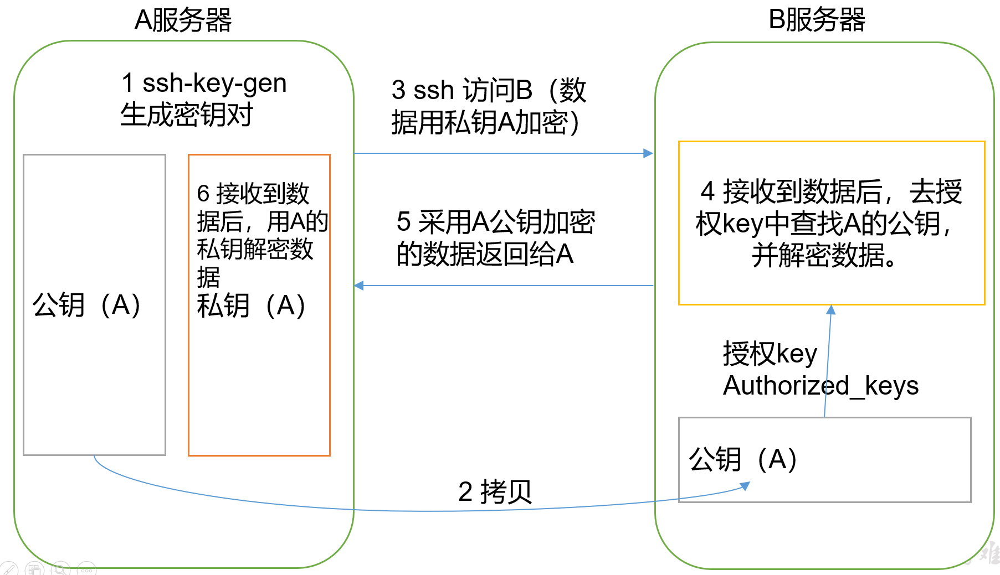

# 工具

## ssh

（1）基本语法

``` shell
ssh 另一台电脑的ip地址
```

（2）ssh连接时出现Host key verification failed的解决方法

​         解决方案如下：直接输入yes  

### 免密登录配置

 原理：



#### （1）生成公钥和私钥：  

```shell
ssh-keygen -t rsa
```

然后敲（三个回车），就会生成两个文件id_rsa（私钥）、id_rsa.pub（公钥）

#### （2）将公钥拷贝到要免密登录的目标机器上  

```
ssh-copy-id hadoop1
ssh-copy-id hadoop2
ssh-copy-id hadoop3
```

### .ssh文件夹下（~/.ssh）的文件功能解释

| known_hosts     | 记录ssh访问过计算机的公钥(public  key) |
| --------------- | -------------------------------------- |
| id_rsa          | 生成的私钥                             |
| id_rsa.pub      | 生成的公钥                             |
| authorized_keys | 存放授权过得无密登录服务器公钥         |


## scp（secure copy）安全拷贝 

（1）scp定义：scp可以实现服务器与服务器之间的数据拷贝。（from server1 to server2）

（2）基本语法

``` shell
scp   -r     $from_dir/$from_file        $to_user@$to_host:$to_dir/$to_file
```

- `-r`：递归
- `$from_dir/$from_file`：要拷贝的文件路径/名称
- `$to_user@$to_host:$to_dir/$to_file`：目的用户@主机:目的路径/名称

（3）案例实操

```
scp -r /usr/local/java  root@hadoop2:/usr/local/java
```

``` shell
scp -r root@hadoop1:/usr/local/java  root@hadoop3:/usr/local/java
```

注意：拷贝过来的目录，别忘了修改所有文件的，所有者和所有者组。

``` shell
sudo chown root:root -R /usr/local/java
```

## rsync远程同步工具

​		rsync主要用于备份和镜像。具有速度快、避免复制相同内容和支持符号链接的优点。

​		rsync和scp区别：用rsync做文件的复制要比scp的速度快，rsync只对差异文件做更新。scp是把所有文件都复制过去。

（1）基本语法

``` shell
rsync    -rvl      $from_dir/$from_file        $to_user@$to_host:$to_dir/$to_file
```

- `-r`：递归
- `-v  `：显示复制过程 
- `-l  `： 拷贝符号连接  
- `$from_dir/$from_file`：要拷贝的文件路径/名称
- `$to_user@$to_host:$to_dir/$to_file`：目的用户@主机:目的路径/名称

（2）案例实操

``` shell
rsync -rvl /usr/local/java  root@hadoop2:/usr/local/java
```


# 问题解决

### -bash: make: command not found的解决办法

Centos中无法使用make，make install，命令 make: command not found

一般出现这个-bash: make: command not found提示，

是因为安装系统的时候使用的是最小化mini安装，

系统没有安装make、vim等常用命令，直接yum安装下即可。

安装：

```
yum -y install gcc automake autoconf libtool make
```

安装g++:

```
yum -y install gcc gcc-c++
```


### bash: wget: command not found

```
yum -y install wget
```


