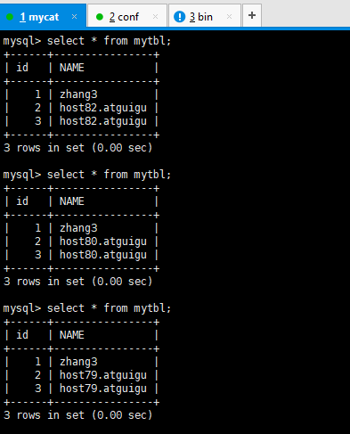

# Mycat入门

## Mycat是什么

Mycat 是数据库中间件。Mycat的官网 : http://www.mycat.io/

### 1、数据库中间件 

中间件：是一类连接软件组件和应用的计算机软件，以便于软件各部件之间的沟通。 
例子：Tomcat，web中间件。 
数据库中间件：连接java应用程序和数据库 

### 2、为什么要用Mycat？ 

① Java与数据库紧耦合。 
② 高访问量高并发对数据库的压力。 
③ 读写请求数据不一致 

### 3、数据库中间件对比 


① Cobar属于阿里B2B事业群， 始于2008年， 在阿里服役3年多， 接管3000+个MySQL数据库的schema,集群日处理在线SQL请求50亿次以上。由于Cobar发起人的离职，Cobar停止维护。 

② Mycat是开源社区在阿里cobar基础上进行二次开发，解决了cobar存在的问题，并且加入了许多新的功能在其中。青出于蓝而胜于蓝。 

③ OneProxy基于MySQL官方的proxy思想利用c进行开发的，OneProxy是一款商业收费的中间件。舍弃了一些功能，专注在性能和稳定性上。 

④ kingshard由小团队用go语言开发，还需要发展，需要不断完善。 

⑤ Vitess是Youtube生产在使用，架构很复杂。不支持MySQL原生协议，使用需要大量改造成本。 

⑥ Atlas是360团队基于mysql proxy改写，功能还需完善，高并发下不稳定。 

⑦ MaxScale是mariadb（MySQL原作者维护的一个版本） 研发的中间件 

⑧ MySQLRoute是MySQL官方Oracle公司发布的中间件

9.Apache ShardingSphere

### 4、Mycat可以做什么

#### 1、读写分离  


#### 2、数据分片 

垂直拆分（分库）、水平拆分（分表）、垂直+水平拆分（分库分表） 


#### 3、多数据源整合 


## Mycat原理 

​		Mycat 的原理中最重要的一个动词是 “拦截” ， 它拦截了用户发送过来的 SQL 语句， 首先对 SQL 语句做了一些特定的分析：如分片分析、路由分析、读写分离分析、缓存分析等，然后将此 SQL 发往后端的真实数据库，并将返回的结果做适当的处理，最终再返回给用户。 


这种方式把数据库的分布式从代码中解耦出来，程序员察觉不出来后台使用 Mycat 还是MySQL。 

## 安装启动 

### 安装

1、解压后即可使用 

上传到`/opt`，解压：

```
tar -zxvf Mycat-server-1.6.7.1-release-20190627191042-linux.tar.gz
```

解压缩文件拷贝到 linux 下 /usr/local/ 

```
cp -r mycat /usr/local/
```


2、`conf`下有重要的三个配置文件 
①schema.xml：定义逻辑库，表、分片节点等内容 
②rule.xml：定义分片规则 
③server.xml：定义用户以及系统相关变量，如端口等

### 启动 

#### 1、修改配置文件server.xml 

修改用户信息，与MySQL区分，如下：

```xml
<user name="mycat"> 
                <property name="password">123456</property> 
                <property name="schemas">TESTDB</property> 
</user> 
```


#### 2、修改配置文件 schema.xml 

删除`<schema>`标签间的表信息， `<dataNode>`标签只留一个， `<dataHost>`标签只留一个，` <writeHost> `
`<readHost>`只留一对 

```xml
<?xml version="1.0"?> 
<!DOCTYPE mycat:schema SYSTEM "schema.dtd"> 
<mycat:schema xmlns:mycat="http://io.mycat/"> 
 
        <schema name="TESTDB" checkSQLschema="false" sqlMaxLimit="100" dataNode="dn1"> 
        </schema> 
        <dataNode name="dn1" dataHost="host1" database="testdb" /> 
        <dataHost name="host1" maxCon="1000" minCon="10" balance="0" 
                          writeType="0" dbType="mysql" dbDriver="native" switchType="1"  
slaveThreshold="100"> 
                <heartbeat>select user()</heartbeat> 
                <!-- can have multi write hosts --> 
                <writeHost host="hostM1" url="192.168.140.128:3306" user="root" 
                                   password="123123"> 
                        <!-- can have multi read hosts --> 
                        <readHost host="hostS1" url="192.168.140.127:3306" user="root" 
password="123123" /> 
                </writeHost> 
        </dataHost> 
</mycat:schema> 
```


#### 3、验证数据库访问情况 

Mycat 作为数据库中间件要和数据库部署在不同机器上，所以要验证远程访问情况。

```shell
mysql -uroot -p123123 -h 192.168.140.128 -P 3306 
mysql -uroot -p123123 -h 192.168.140.127 -P 3306 
 
#如远程访问报错，请建对应用户 
grant all privileges on *.* to root@'缺少的host'  identified by '123123'; 
```

#### 4、启动程序 

①控制台启动 ：去 mycat/bin 目录下执行 `./mycat console `
②后台启动 ：去 mycat/bin 目录下 `./mycat start `

为了能第一时间看到启动日志，方便定位问题，我们选择①控制台启动。


#### 5、启动时可能出现报错 

如果操作系统是 CentOS6.8，可能会出现域名解析失败错误，如下图 


可以按照以下步骤解决 
① 用 vim 修改 /etc/hosts 文件，在 127.0.0.1 后面增加你的机器名 


② 修改后重新启动网络服务


###  登录 

1、登录数据窗口 

此登录方式用于通过 Mycat 查询数据，我们选择这种方式访问 Mycat 

```
mysql -umycat -p123456 -P 8066 -h 192.168.140.128 
```

```
show databases;

use TESTDB;

show tables;
```


#### 2、登录后台管理窗口 

此登录方式用于管理维护 Mycat 

```
mysql -umycat -p123456 -P 9066 -h 192.168.140.128 
```

#常用命令如下：

```
show database 
```


```
show @@help
```


# 搭建读写分离

我们通过 Mycat 和 MySQL 的主从复制配合搭建数据库的读写分离，实现 MySQL 的高可用性。
我们将搭建：一主一从、双主双从两种读写分离模式。 

## 1 搭建一主一从 

一个主机用于处理所有写请求，一台从机负责所有读请求，架构图如下 


### 1、 搭建 MySQL 数据库主从复制 

① MySQL 主从复制原理 


② 主机配置(host79) 

```properties
修改配置文件：vim /etc/my.cnf 
#主服务器唯一ID 
server-id=1 
 #启用二进制日志 
log-bin=mysql-bin 
# 设置不要复制的数据库(可设置多个) 
binlog-ignore-db=mysql 
binlog-ignore-db=information_schema 
#设置需要复制的数据库 
binlog-do-db=需要复制的主数据库名字 
#设置logbin格式 
binlog_format=STATEMENT
```

binlog 日志三种格式 


③ 从机配置(host80) 

```
修改配置文件：vim /etc/my.cnf 
#从服务器唯一ID 
server-id=2 
 #启用中继日志 
relay-log=mysql-relay 
```

④ 主机、从机重启 MySQL 服务 

```
systemctl restart mysqld
systemctl status mysqld
```


⑤ 主机从机都关闭防火墙 
⑥ 在主机上建立帐户并授权 slave 

```
#在主机MySQL里执行授权命令 
GRANT REPLICATION SLAVE ON *.* TO 'slave'@'%' IDENTIFIED BY '123123'; 

#查询master的状态 
show master status; 
```


```
#记录下File和Position的值 
#执行完此步骤后不要再操作主服务器MySQL，防止主服务器状态值变化 
```

⑦ 在从机上配置需要复制的主机

```
#复制主机的命令 
CHANGE MASTER TO MASTER_HOST='主机的IP地址', 
MASTER_USER='slave', 
MASTER_PASSWORD='123123', 
MASTER_LOG_FILE='mysql-bin.具体数字',MASTER_LOG_POS=具体值; 
```


```
#启动从服务器复制功能 
start slave; 
#查看从服务器状态 
show slave status\G; 
```


```
#下面两个参数都是Yes，则说明主从配置成功！ 
# Slave_IO_Running: Yes 
# Slave_SQL_Running: Yes 
```

⑧ 主机新建库、新建表、insert 记录，从机复制 


⑨ 如何停止从服务复制功能 

```
stop slave; 
```

⑩ 如何重新配置主从

```
stop slave;  
reset master; 
start slave
```

### 2、 修改 Mycat 的配置文件 schema.xml 

之前的配置已分配了读写主机，是否已实现读写分离？

```
验证读写分离 
（1）在写主机插入：insert into mytbl values (1,@@hostname); 
主从主机数据不一致了 
（2）在Mycat里查询：select * from mytbl;  
```

修改`<dataHost>`的balance属性，通过此属性配置读写分离的类型

```
负载均衡类型，目前的取值有4 种： 
（1）balance="0", 不开启读写分离机制，所有读操作都发送到当前可用的 writeHost 上。 
 
（2）balance="1"，全部的 readHost 与 stand by writeHost 参与 select 语句的负载均衡，简单的说，当双主双从
模式(M1->S1，M2->S2，并且 M1 与 M2 互为主备)，正常情况下，M2,S1,S2 都参与 select 语句的负载均衡。 
 
（3）balance="2"，所有读操作都随机的在 writeHost、readhost 上分发。 
 
（4）balance="3"，所有读请求随机的分发到 readhost 执行，writerHost 不负担读压力 
```

为了能看到读写分离的效果，把balance设置成2，会在两个主机间切换查询 

```
… 
<dataHost name="host1" maxCon="1000" minCon="10" balance="2" 
                          writeType="0" dbType="mysql" dbDriver="native" switchType="1" 
slaveThreshold="100"> 
… 
```


### 3、 启动 Mycat 

### 4、 验证读写分离 

```
#（1）在写主机数据库表mytbl中插入带系统变量数据，造成主从数据不一致 
INSERT INTO mytbl VALUES(2,@@hostname); 
```


```
#（2）在Mycat里查询mytbl表,可以看到查询语句在主从两个主机间切换 
```


## 2、搭建双主双从

​		一个主机 m1 用于处理所有写请求， 它的从机 s1 和另一台主机 m2 还有它的从机 s2 负责所有读请求。当 m1 主机宕机后，m2 主机负责写请求，m1、m2 互为备机。架构图如下 


### 1、 搭建 MySQL 数据库主从复制（双主双从） 

① 双主机配置 
Master1配置 

```
修改配置文件：vim /etc/my.cnf 
 
#主服务器唯一ID 
server-id=1 
 #启用二进制日志 
log-bin=mysql-bin 
# 设置不要复制的数据库(可设置多个) 
binlog-ignore-db=mysql 
binlog-ignore-db=information_schema 
#设置需要复制的数据库 
binlog-do-db=需要复制的主数据库名字 
#设置logbin格式 
binlog_format=STATEMENT 
# 在作为从数据库的时候，有写入操作也要更新二进制日志文件 
log-slave-updates  
#表示自增长字段每次递增的量，指自增字段的起始值，其默认值是1，取值范围是1 .. 65535 
auto-increment-increment=2  
# 表示自增长字段从哪个数开始，指字段一次递增多少，他的取值范围是1 .. 65535 
auto-increment-offset=1  
```

Master2配置 

```
修改配置文件：vim /etc/my.cnf 
 
#主服务器唯一ID 
server-id=3 
 #启用二进制日志 
log-bin=mysql-bin 
# 设置不要复制的数据库(可设置多个) 
binlog-ignore-db=mysql 
binlog-ignore-db=information_schema 
#设置需要复制的数据库 
binlog-do-db=需要复制的主数据库名字 
#设置logbin格式 
binlog_format=STATEMENT 
# 在作为从数据库的时候，有写入操作也要更新二进制日志文件 
log-slave-updates  
#表示自增长字段每次递增的量，指自增字段的起始值，其默认值是1，取值范围是1 .. 65535 
auto-increment-increment=2  
# 表示自增长字段从哪个数开始，指字段一次递增多少，他的取值范围是1 .. 65535 
auto-increment-offset=2 
```

② 双从机配置 
Slave1配置

```
修改配置文件：vim /etc/my.cnf 
#从服务器唯一ID 
server-id=2 
 #启用中继日志 
relay-log=mysql-relay
```

Slave2配置 

```
修改配置文件：vim /etc/my.cnf 
#从服务器唯一ID 
server-id=4 
 #启用中继日志 
relay-log=mysql-relay 
```

③ 双主机、双从机重启 mysql 服务 
④ 主机从机都关闭防火墙 
⑤ 在两台主机上建立帐户并授权 slave 

```
#在主机MySQL里执行授权命令 
GRANT REPLICATION SLAVE ON *.* TO 'slave'@'%' IDENTIFIED BY '123123'; 
#查询Master1的状态 
show master status; 
```


```
#查询Master2的状态 
show master status; 
```


```
#分别记录下File和Position的值 
#执行完此步骤后不要再操作主服务器MYSQL，防止主服务器状态值变化
```

⑥ 在从机上配置需要复制的主机 
Slava1 复制 Master1，Slava2 复制 Master2 

```
#复制主机的命令 
CHANGE MASTER TO MASTER_HOST='主机的IP地址', 
MASTER_USER='slave', 
MASTER_PASSWORD='123123', 
MASTER_LOG_FILE='mysql-bin.具体数字',MASTER_LOG_POS=具体值; 
 
Slava1的复制命令 
```


```
Slava2的复制命令 
```


```
#启动两台从服务器复制功能 
start slave; 
#查看从服务器状态 
show slave status\G; 
```

#Slava1的复制Master1 


#Slava2的复制Master2 


```
#下面两个参数都是Yes，则说明主从配置成功！ 
# Slave_IO_Running: Yes 
# Slave_SQL_Running: Yes 
```

⑦ 两个主机互相复制 

```
Master2 复制 Master1，Master1 复制 Master2 
# Master2的复制命令
```


```
# Master1的复制命令
```


```
#启动两台主服务器复制功能 
start slave; 
 
#查看从服务器状态 
show slave status\G; 
 
 
Master2的复制Master1 
```


Master1的复制Master2 


```
#下面两个参数都是Yes，则说明主从配置成功！ 
# Slave_IO_Running: Yes 
# Slave_SQL_Running: Yes 
```

⑧ Master1 主机新建库、新建表、insert 记录，Master2 和从机复制 


⑨ 如何停止从服务复制功能 

```
stop slave; 
```

⑩ 如何重新配置主从 

```
stop slave;  
reset master; 
```

### 2、 修改 Mycat 的配置文件 schema.xml 

```
修改<dataHost>的balance属性，通过此属性配置读写分离的类型 
负载均衡类型，目前的取值有4 种： 
（1）balance="0", 不开启读写分离机制，所有读操作都发送到当前可用的 writeHost 上。 
 
（2）balance="1"，全部的 readHost 与 stand by writeHost 参与 select 语句的负载均衡，简单的说，当双主双从
模式(M1->S1，M2->S2，并且 M1 与 M2 互为主备)，正常情况下，M2,S1,S2 都参与 select 语句的负载均衡。 
 
（3）balance="2"，所有读操作都随机的在 writeHost、readhost 上分发。 
 
（4）balance="3"，所有读请求随机的分发到 readhost 执行，writerHost 不负担读压力 
```

为了双主双从读写分离balance设置为1 

```
… 
<dataNode name="dn1" dataHost="host1" database="testdb" /> 
        <dataHost name="host1" maxCon="1000" minCon="10" balance="1" 
                          writeType="0" dbType="mysql" dbDriver="native" switchType="1"  
slaveThreshold="100" > 
                <heartbeat>select user()</heartbeat> 
                <!-- can have multi write hosts --> 
                <writeHost host="hostM1" url="192.168.140.128:3306" user="root" 
                                   password="123123"> 
                        <!-- can have multi read hosts --> 
                        <readHost host="hostS1" url="192.168.140.127:3306" user="root" 
password="123123" /> 
                </writeHost> 
                <writeHost host="hostM2" url="192.168.140.126:3306" user="root" 
                                   password="123123"> 
                        <!-- can have multi read hosts --> 
                        <readHost host="hostS2" url="192.168.140.125:3306" user="root" 
password="123123" /> 
                </writeHost> 
        </dataHost> 
… 
#balance="1": 全部的readHost与stand by writeHost参与select语句的负载均衡。 
#writeType="0": 所有写操作发送到配置的第一个writeHost，第一个挂了切到还生存的第二个 
#writeType="1"，所有写操作都随机的发送到配置的 writeHost，1.5 以后废弃不推荐 
 #writeHost，重新启动后以切换后的为准，切换记录在配置文件中:dnindex.properties 。 
#switchType="1": 1 默认值，自动切换。 
#              -1 表示不自动切换 
#              2 基于 MySQL 主从同步的状态决定是否切换。
```


### 3、 启动 Mycat 

### 4、 验证读写分离 

```
#在写主机Master1数据库表mytbl中插入带系统变量数据，造成主从数据不一致 
INSERT INTO mytbl VALUES(3,@@hostname); 
```


```
#在Mycat里查询mytbl表,可以看到查询语句在Master2（host81）、Slava1（host80）、Slava2（host82）
主从三个主机间切换 
```


### 5、 抗风险能力 

```
#停止数据库Master1 
```


```
#在Mycat里插入数据依然成功，Master2自动切换为写主机 
INSERT INTO mytbl VALUES(3,@@hostname); 
```


#启动数据库Master1 


```
#在Mycat里查询mytbl表,可以看到查询语句在Master1（host79）、Slava1（host80）、Slava2（host82）
主从三个主机间切换 
```



Master1、Master2 互做备机，负责写的主机宕机，备机切换负责写操作，保证数据库读写分离高
可用性。 

# 垂直拆分——分库

​		一个数据库由很多表的构成， 每个表对应着不同的业务， 垂直切分是指按照业务将表进行分类，分布到不同 的数据库上面，这样也就将数据或者说压力分担到不同的库上面，如下图：


