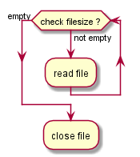
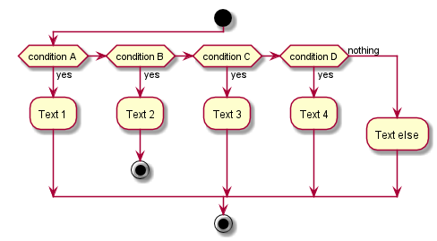

## test001

``` pascal
@startuml
while (check filesize ?) is (not empty)
  :read file;
endwhile (empty)
:close file;
@enduml
```



## test002

``` p
@startuml
start
if (condition A) then (yes)
  :Text 1;
elseif (condition B) then (yes)
  :Text 2;
  stop
elseif (condition C) then (yes)
  :Text 3;
elseif (condition D) then (yes)
  :Text 4;
else (nothing)
  :Text else;
endif
stop
@enduml
```



