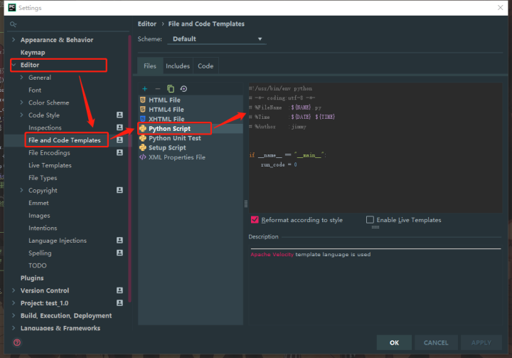

# PyCharm中设置Python文件模板, 及设置参数详解

通过本篇，你将学会在Pycharm编译器中配置自己的.py模板，还将深刻理解每个参数的含义和作用。

一、py模板设置方法

首先，在 Pycharm 中找到模板设置选项，它的所有常用设置都在[Settings]中：

标题栏 → [File]→ [Settings]→ 打开如下图的页面

Settings页面操作：[Edit]→ [File and Code Templates]→ [Python Script]

下面是小编常用的一套.py模板：

\# !/usr/bin/env python

\# -*- coding:utf-8 -*-

\# @FileName :${NAME}.py

\# @Time :${DATE} ${TIME}

\# @Author :jimmy

if __name__ == "__main__":

run_code = 0

二、 参数详解

**1. 模板的其它变量**

除了上述我常用的{NAME}、{DATE} 、{TIME}外，Pycharm还支持很多其它参数配置，如下：

$ {PROJECT_NAME} - 当前项目的名称；

$ {NAME} - 在文件创建过程中，在对话框中输入的新文件名称；

$ {USER} - 当前用户的登录名；

$ {DATE} - 当前的系统日期；

$ {TIME} - 当前系统时间；

$ {YEAR} - 今年；

$ {MONTH} - 当月；

$ {DAY} - 当月的当天；

$ {HOUR} - 目前的小时；

$ {MINUTE} - 当前分钟；

$ {PRODUCT_NAME} - 将在其中创建文件的IDE的名称。

**2. 关于“# !/usr/bin/env python”和“# !/usr/bin/python”**

\# !/usr/bin/python 是调用 /usr/bin 下的python解释器。

\# !/usr/bin/env python 是为了防止用户没有将python装在默认的/usr/bin路径里。当系统看到这一行的时候，首先会到env设置里查找python的路径，再调用对应路径下的解释器程序完成操作。

**3. 关于 # -\*- coding:utf-8 -\*-**

设置python的编码格式为：utf-8。因为python3已经默认是支持中文的了，所以，添加这句话是为了方便程序的移植。

也可使用如下格式：

\# coding=utf-8

**4. 关于 if __name__ == "__main__"**

这句话的意思就是：当模块被直接运行时，以下代码块将被运行，当模块是被导入时，代码块不被运行。

这是Python程序的主入口。因为我通常使用pytyhon当做脚本语言，所以这一句也比较常用，放进模板里稍微节省一步操作。