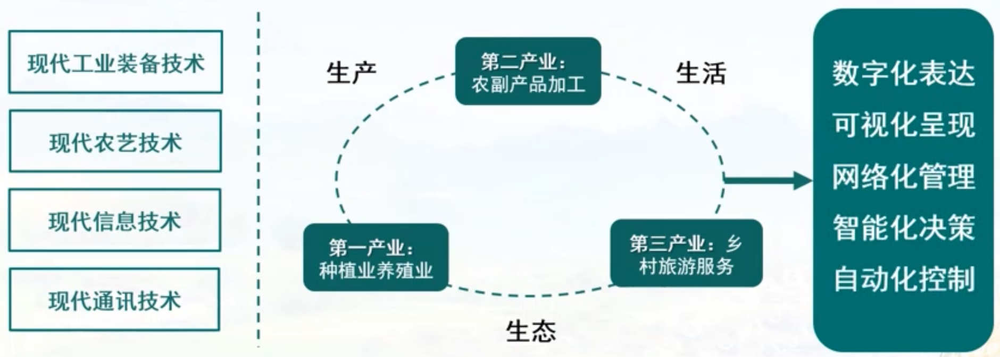
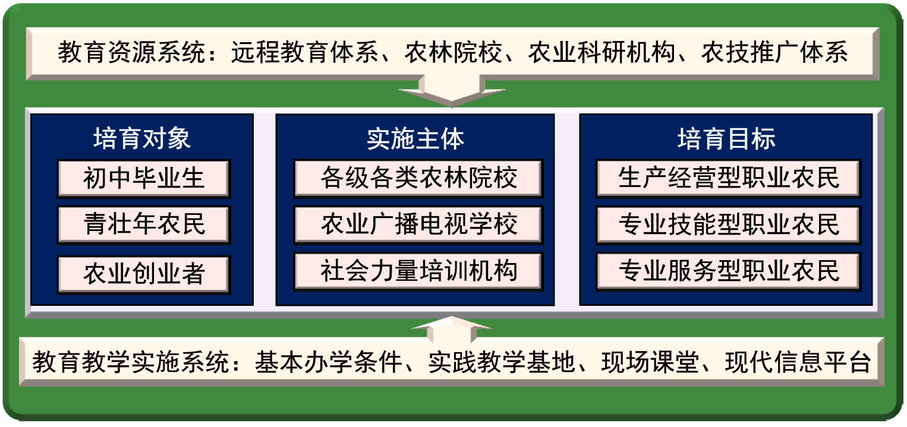
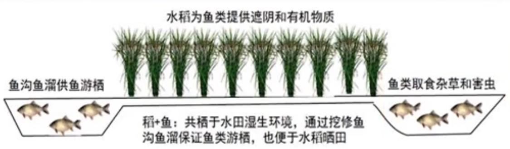

参考：《生态学原理》《经济学原理》

# 现代农业

## 现代农业的主要表现形式

- 有机农业： 主要针对杀虫剂和生长调节剂对人类健康的危害，探索不使用化学品的有机农业。 
-  生态农业 ： 主张摒弃石油农业的负面影响，发展以生物有机质和生物有机体投入为主的农业经营模式。 
-  自然农业 ： 认为农业应回归传统的铁犁牛耕的小农经济形式，形成家庭经营的中小型家庭农场。 
-  生物动力学农业： 重视生物动力输入，主张回归牛耕和利用蚯蚓松土，减少或不使用机械动力，依托生物动力学机制实现农业的持续发展。  

-  中国生态农业 ：生物动力、有机肥、绿肥、生物固氮

## 生态农业运动

## 中国生态农业运动

## 现代农业发展模式

- 规模化、机械化集约发展模式
- 资源节约型集约发展模式
  - 追求单位内的产量
- 专业化、标准化集约发展模式
  - 区域专业化
  - 作业专业化
  - 农村专业化

## 生态智慧农业

## 农业产业的弱质性和弱势性

## 农业的多功能性和公益性

## 农业发展转变

## 农业供给侧结构改革

## 乡村振兴战略

## 农业经营模式

### 农业家庭经营

### 农业合作经营

### 企业经营

引入现代管理机制，具有自主创新能力和核心竞争力。

#### 大型农业企业

#### 龙头农业企业

## 农业经营新理念

- 提升产业链
- 提升价值链
- 完善利益链

协调：

- 社会效益
- 经济效益
- 生态效益

- 规模化
- 专业化
- 标准化
- 信息化

## 新型职业农民

### 专业化

### 层级化

### 多样化

## 新型职业农民培养

## 职业农民制度

## 理性小农

##  农业CEO

## 农业经营理念更新-现代农业发展

## 现代农业探索

### 生态农业

生态农业的三大组件：

- 食用菌栽培
- 沼气发酵
- 蚯蚓、蝇蛆、黄粉虫等腐生动物养殖

生态种养技术：

- 果园养鸡
- 稻田养鸭
- 林下养殖
  - 如：牛蛙等
- 农田养蜂

生态农业模式：

- 桑植鱼塘（物质循环系统）

  1. 基面种桑
  2. 桑叶喂蚕
  3. 蚕沙、蚕粪、碎桑叶肥塘养鱼
  4. 塘泥上基肥桑

  

- 稻鱼共生系统

  

- 猪沼果能源生态模式

  

- 四位一体能源生态模式

  

- 五配套能源生态模式

  

- 

### 循环农业

#### 实践模式

#### 假想模型

### 设施农业

设施农业示例

### 都市农业

### 休闲农业

### 数字农业

### 精准农业

### 智慧农业

