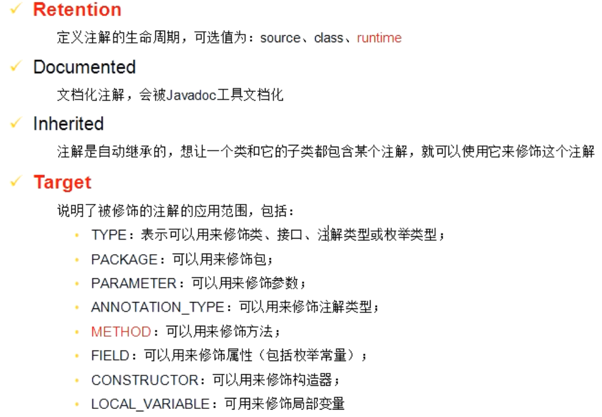
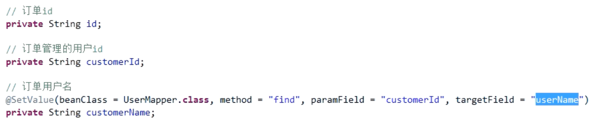

# 代理

# 切面

# 注解

需要考虑注解附带的信息：

- 哪些属性需要设置
- 该调用那个bean的那个方法
- 该传入那个属性的值作为参数
- 该获取得到的对象上的那个属性的值


annotation注解

定义：




## 示例：

### 1、定义注解

@SetValue

```java
/**
 * 设置值的注解
 *
 * @author chentiefeng
 * @date 2020-10-11 00:18
 */
@Target(ElementType.FIELD)
@Retention(RetentionPolicy.RUNTIME)
@Documented
public @interface SetValue {

    /**
     * 需要的bean的类
     * @return
     */
    Class<?> beanClass();

    /**
     * 调用bean的那个方法
     * @return
     */
    String method();

    /**
     * 参数字段名
     * @return
     */
    String paramField();

    /**
     * 需要映射的字段名
     * @return
     */
    String targetField();
}
```

@NeedSetFieldValue

```java
/**
 * 需要设置值的注解
 *
 * @author chentiefeng
 * @date 2020-10-11 00:18
 */
@Target(ElementType.METHOD)
@Retention(RetentionPolicy.RUNTIME)
@Documented
public @interface NeedSetFieldValue {
    
}
```

### 2、使用注解



### 3、切面

Maven依赖：

 基本和普通springboot项目一样，就是多了`spring-boot-starter-aop`这jar的依赖。 


```java
/**
 * 用于设置值的切面，生效于@NeedSetFieldValue
 *
 * @author chentiefeng
 * @date 2020-10-11 00:34
 */
@Component
@Aspect
public class SetFieldValueAspect {

    /**
     * 环绕通知：目标方法执行前后分别执行一些代码，发生异常时执行另外一些代码
     * @param proceedingJoinPoint
     * @return
     */
    @Around("@annotation(NeedSetFieldValue)")
    public Object doSetFieldValue(ProceedingJoinPoint proceedingJoinPoint) throws Throwable {
        String methodName=proceedingJoinPoint.getSignature().getName();
        System.out.println("环绕通知-> 前置通知");
        //执行目标方法
        Object result=proceedingJoinPoint.proceed();

        //设置属性值
        if(result instanceof Collection){
            //设置集合中每个对象的属性值
        }else{
            //设置对象的属性值
        }
        return result;
    }

    private void setFieldValue(Object obj) throws Exception {
        if(obj==null){
            return;
        }
        //1、获得Class对象
        Class<?> clazz=obj.getClass();
        //2、获取里面的字段
        Field[] fields=clazz.getDeclaredFields();
        //注意，如果Objects是集合，可以考虑缓存查询结果，如果存在，就不再执行反射执行查询
        for (Field field:fields){
            SetValue setValueAnnotation=field.getAnnotation(SetValue.class);
            if(setValueAnnotation==null){
                continue;
            }
            //获取注解中的信息
            //从Spring容器中获取bean
            Object bean=this.applicationContext.getBean(setValueAnnotation.beanClass());
            //获取参数字段
            Field paramField=clazz.getDeclaredField(setValueAnnotation.paramField());
            //获取参数值
            Object paramValue=paramField.get(obj);

            //获取方法，参数时需要传入的对象的属性值
            Method method=setValueAnnotation.beanClass().getMethod(setValueAnnotation.method(),paramField.getType());


            //获取查询结果值
            Object convertResult=method.invoke(bean,paramValue);

            //设置回对象
            field.set(obj,convertResult);
        }

    }
}
```

