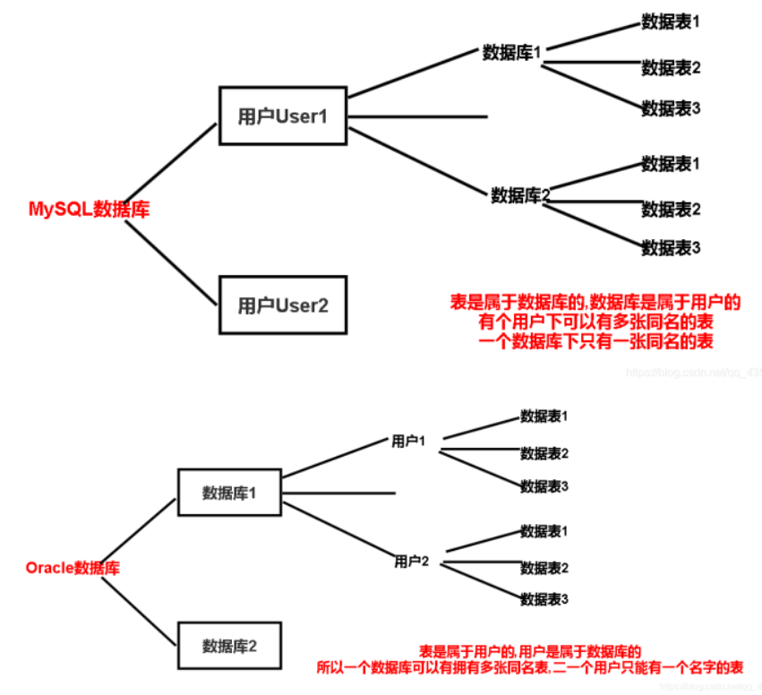

# Oracle和Mysql的对比

##  本质区别 

- Oracle数据库是一个对象关系数据库管理系统（收费）

- MySQL是一个开源的关系数据库管理系统（免费）

##  数据库的安全性： 

- mysql使用三个参数来验证用户，即用户名，密码和位置

- Oracle使用了更多的安全功能，如用户名，密码，配置文件，本地身份验证，外部身份验证，高级安全增强功能等

##  权限 

 MySQL的权限系统是通过继承形成的分层结构。权限授于高层时，其他低层隐式继承被授于的权限，当然低层也可改写这些权限。 

按授权范围不同，MySQL有以下种授权方式：

1、全局；

2、基于每个主机；

3、基于表；

4、基于表列。

每一级在数据库中都有一个授权表。当进行权限检查时，MySQL从高到低检查每一张表，低范围授权优先于高范围授权。

与Oracle不同，MySQL没有角色的概念。也就是说，如果对一组用户授于同样的权限，需要对每一个用户分别授权。

##  模式

模式包含表、视图、索引、用户、约束、存储过程、触发器和其他数据库相关的概念。多数关系型数据库都有相似的概念。

本节包含以下内容：

1、模式对象的相似性；

2、模式对象的名称；

3、表设计时的关注点；

4、多数据库整合；

5、MySQL模式整合的关注点。

模式对象的相似性

就模式对象，Oracle和MySQL存储诸多的相似，但也有一些不同。

###  模式对象 

模式对象

| Oracle               | MySQL                       |
| -------------------- | --------------------------- |
| AFTER trigger        | trigger                     |
| BEFORE trigger       | trigger                     |
| Check constraint     | Check constraint            |
| Column default       | Column default              |
| Database             | Database                    |
| Foreign key          | Foreign key                 |
| Index                | Index                       |
| Package              | N/A                         |
| PL/SQL function      | Routine                     |
| PL/SQL procedure     | Routine                     |
| Primary key          | Primary key                 |
| Role                 | N/A                         |
| Schema               | Schema                      |
| Sequence             | AUTO_INCREMENT for a column |
| Snapshot             | N/A                         |
| Synonym              | N/A                         |
| Table                | Table                       |
| Tablespace           | N/A                         |
| Temporary table      | Temporary table             |
| Trigger for each row | Trigger for each row        |
| Unique key           | Unique key                  |
| User                 | User                        |
| View                 | View                        |

### 模式对象的名称

Oracle是大小写不敏感的，并且模式对象是以在写时行存储。在Oracle的世界中，列、索引、存储过程、触发器以及列别名都是大小写不敏感，并且在所有的平台都是如此。MySQL是大小写敏感的，如数据库相对的存储路径、表对应的文件都是如此。

当把关键字用引号引起来时，Oracle和MySQL都允许把这些关键字用于模式对象。但MySQL对于一些关键字，不加引号也行。

##  表设计的关注点 

本节主要讨论当把MySQL转为Oracle时需要注意的地方。主要包含以下两点：

1、字符数据的类型；

2、列默认值。

### 字符数据类型

MySQL和Oracle在字符型数据保存和读取上存在一些不同。

MySQL的字符类型，如CHAR和VARCHAR的长度小于65535字节。

Oracle支持4种字体类型：CHAR、NCHAR、NVARCHAR2和VARCHAR2。CHAR和NCHAR的最大长度为2000字节，NVARCHAR2和VARCHAR2最大长度为4000字节。

MySQL的CHAR在按一定长度存储时，是用空格填充的右对齐方式，在读取时去掉空格。

###  列默认值 

 MySQL会处理列默认值，不允许他为空，这点和Oracle不同。在Oracle中如果向表插入数据，需要对有所有不允许为NULL列的值。 

##  多数据库迁移 

 如果多个MySQL数据库位于同一个数据库服务上，支持迁移。 

##  数据存储概念 

MySQL的数据库对应于服务器上数据目录内的子目录，这一数据存储方式与多数据数据库不同，也包括Oracle。数据库中的表对应一个或者多个数据库目录下的文件，并取表存储时的存储引擎。

一个Oracle数据库包含一个或者多个表空间。表空间对应数据在磁盘上的物理存储。表空间是从一个或者多个数据文件开始构建的。数据文件是文件系统中的文件或者原始存储的一块空间。

##  一些语法上的区别： 

###  主键 

mysql一般使用自动增长类型，在创建表的时候指定表的主键为auto increment，主键就会自动增长。

Oracle中没有自动增长，主键一般使用序列，插值时依次赋值即可。

###  引号问题： 

Oracle不使用双引号，会报错

mysql则对引号没有限制

###  分页查询： 

mysql分页查询使用关键字limit来实现

Oracle没有实现分页查询的关键字，实现起来较复杂，在每个结果集中只有一个rownum字段标明它的位置，并且只能用rownum<=某个数，不能用rownum>=某个数，因为ROWNUM是伪列，在使用时所以需要为ROWNUM取一个别名，变成逻辑列，然后来操作。

###  数据类型： 

mysql中的整型：int，字符串类型：varchar

Oracle中的整形：number，字符串类型：varchar2

## 总结

 下图可以清楚地表达两个数据库表间关系的区别 

