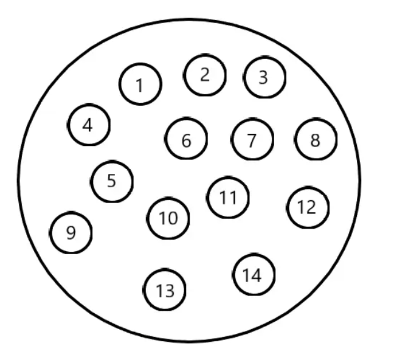
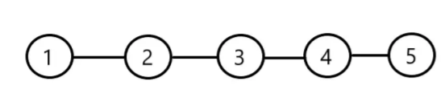
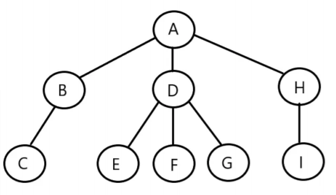
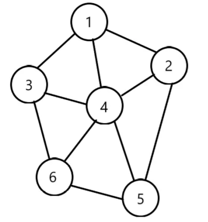
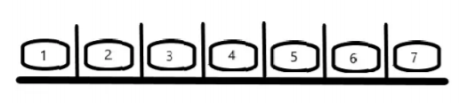
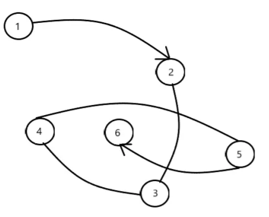
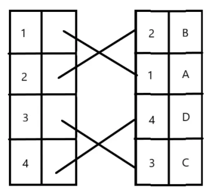
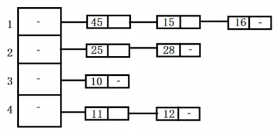
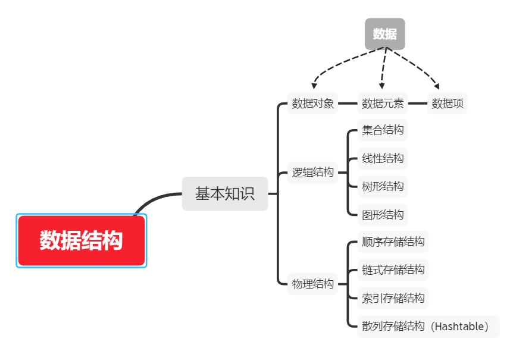

# 认识数据结构

## 基本概念和术语

### 1、数据结构

 		数据结构是计算机存储、组织数据的方式。**数据结构是指相互之间存在一种或多种特定关系的数据元素的集合**。在计算机中很多数据元素都是存在特定关系的，也就是数据的组成形式，假如某一天我们广大优秀的编程人员编写代码的时候不再运用算法，那结果可想而知我们在电脑上去查找数据或者删除数据的话会变的有多慢。

 		所以为了写出一个好程序，就必须分析待处理对象的特性以及对象之间存在的关系。这也是研究数据结构的意义所在。

### 2、数据对象

 		**数据对象：是性质相同的数据元素的集合，是元素的子集**。什么是性质相同呢？可能有很多同学要问了，我们还是举个例子，比如说QQ好友分组，我们把小妹妹都分到一组，那她们都有什么特征呢？都是女生，都长的漂亮等等，这就是性质相同。既然数据对象是数据的子集，那我们在实际运用中，处理的数据元素通常具有相同性质，在不产生混淆的情况下，我们都将数据对象简称为数据。可以理解为你QQ的好友分组。

### 3、数据元素

​		**数据元素：它是数据的基本单位，有时，一个数据元素可由若干个数据项组成**。比如一个图书馆里图书就是它的数据元素，再比如畜类，牛、马、羊、鸡、犬等就是禽类的数据元素。同样，你也可以理解你QQ的好友分组里面的人。

### 4、数据项

​		**数据项：数据元素可由若干个数据项（data item）组成，数据项是数据的不可分割的最小单位**。你也可以把数据元素理解为一个人，数据项就是人的眼、耳、鼻，是不可以分割的。

5、数据

​		**数据：是描述客观事物的符号，能输入到计算机并被计算机程序处理的符号的介质的总称**，它不仅指狭义上的数字，还可以是具有一定意义的文字、字母、数字符号的组合、图形、图像、视频、音频等，也是客观事物的属性、数量、位置及其相互关系的抽象表示。例如，“0、1、2...`”、“阴、雨、下降、气温”“学生的档案记录、货物的运输情况”等都是数据。数据经过加工后就成为信息。也就是说数据其实也就是符号，但是它可以输入到计算机中同样可以被计算机识别，并且可以通过计算机进行处理。

下面我们就来讨论一下数据结构吧。

## 逻辑结构和物理结构

​		数据结构就是就是研究数据的逻辑、存储结构和运算方法的一门学科，通俗的来讲我们可以把**数据结构分为逻辑结构和物理结构**，我们先来说说逻辑结构。

### 逻辑结构

​		**逻辑结构：是指数据对象中元素之间的相互关系**。这个也是我们数据结构主要关注的问题，逻辑结构主要分为一下四种基本结构：

#### 1、集合结构

​		**集合结构：集合结构中的数据元素除了同属于一个集合外，它们之间没有其它关系**。也是一种最简单的数据结构，这种集合关系这也就类似于数学中的集合。

####  2、线性结构 

​		**线性结构：线性结构中的数据元素之间是一对一的关系**。如下图可以明确的看到每个元素 之间都是一种先后关系，与它相邻的前后结点最多只能有一个。 

####  3、树形结构 

**树形结构：树形结构中的元素之间存在这一种一对多的层次关系** 。

####  4、图形结构 

​		**图形结构：图形结构的数据元素是多对多的关系**。如果关系是有方向的，那么用带箭头的 连线表示。 

### 物理结构

​		数据的物理结构是逻辑结构的计算机存储器中的实现。像硬盘、软盘、光盘等外部存储器。 简单点来讲，**物理结构是指数据的逻辑结构在计算机中的存储形式**。逻辑结构大致分四种，但是需要我们**记住的只有两种：顺序存储结构、链式存储结构**。  

####  1、顺序存储结构 

​			顺序存储结构：借助元素的存储器中的相对的位置来表示数据元素间的逻辑关系，也就是说把数据元素存储在连续的系统单元格里，其数据的逻辑关系和物理关系是一致的。  

顺序存储结构其实也很好理解，你可以把它们看做排队，从第一个人一定可以找到最后一个人。数 组也是这样的一个结构，如果你要建立一个大小为5的整型数组，那么在计算机中就会开辟一 段连续的空间，于是放第一个元素就在第一个位置，放第二个元素就在第二个位置，直到放满 为止。  

####  2、链式存储结构 

​		但是总有人想插队怎么办，或者有人想去上厕所，有人放弃了排队，所以现在就有一种新的 排队方式就是取号排队，每个人在排队之前都会去领一张带着号码的纸，上面所写的数字也就 是你现在的位置，然后我们就不需要站在那里去排队了，只需要听到有人叫你手中所拿的号码 即可。这也就好比我们数据结构中的链式存储结构：是一组任意的存储单元存储线性表的数据元素(**这组存储单元可以是连续的,也可以是不连续的**)。它相对于顺序存储结构来说它的插入、删除灵活 (不必移动节点，只要改变节点中的指针)，但是查找节点时链式存储要比顺序存储慢。 

####  3、索引存储结构 

​		索引存储：除建立存储结点信息外，还建立附加的索引表来标识结点的地址。索引表由若干索引项组成。索引存储结构是用结点的索引号来确定结点存储地址，其优点是检索速度快，缺点是增加了附加的索引表,会占用较多的存储空间。 

####  4、散列存储结构 

​		散列存储结构也叫Hashtable：是存储结构的一种，特点是很快，结构有多种，最流行、最容易理解的为顺序表+链表，主结构为顺序表，每个顺序表的节点在单独引出一个链表。 

## 总结

