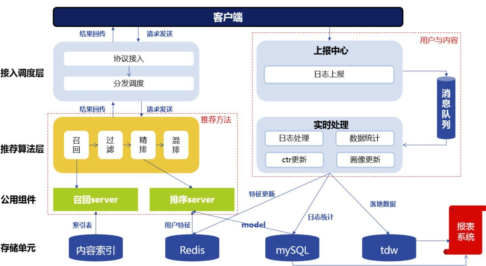
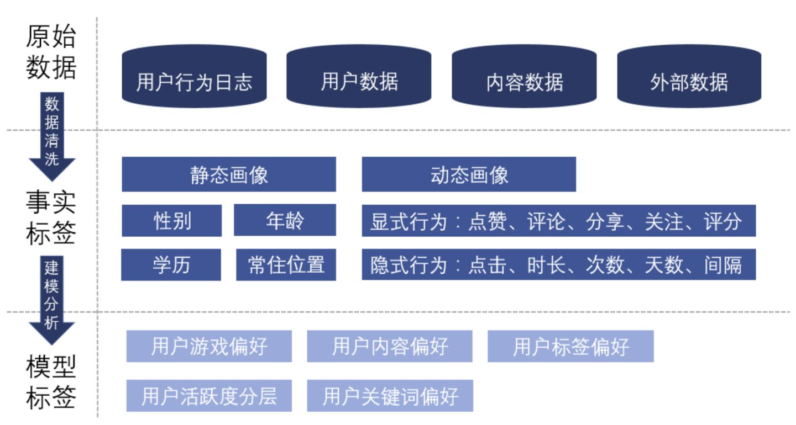
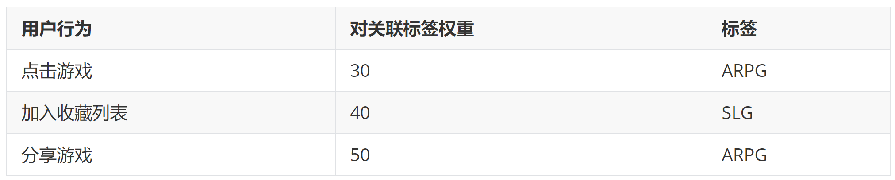
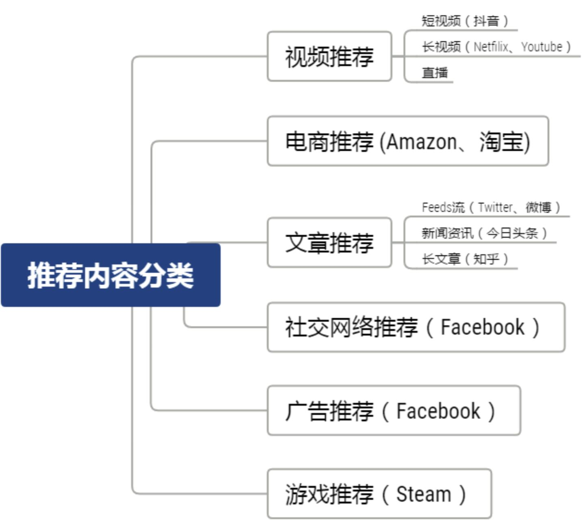
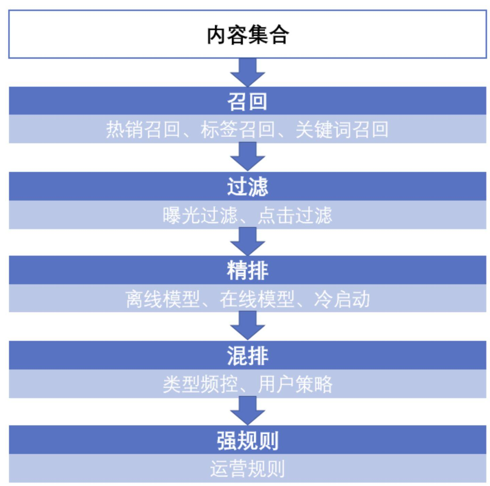
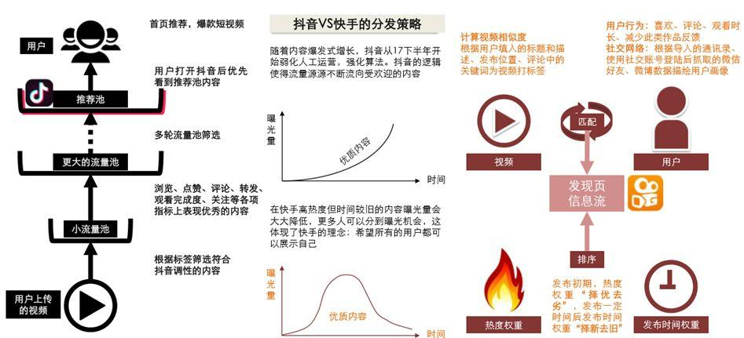
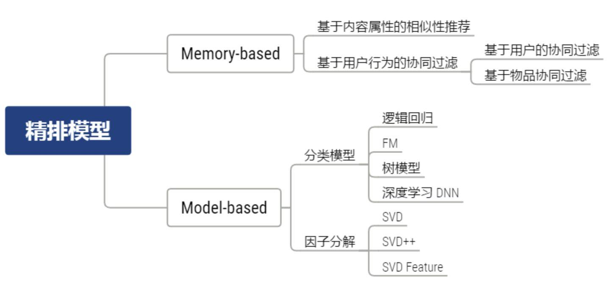
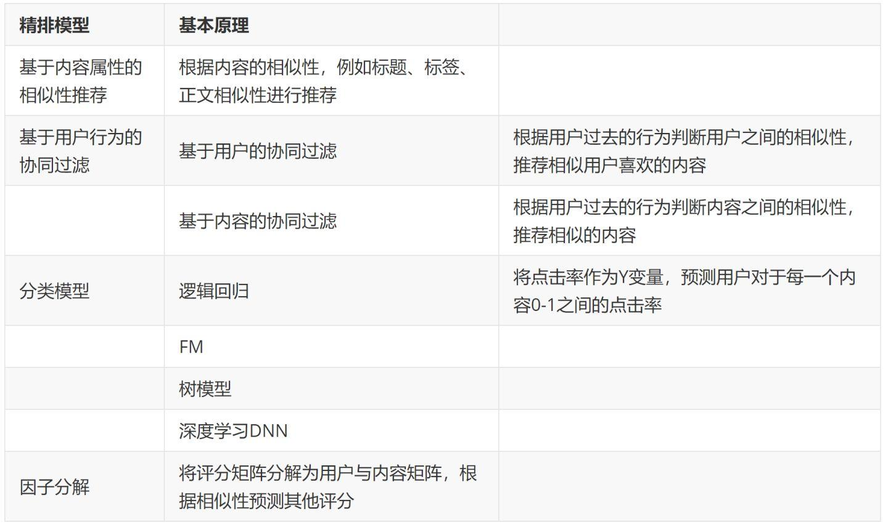

 推荐系统主要是由数据、算法、架构三个方面组成。 

-  **数据提供了信息**。数据储存了信息，包括用户与内容的属性，用户的行为偏好例如对新闻的点击、玩过的英雄、购买的物品等等。 
-  **算法提供了逻辑**。数据通过不断的积累，存储了巨量的信息。  在巨大的数据量与数据维度下，人已经无法通过人工策略进行分析干预，因此需要基于一套复杂的信息处理逻辑，基于逻辑返回推荐的内容或服务。 
-  **架构解放了双手**。架构保证整个推荐自动化、实时性的运行。架构包含了接收用户请求，收集、处理，存储用户数据，推荐算法计算，返回推荐结果等。有了架构之后算法不再依赖于手动计算，可以进行实时化、自动化的运行。  一个推荐系统的实时性要求越高、访问量越大那么这个推荐系统的架构就会越复杂。 

推荐系统的整体框架

推荐的框架主要有以下几个模块

- **协议调度**：请求的发送和结果的回传。在请求中，用户会发送自己的 ID，地理位置等信息。结果回传中会返回推荐系统给用户推荐的结果。
- **推荐算法**：算法按照一定的逻辑为用户产生最终的推荐结果。不同的推荐算法基于不同的逻辑与数据运算过程。
- **消息队列**：数据的上报与处理。根据用户的 ID，拉取例如用户的性别、之前的点击、收藏等用户信息。而用户在 APP 中产生的新行为，例如新的点击会储存在存储单元里面。
- **存储单元**：不同的数据类型和用途会储存在不同的存储单元中，例如内容标签与内容的索引存储在 mysql 里，实时性数据存储在 redis 里，需要进行数据统计的数据存储在 TDW 里。

# **三、用户画像**

# **3.1 用户标签**

**标签是我们对多维事物的降维理解，抽象出事物更具有代表性的特点。** 我们永远无法完全的了解一个人，所以我们只能够通过一个一个标签的来刻画他，所有的标签最终会构建为一个立体的画像，一个详尽的用户画像可以帮助我们更加好的理解用户。

# **用户画像的分类**

# **1. 原始数据**

原始数据一共包含四个方面

- **用户数据：** 例如用户的性别、年龄、渠道、注册时间、手机机型等。
- **内容数据：** 例如游戏的品类，对游戏描述、评论的爬虫之后得到的关键词、标签等。
- **用户与内容的交互：** 基于用户的行为，了解了什么样的用户喜欢什么样的游戏品类、关键词、标签等。
- **外部数据：** 单一的产品只能描述用户的某一类喜好，例如游戏的喜好、视频的喜好，外部数据标签可以让用户更加的立体。

# **2. 事实标签**

事实标签可以分为静态画像和动态画像。

- **静态画像：** 用户独立于产品场景之外的属性，例如用户的自然属性，这类信息比较稳定，具有统计性意义。
- **动态画像：** 用户在场景中所产生的显示行为或隐式行为。
- **显示行为**：用户明确的表达了自己的喜好，例如点赞、分享、关注、评分等。（评论的处理更加复杂，需要通过 NLP 的方式来判断用户的感情是正向、负向、中性）。
- **隐式行为**：用户没有明确表达自己的喜好，但“口嫌体正直”，用户会用实际行动，例如点击、停留时长等隐性的行为表达自己的喜好。

隐式行为的权重往往不会有显示行为大，但是在实际业务中，用户的显示行为都是比较稀疏的，所以需要依赖大量的隐式行为。

# **3. 模型标签**

模型标签是由事实标签通过加权计算或是聚类分析所得。通过一层加工处理后，标签所包含的信息量得到提升，在推荐过程中效果更好。

- **聚类分析：** 例如按照用户的活跃度进行聚类，将用户分为高活跃-中活跃-低活跃三类。
- **加权计算：** 根据用户的行为将用户的标签加权计算，得到每一个标签的分数，用于之后推荐算法的计算。

# **四、内容画像**

**内容画像：** 例如对于文章中的新闻资讯类推荐，需要利用 NLP 的技术对文章的标题，正文等等提取关键词、找到对应的标签等。视频除了对于分类、标题关键词的抓取外，还依赖于图片处理的技术。因此在推荐前需要对推荐的商品或内容进行一系列的处理过程。

**环境变量：** 对于推荐系统来说，环境画像也非常的重要。例如在短视频的推荐场景中，用户在看到一条视频所处的时间、地点以及当时所浏览的前后内容、当天已浏览时间等是非常重要的变量。

推荐内容与场景通常可以分为以下几类

# **五、算法构建**

# **5.1 推荐算法流程**

推荐算法其实本质上是一种信息处理逻辑，当获取了用户与内容的信息之后，按照一定的逻辑处理信息后，产生推荐结果。热度排行榜就是最简单的一种推荐方法，它依赖的逻辑就是当一个内容被大多数用户喜欢，那大概率其他用户也会喜欢。但是基于粗放的推荐往往会不够精确，想要挖掘用户个性化的，小众化的兴趣，需要制定复杂的规则运算逻辑，并由机器完成。

推荐算法主要分为以下几步：

- **召回**：当用户以及内容量比较大的时候，往往先通过召回策略，将百万量级的内容先缩小到百量级。
- **过滤**：对于内容不可重复消费的领域，例如实时性比较强的新闻等，在用户已经曝光和点击后不会再推送到用户面前。
- **精排**：对于召回并过滤后的内容进行排序，将百量级的内容并按照顺序推送。
- **混排**：为避免内容越推越窄，将精排后的推荐结果进行一定修改，例如控制某一类型的频次。
- **强规则**：根据业务规则进行修改，例如在活动时将某些文章置顶。

- 例如在抖音与快手的分发中：抖音强平台基于内容质量分发，快手轻平台基于社交和兴趣分发，抖音：内容质量>关系>双向互动。快手：内容质量 约等于 关系 > 双向互动。抖音基于将内容从小流量开始，其中表现优质的内容将不断的进入更大的流量池中，最终进入推荐池，形成 90 天+精品召回池，最终的结果也是优质内容的热度随着时间推移逐渐累积增加，头部内容的集中度很高。

# **5.2 召回策略**

- **召回的目的**：当用户与内容的量级比较大，例如对百万量级的用户与内容计算概率，就会产生百万*百万量级的计算量。但同时，大量内容中真正的精品只是少数，对所有内容进行一次计算将非常的低效，会浪费大量的资源和时间。因此采用召回策略，例如热销召回，召回一段时间内最热门的 100 个内容，只需进行一次计算动作，就可以对所有用户应用。
- **召回的重要性**：虽然精排模型一直是优化的重点，但召回模型也非常的重要，因为如果召回的内容不对，怎么精排都是错误的。
- **召回方法**：召回的策略不应该是简单的策略堆砌，而应该是方法的相互补充。

1. 热销召回：将一段时间内的热门内容召回。
2. 协同召回：基于用户与用户行为的相似性推荐，可以很好的突破一定的限制，发现用户潜在的兴趣偏好。
3. 标签召回：根据每个用户的行为，构建标签，并根据标签召回内容。
4. 时间召回：将一段时间内最新的内容召回，在新闻视频等有时效性的领域常用。是常见的几种召回方法。

# **5.3 精排策略**

# **5.3.1 精排模型**

- **精排模型的不同类别**

- **精排模型的基本原理**

**5.3.2 Model-based 精排模型——逻辑回归为例**

- **原理介绍**

1.概念：逻辑回归通过 sigmoid 函数，将线性回归变为可以解决二分类的方法，它可用于估计某种事物发生的可能性。

2.计算公式**：**Y 根据目标设计：例如是否点击（是：1，否：0，最后预测一个 0-1 之间的点击概率）；X 根据特征工程设计：这一块就涉及到了前面提到的用户画像与内容画像，所有的画像都是对样本的特征的刻画。特征工程需要根据业务场景选择合适的特征并进行一定的加工；W 由模型训练得到。

- **构建流程**

基于我们的目标，需要进行样本的收集（样本是对客观世界的具体描述），通过对已收集到的样本进行特征构造，并对其进行训练，最终求出模型参数的具体数值。

1. 建立样本

逻辑回归为有监督模型，因此需要有已经分类好的样本。正样本：用户曝光过某物品并点击。附样本：用户曝光过某物品并且没有点击。如果正负样本差距过大，可以将负样本随机抽样后与正样本一起训练。或只保留有点击行为的用户作为样本，将曝光但是没有被点击的物品作为负样本。

1. 特征工程

特征工程是对收集到的样本进行更加深度的特征刻画。虽然作为算法人员与用户接触较少，但对身边使用该产品的同学，进行深入的观察与访谈，了解他们对于所推荐内容的反馈，往往可以得到意料之外的特征开发方向。主要分为以下几个维度。

- 基础数据
- 趋势数据
- 时间数据
- 交叉数据

不同交叉方法得到的不同的参数数量

# **5.4 其他**

拓展阅读：

Learning and Reasoning on Graph for Recommendation

**http://staff.ustc.edu.cn/~hexn/slides/cikm19-tutorial-graph-rec.pdf**

Concept to Code:Deep Learning for Multitask Recommendation

**https://drive.google.com/file/d/1YDSuPI-DBWSn-QeCK8zTa75iBsq-kaRx/view**

# **6 算法衡量标准**

# **6.1 算法衡量指标**

- **硬指标**：对于大多数的平台而言，推荐系统最重要的作用是提升一些“硬指标”。例如新闻推荐中的点击率，但是如果单纯以点击率提升为目标，最后容易成为一些低俗内容，“标题党”的天下。
- **软指标**：除了“硬指标”，推荐系统还需要很多“软指标”以及“反向指标”来衡量除了点击等之外的价值。好的推荐系统能够扩展用户的视野，发现那些他们感兴趣，但是不会主动获取的内容。同时推荐系统还可以帮助平台挖掘被埋没的优质长尾内容，介绍给感兴趣的用户。

# **6.2 获得推荐效果**

如何去获得推荐效果。可以分为离线实验、用户调查、在线实验三种方法。

- **离线实验：** 通过反复在数据样本进行实验来获得算法的效果。通常这种方法比较简单、明确。但是由于数据是离线的，基于过去的历史数据，不能够真实的反应线上效果。同时需要通过时间窗口的滚动来保证模型的客观性和普适性。
- **用户反馈：** 当在离线实验阶段得到了一个比较不错的预测结果之后，就需要将推荐的结果拿到更加真实的环境中进行测评，如果这个时候将算法直接上线，会面临较高的风险。因为推荐结果的好坏不能仅仅从离线的数字指标衡量，更要关注用户体验，所以可以通过小范围的反复白板测试，获得自己和周围的人对于推荐结果的直观反馈，进行优化。
- **在线测试（AB test）：** 实践是检验真理的唯一标准，在推荐系统的优化过程中，在线测试是最贴近现实、最重要的反馈方式。通过 AB 测试的方式，可以衡量算法与其他方法、算法与算法之间的效果差异。但是要注意的是，AB 测序需要一定的观察期以及科学的实验流程，才能证明得到的结论是真实可信的。

# **7 除了算法本身之外...**

# **7.1 推荐算法是否会导致信息不平等和信息茧房？**

推荐系统并非导致信息不平等和信息茧房的根本原因。

- **内容的不平等或许更多的产生于用户天性本身，而推荐算法的作用更像是帮助用户“订阅”了不同的内容。** 用户天然的会对信息产生筛选，并集中在自己的兴趣领域。在过去杂志订阅的阶段，虽然每个杂志和报纸的内容都是完全相同的，但是用户通过订阅不同的杂志实际接受到了完全不同的消息。而今天的内容 APP 提供了各种话题，各种类型的内容，但用户通过推荐算法，在无意识的情况下“订阅”了不同的“杂志”。
- **人们更加集中于垂直的喜好是不可逆转的趋势。** 从内容供给的角度来讲，从内容的匮乏到繁荣，从中心化到垂直聚群，用户的选择更贴近自己的喜好是不可逆转的趋势。在没有提供太多选项的时候，人们会更多的集中在某几个内容上面，而当今天层出不穷的内容出现，人们开始追逐更加个性化，精细化的内容。

但不可否认的是，推荐系统的便捷性、自动化、实时性会加重这些问题。在这样的情况下，我们能做些什么？

- **追求长期价值，“带用户探索世界”**：展示更多的优质内容，而不是仅仅局限于用户更有可能点击的内容，扩展用户兴趣认知，给用户展示多元化的内容，用户消费更多的内容，更久的在平台上停留。让用户获取到更多的，更长远价值，才是让用户在平台上留存的本质。

# **7.2 推荐算法如何帮助用户挖掘小众兴趣？**

- 扩大系统的资源池，让小众的兴趣也有足够的内容覆盖。
- 产品设计鼓励更主动的行为表达（收藏、关注），减少因为时间衰减的将小众兴趣遗忘。
- 在混排的时候加入更多随机的内容，或者限制某一类型出现的频率。

# **7.3 算法如何更好的与产品结合？**

- **关注产品体验，而不仅仅是算法本身的表现**。
- **关注隐性反向指标：** 用户对于内容的感知是非常敏感的，不好的内容会损伤用户体验，甚至导致用户流失。但问题是不是所有用户在被推荐了不喜欢或不良的内容后会产生显性行为，例如“投诉行为”，所以还需要更多的关注反向的隐性指标，例如观察用户在被推荐了某些内容后是否造成了流失或使用频率的下降。